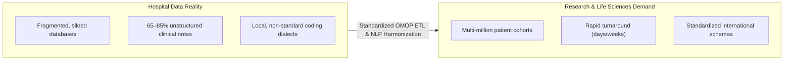
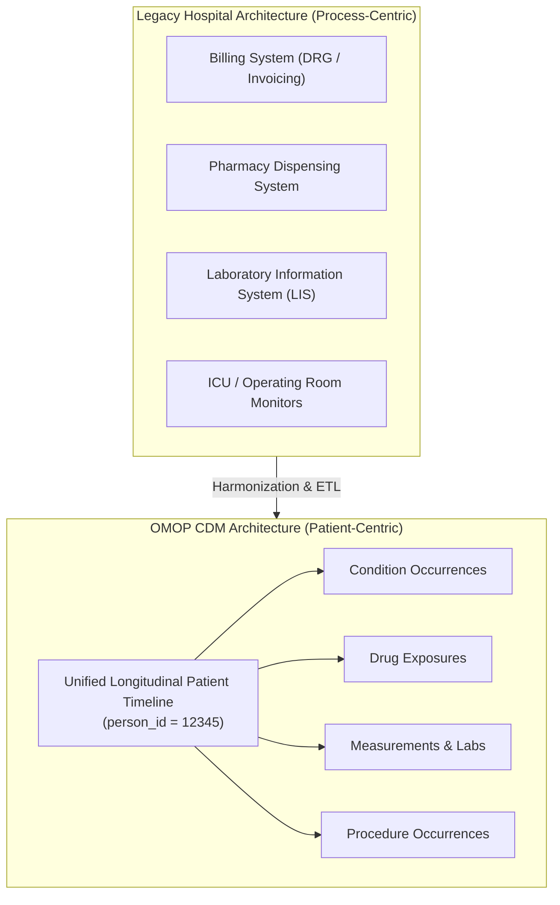
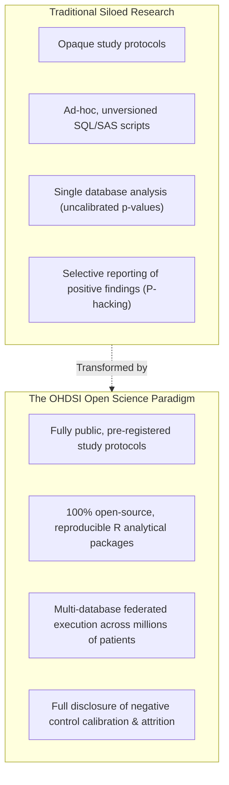

# Real-World Data at Scale & Open Science
{: .no_toc }

Translating real-world clinical records into reproducible evidence requires overcoming severe structural bottlenecks: hospital data silos, process-centric architectures, and the reproducibility crisis in observational research.

1. TOC
{:toc}

## 1. The Demand vs. Supply Asymmetry

Healthcare and life sciences have long suffered from an uneven demand-to-supply relationship in clinical data:

According to recent pharmacoepidemiology and biomedical reviews (*Grimberg et al., 2021; Zhao et al., 2022*):
*   **The 2.3 Exabyte Bottleneck:** Over 2.3 exabytes of clinical data are generated annually, but only a fraction is accessible for scientific investigation.
*   **Unstructured Information:** Between 65% and 85% of all clinically rich data (pathology findings, treatment rationales, symptom severity, staging) is locked in unstructured free-text clinical notes.
*   **Siloed Infrastructure:** Most hospital databases remain completely isolated behind institutional firewalls without standardized interfaces.

## 2. Process-Centric vs. Patient-Centric Data Architecture

The primary obstacle to scaling health data analytics is historical system design:

### The Legacy Paradigm (Process-Centric)
Hospital IT systems were built to digitize administrative and operational workflows—billing insurance, managing bed occupancy, ordering laboratory panels, and tracking pharmacy inventory. In this model, data is organized by department and transaction, making it fragmented and difficult to aggregate longitudinally.

### The OMOP Paradigm (Patient-Centric)
Observational research requires reorganizing all clinical events around the **patient**. The OMOP Common Data Model creates a single, unified longitudinal record where every encounter, medication, diagnosis, and measurement is tied to a unique `person_id`.

### The Plug and Electricity Analogy
Standardizing observational health data requires two complementary layers:
*   **Common Data Model (The Socket):** Standardizes table names, column data types, and primary/foreign key relationships across databases.
*   **Standard Vocabularies (The Electrical Current):** Standardizes the semantic meaning of clinical codes (e.g., SNOMED CT for conditions, RxNorm for drugs, LOINC for measurements), ensuring that identical SQL and R code executes seamlessly worldwide.

## 3. The Reproducibility Crisis & Open Science at Scale

Observational health science has historically faced severe challenges regarding reproducibility, p-hacking, and publication bias.

To establish regulatory-grade trust in Real-World Evidence, research networks (OHDSI, DARWIN EU) enforce four core open-science pillars:
1.  **Protocol Transparency:** Study protocols and phenotype definitions are published prior to analysis execution.
2.  **Code Sharing:** Every line of analytical code is packaged in open-source, version-controlled R repositories.
3.  **Complete Results Disclosure:** All diagnostics, negative control calibrations, and attrition flowcharts are published alongside effect estimates.
4.  **Federated Replication:** The identical analytical package is executed across multiple independent health databases internationally.

## 4. Landmark Case Studies: Multinational COVID-19 Network Studies

During the early stages of the COVID-19 pandemic, the global OHDSI network demonstrated the power of standardized, multi-country real-world data networks to answer critical public health questions before randomized clinical trials could be completed.

### 4.1 Rapid Clinical Characterization: Repurposed Drugs (*Prats-Uribe et al., BMJ 2021*)

When the pandemic began, healthcare systems urgently needed to understand real-world treatment patterns for repurposed pharmaceuticals (such as hydroxychloroquine, azithromycin, and corticosteroids).

In a multinational study spanning health systems in the US, Spain, the UK, and the Netherlands (*Prats-Uribe et al., BMJ 2021*):
*   **Scale:** Analyzed hundreds of thousands of hospitalized COVID-19 patients within weeks.
*   **Findings:** Mapped the dramatic surge and sudden collapse of hydroxychloroquine use as evidence regarding lack of efficacy and cardiac toxicity emerged.
*   **Impact:** Provided health authorities and the European Medicines Agency with real-time utilization benchmarks before prospective trials concluded.

### 4.2 Large-Scale Comparative Safety: Vaccine-Induced Thrombosis (*Li et al., BMJ 2022*)

Following the global rollout of COVID-19 vaccines, safety surveillance networks were tasked with evaluating potential risks of Thrombosis with Thrombocytopenia Syndrome (TTS).

In an international network cohort study across five European countries and the US (*Li et al., BMJ 2022*):
*   **Population:** Evaluated over 1.3 million vaccinated individuals across federated OMOP databases.
*   **Methodology:** Applied self-controlled case series (SCCS) and active-comparator new-user cohort designs with empirical negative control calibration.
*   **Findings:** Observed a 30% increased risk of thrombocytopenia following a first dose of the adenovirus-vectored ChAdOx1-S vaccine compared to mRNA vaccines (BNT162b2).
*   **Regulatory Impact:** Informed European and international vaccine regulatory guidelines and benefit-risk balance evaluations.

## References

1. **Grimberg F, Asprion PM, Schneider B, Miho E, Babrak L, Habbabeh A.** (2021). *The Real-World Data Challenges Radar: A Review on the Challenges and Risks regarding the Use of Real-World Data.* Digit Biomark, 5(2), 148–157. [doi:10.1159/000516178](https://doi.org/10.1159/000516178).
2. **Zhao X, et al.** (2022). *Integrating real-world data to accelerate and guide drug development: A clinical pharmacology perspective.* Clin Transl Sci, 15(10), 2293–2302. [doi:10.1111/cts.13376](https://doi.org/10.1111/cts.13376).
3. **Prats-Uribe A, Sena AG, Lai LYH, et al.** (2021). *Use of repurposed and adjuvant drugs in hospital patients with covid-19: multinational network cohort study.* BMJ, 373, n1038. [doi:10.1136/bmj.n1038](https://doi.org/10.1136/bmj.n1038).
4. **Li X, Burn E, Duarte-Salles T, et al.** (2022). *Comparative risk of thrombosis with thrombocytopenia syndrome or thromboembolic events associated with different covid-19 vaccines: international network cohort study from five European countries and the US.* BMJ, 379, e071594. [doi:10.1136/bmj-2022-071594](https://doi.org/10.1136/bmj-2022-071594).
