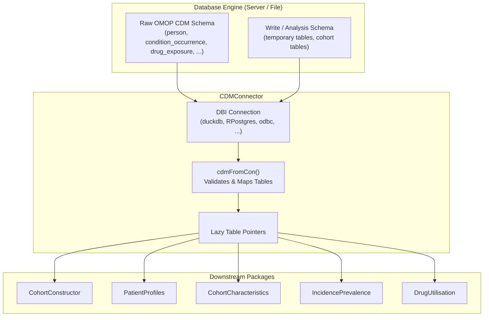

# [CDMConnector](https://darwin-eu.github.io/CDMConnector/)
{: .no_toc}

1. TOC
{:toc}

The `CDMConnector` R package is the foundational bridge between R and relational database management systems hosting the OMOP Common Data Model (CDM). It provides database connectivity, schema separation, and creates the central `<cdm_reference>` object that powers all downstream OHDSI and DARWIN-EU analytic packages.

## Overview

Working with large healthcare databases requires lazy evaluation—translating `dplyr` operations into SQL queries executed directly inside the database engine without pulling millions of patient records into local RAM. `CDMConnector` enables this by wrapping standard `DBI` connections and standardizing table access across diverse database backends (DuckDB, PostgreSQL, Snowflake, Redshift, BigQuery, SQL Server, Oracle).

### Key Features:
- **Unified `<cdm_reference>` Object**: Encapsulates all OMOP tables in a single list-like reference.
- **Read & Write Schema Isolation**: Reads raw OMOP tables from a read-only `cdm_schema` while writing intermediate cohorts and analysis tables into a separate `write_schema`.
- **Cross-Database SQL Translation**: Seamlessly integrates with `dbplyr` to translate R code into database-specific SQL dialect.
- **Mock & Synthetic Datasets**: Direct access to synthetic CDM datasets (e.g., `eunomiaDir()`, `downloadEunomiaData()`) for reproducible research and testing.

---

## Installation

Install the stable release from CRAN:

```r
install.packages("CDMConnector")
```

Or install the development version from GitHub:

```r
# install.packages("pak")
pak::pkg_install("darwin-eu/CDMConnector")
```

If connecting to local DuckDB databases or Eunomia mock data, install the precompiled DuckDB driver binary:

```r
install.packages(
  "duckdb",
  repos = c("https://duckdb.r-universe.dev", "https://cloud.r-project.org")
)
```

---

## System Architecture



---

## Getting Started

### 1. Connecting to a Local DuckDB Database

For local files or synthetic testing datasets:

```r
library(DBI)
library(duckdb)
library(CDMConnector)
library(dplyr)

# Connect using DuckDB driver
con <- DBI::dbConnect(duckdb::duckdb(), dbdir = eunomiaDir())

# Create the cdm reference object
cdm <- cdmFromCon(
  con = con,
  cdmSchema = "main",
  writeSchema = "main"
)

# Inspect available tables
names(cdm)

# Query tables lazily (executes in the database)
cdm$person |>
  count(gender_concept_id) |>
  collect()
```

### 2. Connecting to a Remote Enterprise Database (e.g., PostgreSQL)

```r
library(DBI)
library(RPostgres)
library(CDMConnector)

# Establish live connection
con <- DBI::dbConnect(
  RPostgres::Postgres(),
  dbname = "omop_db",
  host = "db.institution.org",
  port = 5432,
  user = Sys.getenv("DB_USER"),
  password = Sys.getenv("DB_PASSWORD")
)

# Initialize CDM reference with write-schema prefix
cdm <- cdmFromCon(
  con = con,
  cdmSchema = "cdm_synthea",
  writeSchema = c(schema = "scratch", prefix = "study123_")
)
```

---

## Core API Reference

### Database & Reference Management

| Function | Description |
| :--- | :--- |
| `cdmFromCon(con, cdmSchema, writeSchema, ...)` | Creates a `<cdm_reference>` object from an active `DBI` connection. |
| `cdmDisconnect(cdm)` | Closes the underlying database connection and releases resources. |
| `cdmName(cdm)` | Returns the identifier name assigned to the CDM database instance. |
| `cdmVersion(cdm)` | Detects and returns the OMOP CDM version (e.g., 5.3, 5.4). |

### Table & Schema Operations

| Function | Description |
| :--- | :--- |
| `insertTable(cdm, name, table)` | Inserts a local R data frame into the database `write_schema`. |
| `dropSourceTable(cdm, name)` | Drops a table from the `write_schema` in the database. |
| `listSourceTables(cdm)` | Lists all tables physically present in the connected database schemas. |
| `compute(x, name, temporary)` | Materializes a lazy query into a physical table in the `write_schema`. |

### Synthetic & Mock Data Utilities

| Function | Description |
| :--- | :--- |
| `eunomiaDir(datasetName)` | Returns the local directory path for synthetic Eunomia test databases. |
| `downloadEunomiaData(pathToData)` | Downloads and unpacks synthetic OMOP test datasets. |
| `exampleDatasets()` | Lists all available pre-packaged test datasets. |
