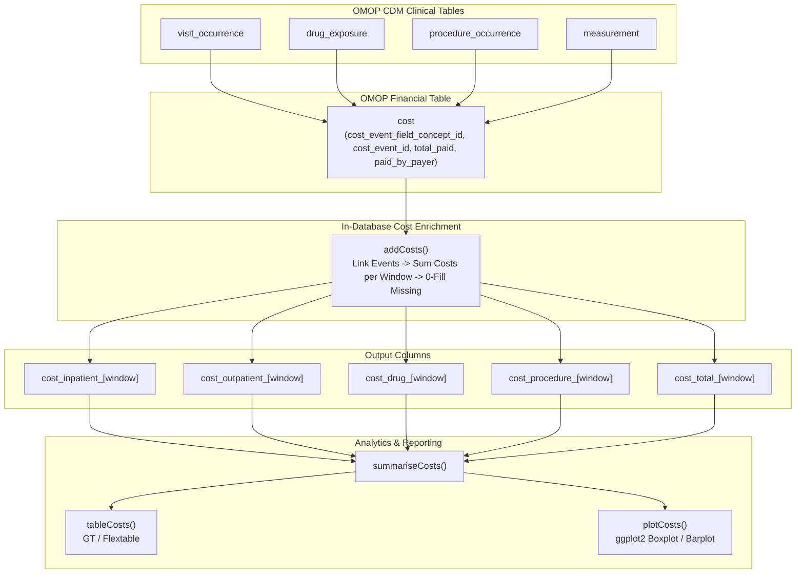

# [CohortCosts](https://github.com/iomedhealth/omopHeor/tree/main/packages/CohortCosts)
{: .no_toc}

1. TOC
{:toc}

The `CohortCosts` R package provides tools for **direct medical cost extraction**, **health economics costing**, and **claims financial aggregation** for Observational Medical Outcomes Partnership (OMOP) Common Data Model (CDM) cohorts following DARWIN EU standards.

---

## Overview

In observational research and Health Economics and Outcomes Research (HEOR), quantifying financial burden requires linking patient clinical encounters to billing and reimbursement records. The OMOP CDM represents these financial transactions in the polymorphic `COST` table.

`CohortCosts` automates the linkage between OMOP clinical event domains (`Condition`, `Visit`, `Drug`, `Procedure`, `Measurement`) and the `COST` table, appending windowed direct medical expenditure columns directly to study cohorts in-database.

---

## Key Features

- **Polymorphic OMOP `COST` Linkage**: Resolves foreign key relationships across multiple clinical tables via `cost_event_field_concept_id` and `cost_event_id`.
- **Domain-Specific & Total Expenditure Breakdown**: Decomposes total medical costs into granular domain categories: Inpatient, Outpatient, Pharmacotherapy, and Procedures.
- **Configurable Cost Metrics**: Supports multiple financial columns from the OMOP `COST` table, including `total_paid`, `total_charge`, `paid_by_payer`, and `paid_by_patient`.
- **Automated Zero-Fill Handling**: Seamlessly defaults missing or unlinked cost records to 0.0, avoiding patient loss during analytic joins.
- **Standardized Summaries & Visuals**: Generates standardized `summarised_result` outputs compatible with `visOmopResults`, publication table formatters (`gt`, `flextable`), and `ggplot2` cost distribution plots.
- **Unit Cost Tariffs & Price Indices**: Supports mapping external standard unit costs and healthcare price index adjustments.

---

## Installation

Install `CohortCosts` from GitHub:

```r
# install.packages("pak")
pak::pkg_install("iomedhealth/omopHeor/packages/CohortCosts")
```

---

## Methodological Architecture



---

## Core Capabilities

### 1. In-Database Direct Medical Cost Enrichment

Append domain-specific expenditures across baseline (`[-365, -1]`) and follow-up (`[0, 365]`) windows:

```r
library(CohortCosts)
library(CDMConnector)
library(dplyr)

# Connect to OMOP CDM database
con <- DBI::dbConnect(duckdb::duckdb(), eunomiaDir("GiBleed"))
cdm <- cdmFromCon(con, cdmSchema = "main", writeSchema = "main")

# Enrich cohort with direct medical expenditures
cdm$cohort_costed <- cdm$target_cohort |>
  addCosts(
    window = list(baseline = c(-365, -1), followup = c(0, 365)),
    costField = "total_paid",
    domains = c("Inpatient", "Outpatient", "Drug", "Procedure"),
    name = "cohort_costed"
  )

# Inspect added cost columns
cdm$cohort_costed |>
  select(subject_id, cohort_start_date, starts_with("cost_")) |>
  glimpse()
```

### 2. Cost Summarization & Reporting

Summarize medical expenditures across study cohorts, strata, and observation windows:

```r
# Aggregate costs into a standardized summarised_result object
cost_summary <- summariseCosts(
  cohort = cdm$cohort_costed,
  estimates = c("mean", "sd", "median", "q25", "q75", "min", "max")
)

# Render formatted GT publication table
tableCosts(
  result = cost_summary,
  type = "gt"
)

# Generate cost distribution visualization
plotCosts(
  result = cost_summary,
  variable = "cost_total_followup"
)
```

---

## Main Functions

| Function | Purpose |
| :--- | :--- |
| `addCosts()` | Enriches a cohort table with windowed direct medical expenditure columns by domain (`Inpatient`, `Outpatient`, `Drug`, `Procedure`, `Total`). |
| `summariseCosts()` | Aggregates per-patient expenditure columns into a standardized `summarised_result` object. |
| `tableCosts()` | Formats summarized cost results into publication-ready tables (`gt`, `flextable`, or `tibble`). |
| `plotCosts()` | Generates ggplot2 boxplots, barplots, and distribution charts of direct medical costs across cohorts and windows. |
