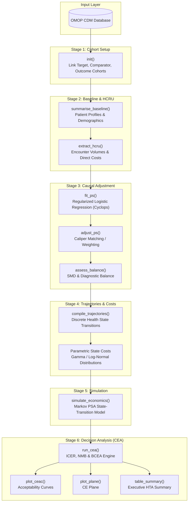

# [CohortEconomics](https://iomedhealth.github.io/omopHeor/)
{: .no_toc}

1. TOC
{:toc}

The `CohortEconomics` R package provides an end-to-end analytical framework for **Health Economics and Outcomes Research (HEOR)**, **causal inference**, **Markov state-transition modeling**, and **Cost-Effectiveness Analysis (CEA)** directly on Observational Medical Outcomes Partnership (OMOP) Common Data Model (CDM) databases.

---

## Overview

Health Technology Assessment (HTA) decision-making requires evaluating whether new clinical interventions provide sufficient health gains relative to their incremental costs. Traditionally, translating observational real-world data (RWD) into decision-analytic models required disconnected, manual data processing steps.

`CohortEconomics` establishes a standardized, reproducible bridge between OMOP CDM cohorts and decision-analytic modeling engines, enforcing a strict **6-stage pipeline**:

1. **Stage 1 (Cohort Initialization)**: Define Target, Comparator, and Safety/Efficacy Outcome cohorts.
2. **Stage 2 (Baseline & HCRU Characterization)**: Profile patient demographics and aggregate healthcare resource utilization.
3. **Stage 3 (Causal Propensity Score Adjustment)**: Control for confounding by indication via regularized logistic regression (`Cyclops`) and greedy caliper matching.
4. **Stage 4 (Trajectory Compilation & State Costs)**: Transform longitudinal clinical histories into discrete Markov health-state transition matrices and parametric cost distributions.
5. **Stage 5 (Economic Simulation)**: Execute Probabilistic Sensitivity Analysis (PSA) Markov microsimulations over defined time horizons with annual discounting.
6. **Stage 6 (Decision Analysis / CEA)**: Calculate Incremental Cost-Effectiveness Ratios (ICER), Net Monetary Benefit (NMB), Cost-Effectiveness Acceptability Curves (CEAC), and Cost-Effectiveness Planes via `BCEA`.

---

## The Rosetta Stone: OMOP to HEOR Mapping

`CohortEconomics` translates OHDSI clinical conventions into health economic evaluation concepts:

| OMOP / OHDSI Concept | HEOR / CEA Concept | Pipeline Stage |
| :--- | :--- | :--- |
| **Target Cohort** (e.g., new users of Drug A) | **Treatment Arm** (The new intervention) | Stage 1 (`init`) |
| **Comparator Cohort** (e.g., new users of Drug B) | **Standard of Care Arm** (The baseline comparator) | Stage 1 (`init`) |
| **Outcome Cohorts** (e.g., clinical events) | **Health States / Clinical Endpoints** (Markov states) | Stage 1 & 4 (`init`, `compile_trajectories`) |
| **Baseline Demographics & Covariates** | **Confounders & Patient Profiles** (PS Matching) | Stage 2 & 3 (`summarise_baseline`, `fit_ps`) |
| **`COST` & `VISIT_OCCURRENCE` Tables** | **HCRU & Direct Medical Expenditures** (ICER numerator) | Stage 2 & 4 (`extract_hcru`, state costs) |

---

## Installation

Install `CohortEconomics` from GitHub:

```r
# install.packages("pak")
pak::pkg_install("iomedhealth/omopHeor/packages/CohortEconomics")
```

---

## 6-Stage Pipeline Architecture



---

## Getting Started Example

The following end-to-end example demonstrates how to run a complete comparative HEOR analysis using DuckDB and the synthetic `GiBleed` dataset:

```r
library(CohortEconomics)
library(CDMConnector)
library(CohortConstructor)
library(dplyr)

# 0. Connect to OMOP CDM database
con <- DBI::dbConnect(duckdb::duckdb(), eunomiaDir("GiBleed"))
cdm <- cdmFromCon(con, cdmSchema = "main", writeSchema = "main")

# 1. Instantiate Study Cohorts
cdm$target_cohort <- conceptCohort(cdm, list(celecoxib = 1118084L), "target_cohort") |>
  requireIsFirstEntry()
cdm$comparator_cohort <- conceptCohort(cdm, list(diclofenac = 1124300L), "comparator_cohort") |>
  requireIsFirstEntry()
cdm$outcome_cohort <- conceptCohort(cdm, list(gi_bleed = 192671L), "outcome_cohort")

# 2. Run the 6-Stage Pipeline
study <- init(
  cdm = cdm,
  target_cohort = "target_cohort",
  comparator_cohort = "comparator_cohort",
  outcome_cohort = "outcome_cohort"
) |>
  summarise_baseline() |>
  extract_hcru(
    baseline_window = c(-365, -1),
    followup_window = c(0, 365)
  ) |>
  fit_ps() |>
  adjust_ps(caliper = 0.2) |>
  compile_trajectories()

# 3. Assign State Cost Distributions
study$costs <- data.frame(
  health_state = c("State_Baseline", "State_Outcome"),
  mean_cost = c(450, 4800),
  se_cost = c(40, 350)
)

# 4. Economic Simulation & Decision Analysis
sim <- simulate_economics(
  traj_obj = study,
  time_horizon = 10,
  discount_rate = 0.03,
  n_samples = 250
)

cea <- run_cea(sim)

# 5. Generate HTA Decision Visualizations
plot_ceac(cea)
plot_plane(cea)
table_summary(cea)
```

---

## Core Stages in Detail

### Stage 1: Cohort Setup & Initialization (`init`)
Validates that the target, comparator, and outcome cohort tables exist in the CDM reference and computes initial cohort record and subject counts via `omopgenerics::cohortCount()`.

### Stage 2: Baseline & HCRU Extraction (`summarise_baseline`, `extract_hcru`)
- **`summarise_baseline()`**: Computes unadjusted baseline demographic characteristics (age, sex, prior observation).
- **`extract_hcru()`**: Extracts encounter rates and resource volumes across Inpatient, ICU, Emergency, Outpatient, Prescription, and Procedure domains.

### Stage 3: Causal Propensity Score Adjustment (`fit_ps`, `adjust_ps`, `assess_balance`)
- **`fit_ps()`**: Fits high-dimensional regularized logistic regression models using `Cyclops` to estimate individual propensity scores $P(\text{Treatment} \mid X)$.
- **`adjust_ps()`**: Performs greedy nearest-neighbor caliper matching or IPTW weighting to construct balanced comparative cohorts.
- **`assess_balance()`**: Computes pre- and post-adjustment Standardized Mean Differences (SMD) to confirm covariate balance.

### Stage 4: Trajectory Compilation & State Costs (`compile_trajectories`)
- Slices longitudinal patient histories into discrete Markov health-state transitions (`State_Baseline` $\rightarrow$ `State_Outcome`) to derive empirical transition probability matrices.
- Links state-specific cost distributions (Gamma/Log-Normal) and health state utilities.

### Stage 5: Economic Simulation (`simulate_economics`)
Runs a Markov state-transition Probabilistic Sensitivity Analysis (PSA). At each Monte Carlo iteration:
- Transition probabilities are drawn from Dirichlet/Gamma distributions.
- State costs are sampled from Gamma distributions.
- Health state utilities are sampled from Beta distributions.
- Future costs and QALYs are accumulated and discounted at a chosen annual rate (e.g., 3%).

### Stage 6: Decision Analysis & CEA (`run_cea`, `plot_*`)
Wraps `BCEA` to calculate:
- **Incremental Cost-Effectiveness Ratio (ICER)**: $\Delta \text{Cost} / \Delta \text{QALY}$.
- **Net Monetary Benefit (NMB)**: $\text{NMB}(k) = k \cdot \Delta E - \Delta C$ across willingness-to-pay ($k$) thresholds.
- **Visualizations**: Cost-Effectiveness Acceptability Curve (`plot_ceac`) and Cost-Effectiveness Plane (`plot_plane`).

---

## Main Functions

| Stage | Function | Purpose |
| :--- | :--- | :--- |
| **Stage 1** | `init()` | Initialize a study object linking target, comparator, and outcome cohorts. |
| **Stage 2** | `summarise_baseline()` | Generate baseline demographic and comorbidity summary tables. |
| **Stage 2** | `extract_hcru()` / `extractHcru()` | Extract healthcare utilization counts across care domains and link OMOP `cost` records. |
| **Stage 3** | `fit_ps()` | Fit high-dimensional regularized logistic regression for propensity scores using `Cyclops`. |
| **Stage 3** | `adjust_ps()` | Apply greedy caliper matching or weighting to balance comparative cohorts. |
| **Stage 3** | `assess_balance()` | Compute Standardized Mean Differences (SMD) and diagnostic balance tables. |
| **Stage 4** | `compile_trajectories()` | Build discrete Markov health-state transition matrices from longitudinal patient journeys. |
| **Stage 5** | `simulate_economics()` | Run Markov state-transition Probabilistic Sensitivity Analysis (PSA) over a defined time horizon. |
| **Stage 6** | `run_cea()` | Execute Bayesian Cost-Effectiveness Analysis (BCEA) and calculate ICER / NMB. |
| **Reporting** | `plot_ceac()` | Generate the Cost-Effectiveness Acceptability Curve (CEAC) plot. |
| **Reporting** | `plot_plane()` | Generate the Cost-Effectiveness Plane scatter plot. |
| **Reporting** | `table_summary()` | Produce an executive summary table of expected costs, QALYs, and ICER. |
