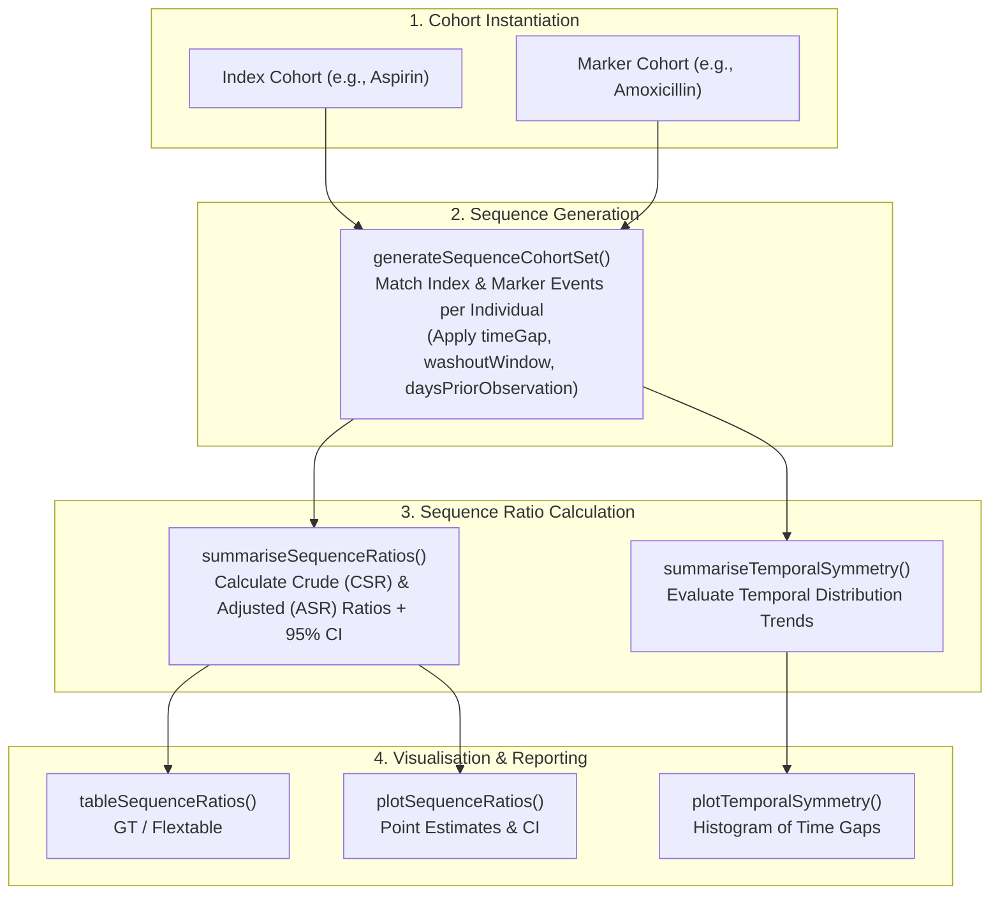

# [CohortSymmetry](https://ohdsi.github.io/CohortSymmetry/)
{: .no_toc}

1. TOC
{:toc}

The `CohortSymmetry` R package provides tools to perform **Sequence Symmetry Analysis (SSA)** and **Prescription Sequence Symmetry Analysis (PSSA)** on Observational Medical Outcomes Partnership (OMOP) Common Data Model (CDM) databases.

---

## Overview

Sequence Symmetry Analysis is a self-controlled study design commonly used for pharmacovigilance, post-marketing drug safety surveillance, and adverse event signal detection. By comparing the order of occurrence between an **index exposure** (e.g., a newly initiated drug) and a **marker event** (e.g., an incident diagnosis or prescription for a symptom), SSA tests whether the marker event occurs disproportionately *after* the index event compared to *before*.

Because individuals serve as their own controls, time-invariant confounding (such as genetics, socioeconomic factors, and chronic comorbidities) is intrinsically controlled for.

`CohortSymmetry` calculates:
* **Crude Sequence Ratio (CSR)**: The ratio of the number of individuals who initiated the marker after the index event ($A$) versus before ($B$): $\text{CSR} = A / B$.
* **Adjusted Sequence Ratio (ASR)**: The CSR adjusted for background prescribing trends and temporal asymmetry in the underlying population.
* **Confidence Intervals**: 95% confidence intervals around CSR and ASR estimates.

---

## Key Features

- **Standardized OMOP Integration**: Operates directly on cohort tables created with `CohortConstructor`, `DrugUtilisation`, or `CDMConnector`.
- **Temporal Symmetry Modeling**: Evaluates sequence distributions across configurable time gaps and washout windows.
- **Publication-Ready Outputs**: Standardized `summarised_result` outputs formatted into tables (`gt`, `flextable`) and diagnostic plots (`ggplot2`).
- **Signal Detection & Negative Controls**: Ideal for rapid safety screening across multiple drug-outcome combinations.

---

## Installation

Install `CohortSymmetry` from CRAN or GitHub:

```r
# From CRAN
install.packages("CohortSymmetry")

# Development version from GitHub
# install.packages("pak")
pak::pkg_install("ohdsi/CohortSymmetry")
```

---

## Methodological Workflow



---

## Usage Example

The following example demonstrates conducting a Sequence Symmetry Analysis on synthetic DuckDB OMOP CDM data:

```r
library(CDMConnector)
library(CohortConstructor)
library(CohortSymmetry)
library(dplyr)

# 0. Connect to database
con <- DBI::dbConnect(duckdb::duckdb(), eunomiaDir("GiBleed"))
cdm <- cdmFromCon(con, cdmSchema = "main", writeSchema = "main")

# 1. Instantiate Index (Celecoxib) and Marker (GI Bleed) cohorts
cdm$celecoxib <- conceptCohort(cdm, list(celecoxib = 1118084L), name = "celecoxib")
cdm$gi_bleed <- conceptCohort(cdm, list(gi_bleed = 192671L), name = "gi_bleed")

# 2. Intersect cohorts into sequence pairs
cdm <- generateSequenceCohortSet(
  cdm = cdm,
  indexTable = "celecoxib",
  markerTable = "gi_bleed",
  name = "celecoxib_gi_bleed",
  timeGap = 365,
  washoutWindow = 365,
  daysPriorObservation = 365
)

# 3. Summarise sequence ratios (CSR, ASR, 95% CI)
sr_results <- summariseSequenceRatios(
  cohort = cdm$celecoxib_gi_bleed
)

# 4. Generate formatted summary table and plot
tableSequenceRatios(result = sr_results, type = "gt")
plotSequenceRatios(result = sr_results, onlyASR = TRUE)
plotTemporalSymmetry(cdm = cdm, sequenceTable = "celecoxib_gi_bleed")
```

---

## Main Functions

| Function | Purpose |
| :--- | :--- |
| `generateSequenceCohortSet()` | Intersects an index cohort and a marker cohort to identify sequence pairs within a defined time window. |
| `summariseSequenceRatios()` | Calculates Crude Sequence Ratios (CSR), Adjusted Sequence Ratios (ASR), and 95% confidence intervals. |
| `summariseTemporalSymmetry()` | Extracts temporal distributions of time differences between index and marker events. |
| `tableSequenceRatios()` | Renders publication-ready sequence ratio summary tables (`gt` or `flextable`). |
| `plotSequenceRatios()` | Generates ggplot2 forest plots showing sequence ratio point estimates and confidence intervals. |
| `plotTemporalSymmetry()` | Plots the distribution of time gaps between index and marker events to visually inspect symmetry. |
