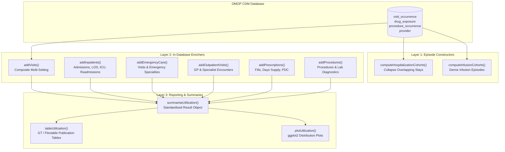

# [CohortUtilisation](https://github.com/iomedhealth/omopHeor/tree/main/packages/CohortUtilisation)
{: .no_toc}

1. TOC
{:toc}

The `CohortUtilisation` R package provides a high-performance, in-database framework for extracting and summarizing **Healthcare Resource Utilization (HCRU)** from Observational Medical Outcomes Partnership (OMOP) Common Data Model (CDM) databases adhering to DARWIN EU standards.

---

## Overview

Quantifying how patient cohorts interact with healthcare systems—across inpatient hospitalizations, intensive care unit (ICU) stays, emergency room visits, outpatient consultations, diagnostic procedures, and prescription dispensing—is central to epidemiology, burden-of-illness studies, and health economics.

`CohortUtilisation` implements a modular **3-layer architecture** aligned with standard OHDSI/DARWIN EU conventions (`CohortConstructor`, `PatientProfiles`, and `CohortCharacteristics`):

* **Layer 1: Care Episode Constructors** (`CohortConstructor` style): Construct derived care episode cohorts by collapsing contiguous or overlapping hospital stays and identifying intravenous infusion regimens.
* **Layer 2: In-Database Cohort Enrichers** (`PatientProfiles` style): Directly append windowed encounter counts, lengths of stay (LOS), ICU days, 30/90-day readmissions, and specialty-stratified metrics to cohort tables in the database.
* **Layer 3: Analytics & Reporting** (`CohortCharacteristics` style): Aggregate enriched cohort metrics into standardized `summarised_result` objects for rendering with `gt`, `flextable`, or `ggplot2`.

---

## Key Features

- **In-Database Execution**: Executes complex joins and window aggregations via `dbplyr` / SQL without transferring patient-level data to memory.
- **Flexible Observation Windows**: Supports user-defined baseline, follow-up, and open-ended or infinite time horizons (e.g. `list(baseline = c(-365, -1), followup = c(0, 365), lifetime = c(0, Inf))`).
- **Provider Specialty Stratification**: Automatically partitions admissions and outpatient encounters across clinical specialties (General Practice, ICU, Emergency Medicine, Cardiology, Oncology, etc.).
- **Dual-Criteria Emergency Detection**: Identifies emergency encounters using OMOP visit concepts (`9203`, `262`, `581478`) and Emergency Medicine provider specialty concepts (`38004510`).
- **Medication Adherence Metrics**: Calculates cumulative days supply and Proportion of Days Covered (PDC).
- **Standardized Output Schemas**: Seamless integration with `visOmopResults` and DARWIN EU reporting pipelines.

---

## Installation

Install `CohortUtilisation` from GitHub:

```r
# install.packages("pak")
pak::pkg_install("iomedhealth/omopHeor/packages/CohortUtilisation")
```

---

## Architecture & Workflow



---

## Core Capabilities

### 1. In-Database Cohort Enrichment

Cohort enrichers append columns directly to an existing OMOP cohort table for specified time windows:

```r
library(CohortUtilisation)
library(CDMConnector)
library(dplyr)

# Connect to OMOP CDM database
con <- DBI::dbConnect(duckdb::duckdb(), eunomiaDir("GiBleed"))
cdm <- cdmFromCon(con, cdmSchema = "main", writeSchema = "main")

# Enrich study cohort with multi-setting visits across baseline and 1-year follow-up
cdm$cohort_enriched <- cdm$target_cohort |>
  addVisits(
    window = list(baseline = c(-365, -1), followup = c(0, 365)),
    settings = c("inpatient", "outpatient", "emergency"),
    stratifySpecialty = TRUE,
    readmissions = TRUE
  ) |>
  addPrescriptions(
    window = list(followup = c(0, 365)),
    daysSupply = TRUE,
    pdc = TRUE
  ) |>
  addProcedures(
    window = list(followup = c(0, 365))
  )
```

### 2. Care Episode Constructors

Derive clean hospitalization and infusion episode cohorts from raw visit and drug exposure records:

```r
# Collapse contiguous or overlapping hospital stays with a 1-day allowable gap
cdm <- computeHospitalizationCohorts(
  cdm = cdm,
  name = "hospitalization_episodes",
  gapDays = 1,
  readmissionWindow = 30
)

# Inspect generated hospitalization cohort
cdm$hospitalization_episodes |>
  glimpse()
```

### 3. Summarization & Publication Tables

Summarize utilization rates across study cohorts and generate publication-ready tables:

```r
# Generate standardised summarised_result
util_summary <- summariseUtilization(
  cohort = cdm$cohort_enriched,
  estimates = c("mean", "sd", "median", "q25", "q75", "min", "max")
)

# Format into publication-ready GT table
tableUtilization(
  result = util_summary,
  type = "gt"
)

# Or generate diagnostic distribution plots
plotUtilization(
  result = util_summary,
  variable = "inpatient_admissions_followup"
)
```

---

## Main Functions

| Layer | Function | Purpose |
| :--- | :--- | :--- |
| **Layer 1** | `computeHospitalizationCohorts()` | Collapses contiguous/overlapping inpatient records and identifies 30-day readmissions. |
| **Layer 1** | `computeInfusionCohorts()` | Constructs continuous parenteral/IV infusion administration episodes. |
| **Layer 2** | `addVisits()` | Composite enricher appending Inpatient, Outpatient, and Emergency care metrics in one execution. |
| **Layer 2** | `addInpatients()` / `addHospitalizations()` | Appends inpatient admissions, length of stay (LOS), ICU days, and 30/90-day readmissions. |
| **Layer 2** | `addEmergencyCare()` / `addEmergency()` | Appends emergency encounters using visit concepts and provider specialty criteria. |
| **Layer 2** | `addOutpatientVisits()` | Appends primary care (GP) and specialist outpatient consultations. |
| **Layer 2** | `addPrescriptions()` | Appends medication fill counts, cumulative days supply, and Proportion of Days Covered (PDC). |
| **Layer 2** | `addProcedures()` | Appends surgical and diagnostic procedure counts and laboratory measurement volume. |
| **Layer 3** | `summariseUtilization()` | Aggregates per-patient utilization metrics into a standardized `summarised_result`. |
| **Layer 3** | `tableUtilization()` | Formats summarized utilization results into publication tables (`gt`, `flextable`, `tibble`). |
| **Layer 3** | `plotUtilization()` | Renders ggplot2 visualizations of healthcare utilization distributions. |
