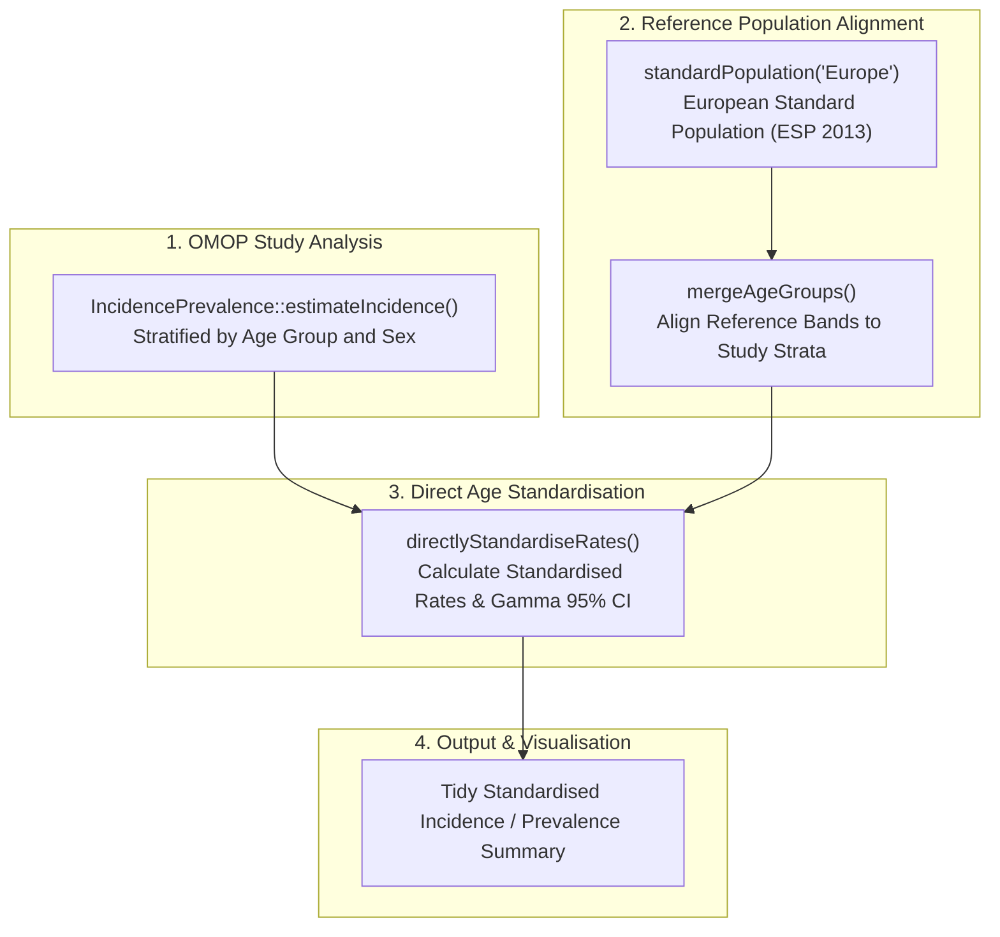

# [EpiStandard](https://oxford-pharmacoepi.github.io/EpiStandard/)
{: .no_toc}

1. TOC
{:toc}

The `EpiStandard` R package provides functions for **direct age standardisation** of epidemiological measures—such as incidence and prevalence rates—enabling valid comparisons across populations or time periods with differing age structures.

---

## Overview

Crude incidence and prevalence rates can be misleading when comparing different healthcare systems, regions, or historical eras with varying age demographics (for example, comparing an older European population to a younger demographic).

Direct standardisation applies stratum-specific rates observed in a study population to a standard reference population (e.g., European Standard Population [ESP 2013], WHO World Standard, or US Standard), calculating the overall rate that would be observed if the study population had the reference age distribution.

`EpiStandard` is built to work seamlessly with results generated by the DARWIN EU [`IncidencePrevalence`](./IncidencePrevalence) package.

---

## Key Features

- **Direct Standardisation**: Computes directly standardised rates (DSR) with 95% confidence intervals using the Gamma method (Fay & Feuer, 1997).
- **Built-in Reference Populations**: Includes standard population weights for European (`"Europe"` / ESP 2013), World (`"World"` / WHO), and US populations.
- **Dynamic Age Band Merging**: `mergeAgeGroups()` consolidates fine 5-year reference bands into study-specific custom age brackets (e.g. `0-19`, `20-64`, `65+`).
- **Missing Age Group Handling**: Robust imputation and diagnostic handling when specific age strata are unobserved.
- **Standardized Reporting**: Summarizes results into clean, tidy analytical tables.

---

## Installation

Install `EpiStandard` from CRAN or GitHub:

```r
# From CRAN
install.packages("EpiStandard")

# Development version from GitHub
# install.packages("pak")
pak::pkg_install("oxford-pharmacoepi/EpiStandard")
```

---

## Workflow with `IncidencePrevalence`



---

## Usage Example

```r
library(EpiStandard)
library(IncidencePrevalence)
library(omopgenerics)
library(dplyr)

# 0. Load mock CDM reference with incidence data
cdm <- mockIncidencePrevalence(sampleSize = 10000, outPre = 0.25)

# 1. Estimate stratified incidence rates
cdm <- generateDenominatorCohortSet(
  cdm = cdm,
  name = "denominator",
  cohortDateRange = as.Date(c("2010-01-01", "2020-01-01")),
  ageGroup = list(c(0, 19), c(20, 64), c(65, 150)),
  sex = c("Male", "Female"),
  daysPriorObservation = 0
)

inc <- estimateIncidence(
  cdm = cdm,
  denominatorTable = "denominator",
  outcomeTable = "outcome",
  interval = "years"
)

# 2. Prepare tidy incidence data
incidenceTidy <- inc |>
  asIncidenceResult()

# 3. Align European Standard Population to study age groups
standardPop <- mergeAgeGroups(
  standardPopulation("Europe"),
  newGroups = c("0 to 19", "20 to 64", "65 to 150")
) |>
  rename(denominator_age_group = age_group)

# 4. Compute directly standardised incidence rates
standardised_inc <- directlyStandardiseRates(
  data = incidenceTidy,
  refdata = standardPop,
  event = "outcome_count",
  denominator = "person_years",
  age = "denominator_age_group",
  pop = "pop",
  strata = c("incidence_start_date", "denominator_sex", "outcome_cohort_name")
)

standardised_inc |>
  select(incidence_start_date, denominator_sex, crude_rate, standardised_rate, standardised_rate_95CI_lower, standardised_rate_95CI_upper) |>
  glimpse()
```

---

## Main Functions

| Function | Purpose |
| :--- | :--- |
| `directlyStandardiseRates()` | Calculates directly standardised rates (DSR) and 95% confidence intervals using Gamma distribution methods. |
| `standardPopulation()` | Retrieves standard population weights (e.g. `"Europe"` for ESP 2013, `"World"` for WHO 2000-2025). |
| `mergeAgeGroups()` | Aggregates fine-grained reference age bands into broader target age groups. |
