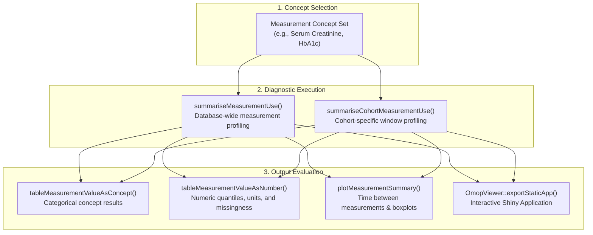

# [MeasurementDiagnostics](https://ohdsi.github.io/MeasurementDiagnostics/)
{: .no_toc}

1. TOC
{:toc}

The `MeasurementDiagnostics` R package provides diagnostic tools to evaluate how laboratory tests, vital signs, and clinical measurements are recorded, structured, and distributed in Observational Medical Outcomes Partnership (OMOP) Common Data Model (CDM) databases.

---

## Overview

Clinical measurements and laboratory findings (e.g., HbA1c, serum creatinine, blood pressure, spirometry) are critical for defining baseline severity, inclusion criteria, and disease progression endpoints. However, measurement data in observational databases often exhibit challenges such as missing values, inconsistent units of measure, mixed recording formats (numeric vs. concept-based categories), and extreme outliers.

`MeasurementDiagnostics` evaluates:
1. **Measurement Utilization**: Overall volume, patient coverage, and time interval between repeated measurements.
2. **Numeric Value Distributions**: Quantile distributions (median, IQR, 1st/99th percentiles), unit consistency, and missingness rates.
3. **Categorical / Concept Values**: Frequencies and distributions of qualitative results (`value_as_concept_id`).
4. **Temporal Timing**: Temporal positioning of measurements relative to cohort index dates (baseline lookback vs. follow-up).

---

## Key Features

- **Database-Wide or Cohort-Specific Diagnostics**: Run diagnostics across the entire CDM (`summariseMeasurementUse`) or restrict evaluation to specific study cohorts (`summariseCohortMeasurementUse`).
- **Comprehensive Unit & Range Profiling**: Identifies aberrant units, extreme outliers, and non-numeric value encodings.
- **Publication-Ready Tables & Figures**: Generates standardized GT/Flextable tables and ggplot2 boxplots and histograms.
- **Interactive Shiny App Integration**: Export directly into interactive exploration applications via [`OmopViewer`](./OmopViewer).

---

## Installation

Install `MeasurementDiagnostics` from CRAN or GitHub:

```r
# From CRAN
install.packages("MeasurementDiagnostics")

# Development version from GitHub
# install.packages("pak")
pak::pkg_install("ohdsi/MeasurementDiagnostics")
```

---

## Diagnostic Workflow



---

## Usage Example

```r
library(CDMConnector)
library(MeasurementDiagnostics)
library(dplyr)

# 0. Connect to OMOP CDM database
con <- DBI::dbConnect(duckdb::duckdb(), eunomiaDir("GiBleed"))
cdm <- cdmFromCon(con, cdmSchema = "main", writeSchema = "main")

# 1. Define measurement concept set (e.g., Hemoglobin concepts)
hb_codes <- list(hemoglobin = c(3000963L, 3004501L, 3010813L))

# 2. Run diagnostic summary stratified by sex
hb_diag <- summariseMeasurementUse(
  cdm = cdm,
  codes = hb_codes,
  bySex = TRUE
)

# 3. Render numeric value summary table
tableMeasurementValueAsNumber(
  result = hb_diag,
  type = "gt"
)

# 4. Render categorical concept summary table
tableMeasurementValueAsConcept(
  result = hb_diag,
  type = "gt"
)

# 5. Plot measurement distribution
plotMeasurementSummary(
  result = hb_diag,
  x = "sex",
  colour = "sex"
)
```

---

## Main Functions

| Function | Purpose |
| :--- | :--- |
| `summariseMeasurementUse()` | Summarizes measurement frequency, numeric value distributions, and categorical values across the entire database. |
| `summariseCohortMeasurementUse()` | Restricts measurement diagnostics to a specific study cohort within defined observation windows. |
| `tableMeasurementValueAsNumber()` | Formats numeric value distributions (median, IQR, ranges, missingness) into publication tables. |
| `tableMeasurementValueAsConcept()` | Formats categorical / qualitative measurement concept values into publication tables. |
| `plotMeasurementSummary()` | Generates ggplot2 visualizations of measurement frequencies and time-between-test intervals. |
