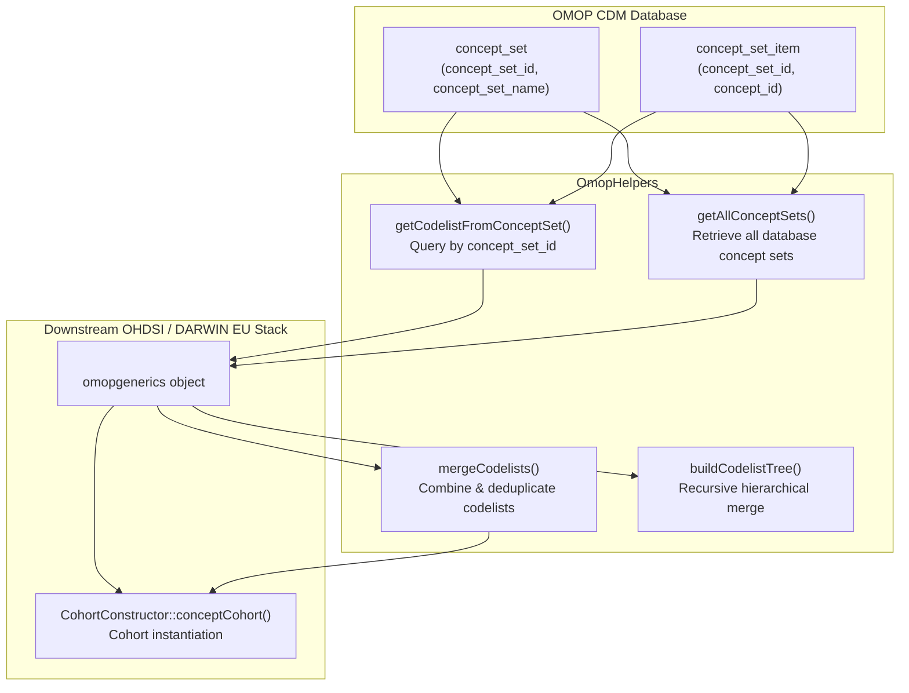

# [OmopHelpers](https://github.com/iomedhealth/OmopHelpers)
{: .no_toc}

1. TOC
{:toc}

The `OmopHelpers` R package provides utility functions for working with OHDSI OMOP Common Data Model (CDM) data. It specializes in **in-database concept set retrieval**, allowing analysts to pull database-managed concept sets directly into formal `omopgenerics::codelist` objects, merge and tree-structure codelists, and generate measurement distribution plots.

---

## Overview

In many institutional OMOP CDM environments, clinical concept sets are defined and maintained centrally within database tables (`concept_set` and `concept_set_item`) rather than external JSON or CSV files. 

`OmopHelpers` bridges this workflow by:
1. **In-Database Concept Extraction**: Querying database concept set tables directly and returning formal `omopgenerics::newCodelist()` objects.
2. **Codelist Merging & Deduplication**: Combining multiple codelist objects into unified concept sets.
3. **Hierarchical Concept Trees**: Recursively traversing and merging nested concept set hierarchies.
4. **Baseline Measurement Visualisation**: Plotting distributions (histograms and density plots) of clinical lab values.

---

## Key Features

- **Direct In-Database Concept Resolution**: Extracts concept sets by `concept_set_id` or pulls all database concept sets via SQL joins.
- **Formal Class Compliance**: Outputs formal `<codelist>` objects fully compatible with `CohortConstructor::conceptCohort()`.
- **Hierarchical Tree Building**: Traverses nested semantic categories and injects merged codelists at each level.
- **Tidy Name Sanitization**: Cleans and normalizes concept set names into standard `snake_case` identifiers.
- **Measurement Profiling**: Visualizes baseline laboratory distributions with optional stratification.

---

## Installation

Install `OmopHelpers` from GitHub:

```r
# install.packages("pak")
pak::pkg_install("iomedhealth/OmopHelpers")
```

---

## Methodological Architecture



---

## Getting Started

### 1. Retrieve a Codelist from the Database

Extract a concept set stored in the database by its `concept_set_id`:

```r
library(DBI)
library(duckdb)
library(CDMConnector)
library(CohortConstructor)
library(OmopHelpers)

# Connect to database
con <- DBI::dbConnect(duckdb::duckdb(), eunomiaDir("GiBleed"))
cdm <- cdmFromCon(con, cdmSchema = "main", writeSchema = "main")

# Pull concept set #123 directly from database tables
asthma_codelist <- getCodelistFromConceptSet(
  conceptSetId = 123,
  con = con,
  cdmSchema = "main"
)

# Instantiate cohort with CohortConstructor
cdm$asthma <- cdm |>
  conceptCohort(
    conceptSet = asthma_codelist,
    name = "asthma"
  )
```

### 2. Retrieve All Database Concept Sets

Extract all concept sets defined in the database as a named list of `<codelist>` objects:

```r
# Fetch all database-defined concept sets
all_codelists <- getAllConceptSets(
  con = con,
  cdmSchema = "main"
)

# Inspect retrieved codelist names
names(all_codelists)
```

### 3. Merge Multiple Codelists

Combine separate codelists into a unified treatment or condition definition:

```r
# Merge beta-blockers and CCBs into a single first-line therapy codelist
first_line_therapy <- mergeCodelists(
  beta_blockers_codes,
  ccb_codes,
  newName = "first_line_therapy"
)
```

### 4. Plot Baseline Measurement Distributions

Plot baseline laboratory distributions (e.g. HbA1c or cholesterol) across study cohorts:

```r
# Plot baseline measurement distribution
plotMeasurementDistribution(
  data = patient_data,
  variable = "hba1c",
  variableDisplay = "HbA1c (%)",
  plotTitle = "Baseline HbA1c Distribution",
  plotType = "histogram",
  strata = "cohort_name",
  bins = 30
)
```

---

## Main Functions

| Function | Purpose |
| :--- | :--- |
| `getCodelistFromConceptSet(conceptSetId, con, cdmSchema)` | Queries database `concept_set` and `concept_set_item` tables to return a formal `omopgenerics::codelist`. |
| `getAllConceptSets(con, cdmSchema)` | Retrieves all concept sets from database tables into a named list of `<codelist>` objects. |
| `mergeCodelists(..., newName)` | Combines multiple `codelist` objects, deduplicating concept IDs into a single new `codelist`. |
| `buildCodelistTree(node, node_name)` | Recursively gathers concept IDs across nested hierarchies and injects `$merged` codelist objects. |
| `clean_name(name_string)` | Cleans and formats strings into standardized snake_case identifiers. |
| `process_codelists(codelist_vector)` | Normalizes and sanitizes names across a list or vector of codelist objects. |
| `plotMeasurementDistribution(data, variable, ...)` | Generates customizable ggplot2 histogram or density plots for baseline measurement variables. |
