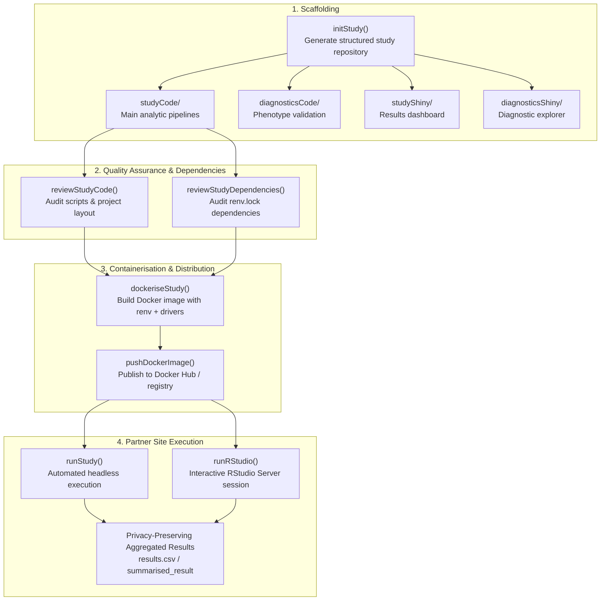

# [OmopStudyBuilder](https://oxford-pharmacoepi.github.io/OmopStudyBuilder/)
{: .no_toc}

1. TOC
{:toc}

The `OmopStudyBuilder` R package streamlines the development, quality assurance, containerization, and execution of distributed network studies across OMOP Common Data Model (CDM) databases. It scaffolds opinionated, production-ready study directories aligned with [OxInfer](https://oxford-pharmacoepi.github.io/Oxinfer/onboarding/code_review.html) and DARWIN EU best practices.

---

## Overview

In multi-center federated health data networks, distributed studies require standardized analytical packages that run reliably across disparate IT infrastructures. 

`OmopStudyBuilder` automates the entire study package lifecycle:
1. **Scaffolding (`initStudy`)**: Generates structured study repositories separating execution scripts, phenotype diagnostics, and interactive exploration apps.
2. **Review & Quality Control (`reviewStudyCode`, `reviewStudyDependencies`)**: Audits file structures, scripts, and `renv.lock` dependency trees before distribution.
3. **Reproducible Execution (`dockeriseStudy`, `runStudy`, `runRStudio`)**: Packages study code into Docker containers with lockfile dependencies and database drivers for automated batch runs or interactive RStudio Server analysis.

---

## Architecture & Lifecycle



---

## Installation

Install `OmopStudyBuilder` from CRAN or GitHub:

```r
# From CRAN
install.packages("OmopStudyBuilder")

# Development version from GitHub
# install.packages("pak")
pak::pkg_install("oxford-pharmacoepi/OmopStudyBuilder")
```

---

## Workflow Guide

### 1. Initializing a Study Project

The `initStudy()` function creates a complete, standardized folder hierarchy for your study:

```r
library(OmopStudyBuilder)

# Initialize a new study directory
initStudy("MyOmopStudy")
```

#### Generated Project Structure

```text
MyOmopStudy/
├── INSTRUCTIONS.md
├── README.md
├── studyCode/                          # Main analytical study subproject
│   ├── studyCode.Rproj
│   ├── codeToRun.R                     # Database connection & credentials
│   ├── runStudy.R                      # Main pipeline orchestrator
│   ├── cohorts/
│   │   └── instantiateCohorts.R        # Cohort definitions & concept sets
│   ├── analyses/
│   │   ├── cohortCharacteristics.R
│   │   ├── incidencePrevalence.R
│   │   ├── drugUtilisation.R
│   │   └── cohortSurvival.R
│   ├── codelist/
│   │   └── codelistCreation.R
│   └── results/                        # Exported summarised_result CSVs
├── diagnosticsCode/                    # Phenotype validation subproject
│   ├── diagnosticsCode.Rproj
│   ├── codeToRun.R
│   ├── runStudy.R
│   └── cohorts/
├── studyShiny/                         # Standalone Shiny dashboard for results
│   ├── studyShiny.Rproj
│   └── README.md
└── diagnosticsShiny/                   # Minimal Shiny app for phenotype diagnostics
    ├── diagnosticsShiny.Rproj
    └── README.md
```

#### Scaffolding Options

You can selectively generate diagnostics-only or study-only projects:

```r
# Diagnostics-only project
initStudy("PhenotypeCheck", diagnostics = TRUE, study = FALSE)

# Main study-only project
initStudy("AnalysisOnly", diagnostics = FALSE, study = TRUE)
```

---

### 2. Dependency Management & Code Review

Once study code and cohorts are implemented, freeze the package environment with `renv` and review the package integrity:

```r
# 1. Initialize and snapshot dependencies
renv::init("./MyOmopStudy/studyCode")
renv::snapshot("./MyOmopStudy/studyCode")

# 2. Inspect study files and scripts
reviewStudyCode("./MyOmopStudy/studyCode")

# 3. Audit dependencies in renv.lock
reviewStudyDependencies(
  dir = "./MyOmopStudy/studyCode",
  type = "analysis"
)
```

---

### 3. Containerisation with Docker

Package the entire study environment (exact R version, locked packages, database drivers, and analytical code) into a standalone Docker image:

```r
# Build Docker image
dockeriseStudy(
  image_name = "my-omop-network-study",
  path = "./MyOmopStudy/studyCode",
  useRStudio = TRUE
)

# Optional: Push image to Docker Hub for data partner distribution
pushDockerImage(
  image_name = "my-omop-network-study",
  repo = "myorg/my-omop-network-study"
)
```

---

### 4. Executing at Partner Sites

Data partners can execute the study container using either interactive or automated modes:

#### Interactive Execution (RStudio Server)
Spins up RStudio Server inside the container and opens the browser interface for the analyst:

```r
library(OmopStudyBuilder)

runRStudio(
  image_name = "myorg/my-omop-network-study:latest",
  results_path = "./results"
)
```

#### Automated Headless Execution
Runs `codeToRun.R` directly and pipes execution logs back to the console:

```r
runStudy(
  image_name = "myorg/my-omop-network-study:latest",
  results_path = "./results",
  data_path = "/path/to/cdm/duckdb",
  script_path = "codeToRun.R"
)

# Stop container when complete
stopStudy(image_name = "myorg/my-omop-network-study:latest")
```

---

## Main Functions

| Function | Description |
| :--- | :--- |
| `initStudy()` | Scaffolds a complete study repository with `studyCode/`, `diagnosticsCode/`, and Shiny subdirectories. |
| `reviewStudyCode()` | Summarizes and audits the files and script structure in a study directory. |
| `reviewStudyDependencies()` | Audits the `renv.lock` dependency hierarchy against expected study profiles. |
| `dockeriseStudy()` | Builds a reproducible Docker image containing R, `renv` dependencies, system drivers, and study code. |
| `runRStudio()` | Launches an interactive RStudio Server instance in a Docker container connected to local results storage. |
| `runStudy()` | Executes a study script non-interactively in Docker with real-time log streaming. |
| `stopStudy()` | Stops running Docker containers instantiated by `runRStudio` or `runStudy`. |
| `pushDockerImage()` | Tags and pushes a built study container image to a remote Docker registry. |
