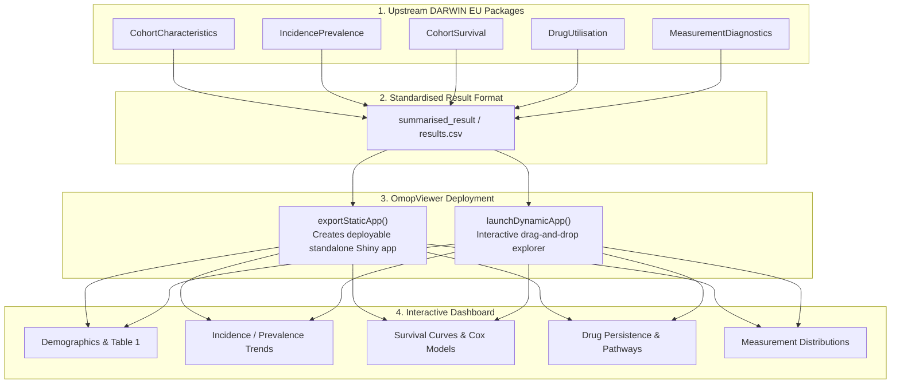

# [OmopViewer](https://ohdsi.github.io/OmopViewer/)
{: .no_toc}

1. TOC
{:toc}

The `OmopViewer` R package provides automated tools to build and deploy interactive **R Shiny applications** for visualizing, exploring, and sharing standardized study results formatted as `<summarised_result>` objects across the DARWIN EU and OHDSI ecosystems.

---

## Overview

In multi-center observational research, sharing raw patient-level data is prohibited by data privacy regulations (such as GDPR and HIPAA). Instead, research networks export aggregated, privacy-preserving `<summarised_result>` data objects.

`OmopViewer` transforms these standardized summary results into interactive, web-based graphical dashboards without requiring manual Shiny coding. It provides two complementary operational modes:

1. **Static Shiny App (`exportStaticApp`)**: Generates a self-contained, customizable Shiny project directory pre-populated with study results, ready for hosting on Shiny Server, Posit Connect, or shinyapps.io.
2. **Dynamic Shiny App (`launchDynamicApp`)**: Launches an interactive dashboard where users can upload any `results.csv` or zipped bundle of `summarised_result` outputs and explore tables and interactive figures on the fly.

---

## Key Features

- **Standardized Result Compatibility**: Native support for results from `CohortCharacteristics`, `IncidencePrevalence`, `CohortSurvival`, `DrugUtilisation`, `MeasurementDiagnostics`, `PhenotypeR`, and `visOmopResults`.
- **Zero-Code Application Generation**: Automatically creates UI, server, and preprocessing files for all recognized result types.
- **Custom Theming & Branding**: Supports custom organization logos, `bslib` Bootstrap themes, title customization, and Markdown landing pages (`background.md`).
- **Granular Panel Navigation**: Configurable panel hierarchies, dropdown menus, and result filters.
- **Privacy Compliant**: Visualizes only aggregated, de-identified summary estimates and suppresses small cell counts according to network minimum thresholds.

---

## Installation

Install `OmopViewer` from CRAN or GitHub:

```r
# From CRAN
install.packages("OmopViewer")

# Development version from GitHub
# install.packages("pak")
pak::pkg_install("ohdsi/OmopViewer")
```

---

## Operational Architecture



---

## Usage Examples

### 1. Generating a Static Deployable Shiny App

Combine multiple study results and export a complete Shiny project:

```r
library(CohortCharacteristics)
library(IncidencePrevalence)
library(OmopViewer)
library(omopgenerics)

# 0. Generate study results
cdm <- mockCohortCharacteristics()
char_res <- summariseCharacteristics(cdm$cohort1)
attr_res <- summariseCohortAttrition(cdm$cohort1)

# 1. Combine into a single result set
study_results <- bind(char_res, attr_res)

# 2. Export complete standalone Shiny app to a target directory
exportStaticApp(
  result = study_results,
  directory = "./study_shiny_dashboard",
  title = "Observational Study Results Dashboard",
  theme = "cerulean"
)
```

The exported directory contains:
- `ui.R` and `server.R`: Complete application logic.
- `global.R`: Package loading and initialization.
- `data/result.csv`: Privacy-preserving aggregated result table.
- `data/studyData.RData`: Preprocessed application data cache.

### 2. Launching the Dynamic Upload Viewer

Launch a local dashboard to inspect any study results file:

```r
library(OmopViewer)

# Launch dynamic interactive explorer
launchDynamicApp()
```

---

## Main Functions

| Function | Purpose |
| :--- | :--- |
| `exportStaticApp()` | Generates a standalone, deployable Shiny application folder from one or more `summarised_result` objects. |
| `launchDynamicApp()` | Launches an interactive Shiny application in your browser allowing drag-and-drop upload and visualization of arbitrary OMOP study results. |
