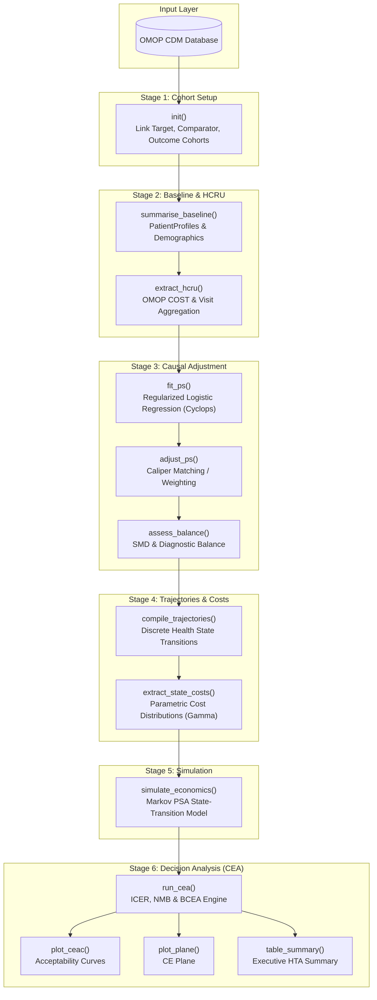

# [HERMES](https://github.com/iomedhealth/hermes)
{: .no_toc}

1. TOC
{:toc}

The `HERMES` (**H**ealth **E**conomic **R**esource **M**odeling & **E**valuation **S**ystem) R package provides a unified, pipeline-friendly interface for Real-World Evidence (RWE) and Health Economics and Outcomes Research (HEOR). It streamlines Healthcare Resource Utilization (HCRU) analysis and Cost-Effectiveness Analysis (CEA) directly on data mapped to the OMOP Common Data Model (CDM).

## Overview

Traditional health economic models often require manual aggregation and ad-hoc data transformations from clinical registries. `HERMES` establishes a standardized, reproducible bridge between the OMOP Common Data Model and Health Technology Assessment (HTA) decision models.

### Key Features:
- **OMOP CDM Native**: Directly integrates with the OMOP database architecture using [`CDMConnector`](https://darwin-eu.github.io/CDMConnector/) and [`omopgenerics`](https://darwin-eu.github.io/omopgenerics/).
- **Native OMOP `COST` Table Integration**: Automatically queries and aggregates direct medical expenditures and resource utilization from the OMOP `cost` and `visit_occurrence` tables.
- **End-to-End 6-Stage Pipeline**: Modular workflow from cohort initialization to causal adjustment, Markov state-transition simulation, and decision-analytic curves.
- **Causal Confounder Adjustment**: Accounts for baseline imbalances between treatment and comparator arms using regularized high-dimensional propensity scores via [`Cyclops`](https://ohdsi.github.io/Cyclops/).
- **Decision-Analytic Outputs**: Produces Cost-Effectiveness Acceptability Curves (CEAC), Incremental Cost-Effectiveness Ratios (ICER), Net Monetary Benefit (NMB), and CE Planes powered by [`BCEA`](https://giabaio.github.io/BCEA/).

---

## Installation

You can install the development version of `HERMES` from GitHub:

```r
# install.packages("remotes")
remotes::install_github("iomedhealth/hermes")
```

---

## The Rosetta Stone: OMOP to HEOR Mapping

`HERMES` maps standard OHDSI clinical conventions to health economic evaluation concepts:

| OMOP / OHDSI Concept | HEOR / CEA Concept | HERMES Stage |
| :--- | :--- | :--- |
| **Target Cohort** (e.g., new users of Drug A) | **Treatment Arm** (The new intervention) | Stage 1 (`init`) |
| **Comparator Cohort** (e.g., new users of Drug B) | **Standard of Care Arm** (The baseline intervention) | Stage 1 (`init`) |
| **Outcome Cohorts** (e.g., clinical events) | **Health States / Clinical Endpoints** (Markov states) | Stage 1 & 4 (`init`, `compile_trajectories`) |
| **Baseline Demographics & Covariates** | **Confounders & Patient Profiles** (PS Matching) | Stage 2 & 3 (`summarise_baseline`, `fit_ps`) |
| **`COST` & `VISIT_OCCURRENCE` Tables** | **HCRU & Direct Medical Expenditures** (ICER numerator) | Stage 2 & 4 (`extract_hcru`, `extract_state_costs`) |

---

## System Architecture

The package enforces a strict 6-stage analytical pipeline:



---

## Getting Started

The following complete example demonstrates how to run the end-to-end HERMES pipeline using DuckDB and the synthetic `Eunomia` dataset.

```r
library(HERMES)
library(CDMConnector)
library(CohortConstructor)
library(dplyr)

# 0. Connect to OMOP CDM database (Eunomia)
con <- DBI::dbConnect(duckdb::duckdb(), CDMConnector::eunomiaDir("GiBleed"))
cdm <- CDMConnector::cdmFromCon(con, cdmSchema = "main", writeSchema = "main")

# 1. Instantiate Study Cohorts
cdm$target_cohort <- conceptCohort(cdm, list(target_cohort = 4285898L), "target_cohort")
cdm$comparator_cohort <- conceptCohort(cdm, list(comparator_cohort = 4266809L), "comparator_cohort")
cdm$outcome_cohort <- conceptCohort(cdm, list(outcome_cohort = 192671L), "outcome_cohort")

# 2. Run the 6-Stage Pipeline
study <- init(
  cdm = cdm,
  target_cohort = "target_cohort",
  comparator_cohort = "comparator_cohort",
  outcome_cohort = "outcome_cohort"
) |>
  summarise_baseline() |>
  extract_hcru(
    baseline_window = c(-365, -1),
    followup_window = c(0, 365),
    cost_field = "total_paid"
  ) |>
  fit_ps() |>
  adjust_ps(caliper = 0.2) |>
  compile_trajectories() |>
  simulate_economics(
    time_horizon = 10,
    discount_rate = 0.03,
    n_samples = 500
  ) |>
  run_cea()

# 3. Generate Decision-Analytic Visuals
plot_ceac(study)
plot_plane(study)
table_summary(study)
```

---

## Core Stages in Detail

### Stage 1: Cohort Setup & Initialization (`init`)
Validates that the target, comparator, and outcome cohort tables exist in the CDM reference and computes initial cohort record and subject counts via `omopgenerics::cohortCount()`.

### Stage 2: Baseline & HCRU Extraction (`summarise_baseline`, `extract_hcru`)
- **`summarise_baseline()`**: Computes unadjusted baseline demographic characteristics (age, sex, prior observation) using `PatientProfiles` and `CohortCharacteristics`.
- **`extract_hcru()`**: Extracts utilization counts across five domains:
  1. *Inpatient & ICU*: Admissions, length of stay (LOS), 30/90-day readmissions.
  2. *Outpatient & Emergency*: Emergency room visits, GP visits, specialist consultations.
  3. *Pharmacotherapy*: Prescription fill counts, total days supply, Proportion of Days Covered (PDC).
  4. *Procedures & Diagnostics*: Procedure counts and laboratory measurement volume.
  5. *Post-Acute Care*: Skilled nursing facility (SNF), hospice, and rehabilitation stays.
  6. *Financial Linkage*: Aggregates direct medical expenditures (`total_paid`, `total_charge`) linked to clinical events from the OMOP `cost` table.

### Stage 3: Causal Propensity Score Adjustment (`fit_ps`, `adjust_ps`, `assess_balance`)
- **`fit_ps()`**: Fits regularized logistic regression models using `Cyclops` to estimate individual propensity scores $P(\text{Treatment} \mid X)$.
- **`adjust_ps()`**: Performs greedy nearest-neighbor caliper matching or IPTW weighting to construct balanced comparative cohorts.
- **`assess_balance()`**: Computes pre- and post-adjustment Standardized Mean Differences (SMD) to confirm balance across baseline covariates.

### Stage 4: Trajectory Compilation & State Costs (`compile_trajectories`, `extract_state_costs`)
- **`compile_trajectories()`**: Slices longitudinal patient histories into uniform time cycles (e.g., 30-day cycles) and derives empirical transition probability matrices between health states (`State_Baseline` $\rightarrow$ `State_Outcome`).
- **`extract_state_costs()`**: Fits parametric cost distributions (e.g., Gamma, Log-Normal) and assigns health-state specific expenditures.

### Stage 5: Economic Simulation (`simulate_economics`)
Runs a Markov state-transition Probabilistic Sensitivity Analysis (PSA). At each iteration:
- Transition probabilities are drawn from Dirichlet/Gamma distributions.
- State costs are sampled from Gamma distributions.
- Health state utilities are sampled from Beta distributions.
- Future costs and QALYs are accumulated and discounted at a chosen annual rate (e.g., 3%).

### Stage 6: Decision Analysis & CEA (`run_cea`, `plot_*`)
Wraps `BCEA` to calculate:
- **Incremental Cost-Effectiveness Ratio (ICER)**: $\Delta \text{Cost} / \Delta \text{QALY}$.
- **Net Monetary Benefit (NMB)**: $\text{NMB}(k) = k \cdot \Delta E - \Delta C$ across willingness-to-pay ($k$) thresholds.
- **Visualizations**: Cost-Effectiveness Acceptability Curve (`plot_ceac`) and Cost-Effectiveness Plane (`plot_plane`).

---

## API Reference

### Main Functions

| Stage | Function | Purpose |
| :--- | :--- | :--- |
| **Stage 1** | `init()` | Initialize a `hermes_study` object with target, comparator, and outcome cohorts. |
| **Stage 2** | `summarise_baseline()` | Generate baseline demographic and comorbidity summary tables. |
| **Stage 2** | `extract_hcru()` | Extract healthcare utilization counts and link OMOP `cost` records. |
| **Stage 3** | `fit_ps()` | Fit high-dimensional regularized logistic regression for propensity scores. |
| **Stage 3** | `adjust_ps()` | Apply greedy caliper matching or weighting to balance cohorts. |
| **Stage 3** | `assess_balance()` | Compute Standardized Mean Differences (SMD) and diagnostic balance. |
| **Stage 4** | `compile_trajectories()` | Build discrete Markov health-state transition matrices. |
| **Stage 4** | `extract_state_costs()` | Estimate state-specific cost distributions and health utilities. |
| **Stage 5** | `simulate_economics()` | Run Markov state-transition Probabilistic Sensitivity Analysis (PSA). |
| **Stage 6** | `run_cea()` | Execute Bayesian Cost-Effectiveness Analysis (BCEA) and calculate ICER/NMB. |
| **Reporting** | `plot_ceac()` | Generate the Cost-Effectiveness Acceptability Curve plot. |
| **Reporting** | `plot_plane()` | Generate the Cost-Effectiveness Plane scatter plot. |
| **Reporting** | `table_summary()` | Produce an executive summary table of expected costs, QALYs, and ICER. |
