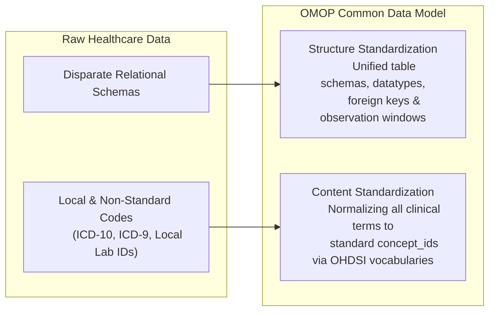
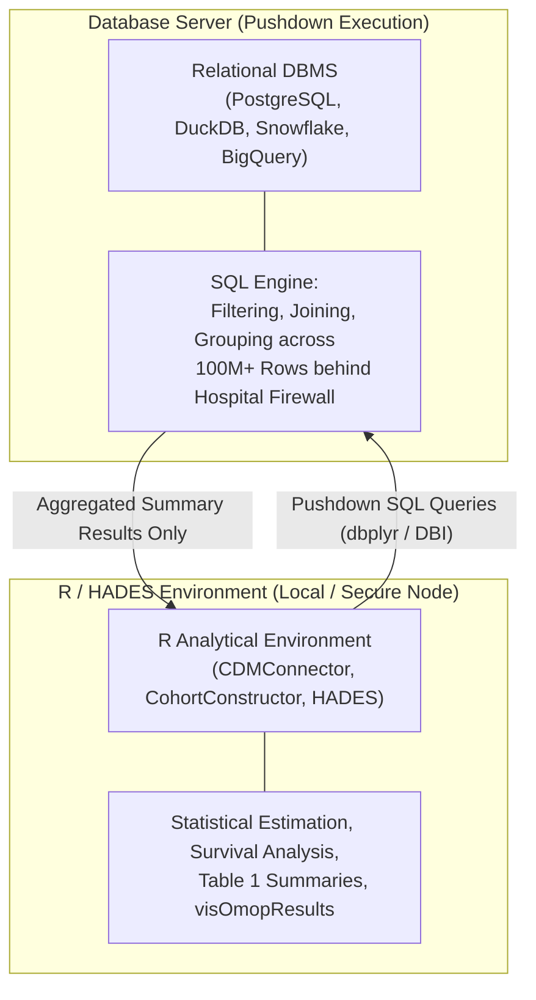
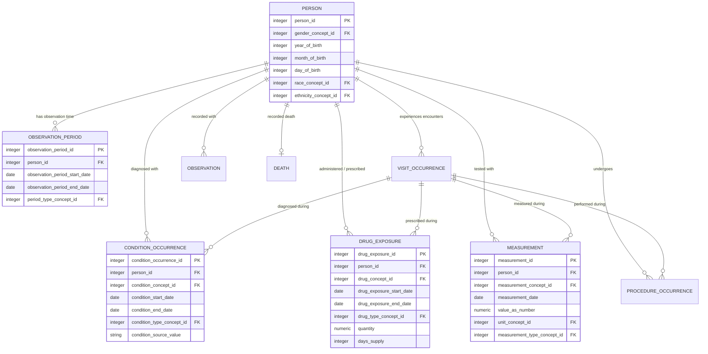
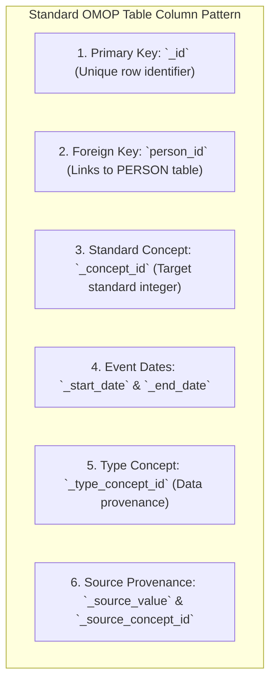
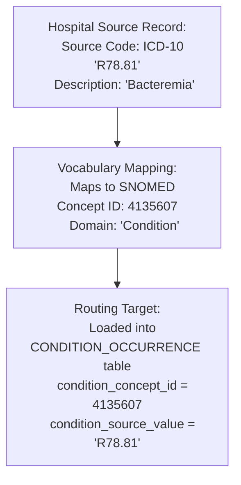

# OMOP CDM Architecture & Domain Models
{: .no_toc }

The Observational Medical Outcomes Partnership (OMOP) Common Data Model (CDM) is an open-community relational database schema designed to standardize both the structure and the semantic content of disparate observational health records.

1. TOC
{:toc}

## 1. Dual Standardization: Structure and Content

Traditional electronic health record (EHR) and claims systems store data in proprietary, departmental formats. The OMOP CDM achieves universal interoperability through two complementary layers:

1.  **Structure Standardization:** Enforces uniform table definitions, column names, data types, and entity relationships across all databases.
2.  **Content Standardization:** Represents all clinical entities (diagnoses, medications, lab tests, procedures) using globally unique standard **`concept_id`** integers derived from authoritative reference terminologies (SNOMED CT, RxNorm, LOINC, UCUM).

### OMOP CDM Versions
*   **OMOP CDM v5.4:** The current authoritative global benchmark used across OHDSI and DARWIN EU network studies.
*   **OMOP CDM v5.3:** Widely deployed legacy version; fully forward-compatible with v5.4 tooling.
*   **Specifications:** Complete schema DDLs and data dictionary specifications are maintained on GitHub at [OHDSI/CommonDataModel](https://ohdsi.github.io/CommonDataModel/cdm54.html).

## 2. Relational Database Foundations & SQL/R Synergy

Observational health analytics leverages the complementary strengths of relational Database Management Systems (DBMS) and statistical computing environments:

*   **SQL (In-Database Computation):** Executes compute-heavy cohort filtering, temporal joins, and aggregations directly on database engines containing billions of rows without moving patient-level data into client memory.
*   **R (Statistical Analysis & Reporting):** Orchestrates study pipelines, calculates adjusted effect estimates (propensity score matching, Cox regression), and formats publication tables and figures.

## 3. Core CDM v5.4 Clinical Tables

The OMOP CDM is strictly **patient-centric**. All clinical events are linked to a single master record in the `PERSON` table:

### 3.1 Primary Clinical Domain Tables

| Table | Domain Description | Standard Reference Vocabulary | Key Identifier & Concept Column |
| :--- | :--- | :--- | :--- |
| **`PERSON`** | Unique patient demographics, sex, birth date, race, ethnicity | OMOP Gender / Race | `person_id`, `gender_concept_id` |
| **`OBSERVATION_PERIOD`** | Valid longitudinal time spans with verifiable healthcare recording | OMOP Type Concepts | `observation_period_id`, `person_id` |
| **`VISIT_OCCURRENCE`** | Healthcare encounters (inpatient admission, outpatient clinic, emergency room) | OMOP Visit | `visit_occurrence_id`, `visit_concept_id` |
| **`CONDITION_OCCURRENCE`** | Diagnoses, medical signs, symptoms, and clinical findings | SNOMED CT | `condition_occurrence_id`, `condition_concept_id` |
| **`DRUG_EXPOSURE`** | Inpatient administrations, prescriptions, and pharmacy dispensations | RxNorm / RxNorm Extension | `drug_exposure_id`, `drug_concept_id` |
| **`MEASUREMENT`** | Structured laboratory tests, vital signs, quantitative assays, and histology | LOINC, SNOMED CT, UCUM | `measurement_id`, `measurement_concept_id` |
| **`PROCEDURE_OCCURRENCE`** | Surgical operations, diagnostic procedures, radiology imaging, and therapy | SNOMED CT, CPT-4, ICD-10-PCS | `procedure_occurrence_id`, `procedure_concept_id` |
| **`OBSERVATION`** | Clinical facts not fitting other domains (social history, allergies, lifestyle) | SNOMED CT | `observation_id`, `observation_concept_id` |
| **`DEATH`** | Date and cause of death | SNOMED CT | `person_id`, `cause_concept_id` |

## 4. Standard Column Conventions

Every event table in the OMOP CDM follows a consistent, predictable column naming convention:

### The Role of `_type_concept_id`
The `_type_concept_id` field records the **provenance** (provenance mechanism) of each record:
*   *EHR problem list diagnosis* (`concept_id = 32840`)
*   *Inpatient hospital discharge diagnosis* (`concept_id = 32817`)
*   *Billing claim primary diagnosis* (`concept_id = 32810`)
*   *Physician prescription written* (`concept_id = 38000177`)
*   *Pharmacy dispensation record* (`concept_id = 38000175`)

This allows researchers to differentiate between a confirmed physician discharge diagnosis and an unadjudicated outpatient billing code.

## 5. Domain Routing & Content Normalization Example

In OMOP, the destination table for a clinical event is determined by the **domain** of the standard mapped concept, not the original source table.

### Detailed Example: Laboratory Measurement
Consider a laboratory test result: **Hemoglobin in Blood = 9.0 g/dL**

In the OMOP `MEASUREMENT` table, this event is normalized into standard structural and content fields:

| Column | Value | Semantic Meaning | Reference Standard |
| :--- | :--- | :--- | :--- |
| `measurement_id` | `104859` | Unique record identifier | Primary Key |
| `person_id` | `243` | Patient ID | Foreign Key to `PERSON` |
| `measurement_concept_id` | **`3000963`** | *Hemoglobin [Mass/volume] in Blood* | LOINC (`718-7`) |
| `measurement_date` | `2024-03-15` | Date test specimen was drawn | ISO Date |
| `value_as_number` | `9.0` | Quantitative numeric result | Float |
| `unit_concept_id` | **`8713`** | *gram per deciliter (g/dL)* | UCUM (`g/dL`) |
| `measurement_type_concept_id` | `32856` | *Lab result from Laboratory Information System* | OMOP Type Concept |
| `measurement_source_value` | `"HGB_BLD"` | Original local hospital test code | Local LIS Code |

## References

1. **Overhage JM, Ryan PB, Reich C, Hartzema AG, Stang PE.** (2012). *Validation of a common data model for active safety surveillance research.* Journal of the American Medical Informatics Association, 19(1), 54–60. [doi:10.1136/amiajnl-2011-000376](https://doi.org/10.1136/amiajnl-2011-000376).
2. **OHDSI CDM Working Group.** (2024). *OMOP Common Data Model v5.4 Specifications.* [https://ohdsi.github.io/CommonDataModel/cdm54.html](https://ohdsi.github.io/CommonDataModel/cdm54.html).
3. **Voss EA, Makadia R, Matcho A, et al.** (2015). *Feasibility and utility of mapping heterogeneous electronic health records to the OMOP Common Data Model.* JAMIA, 22(3), 553–561.
