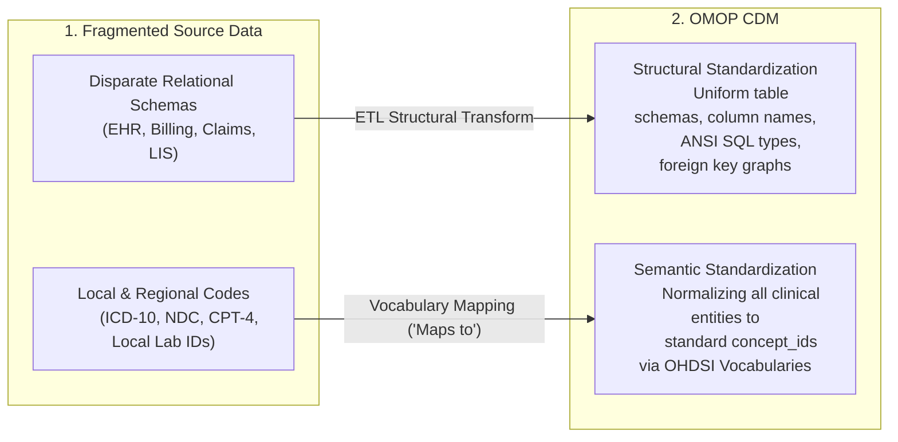
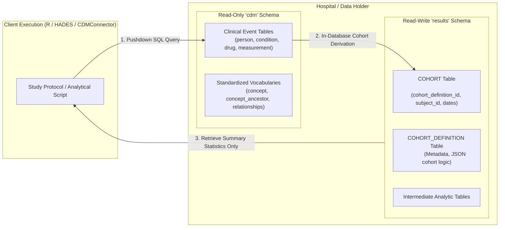
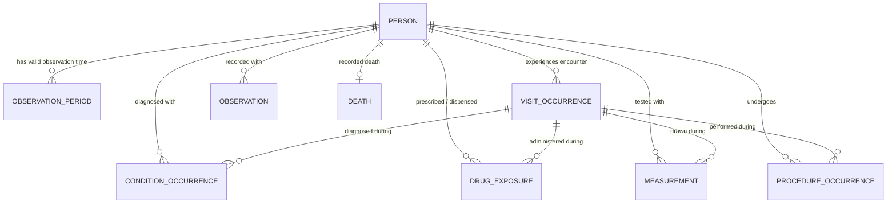
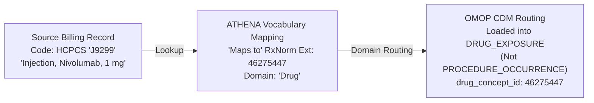
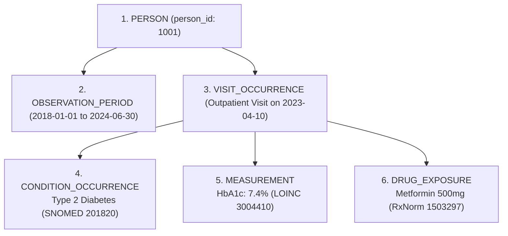

# OMOP CDM Architecture
{: .no_toc }

The Observational Medical Outcomes Partnership (OMOP) Common Data Model (CDM) is an open-community relational database schema maintained by OHDSI. It provides the foundational standard for transforming disparate Electronic Health Record (EHR), administrative claims, and clinical registry data into a universally queryable, privacy-preserving research network.

1. TOC
{:toc}

## 1. The Standardization Contract: Structure and Semantics

Observational healthcare records originate in operational silos—hospital EHRs, regional billing clearinghouses, and laboratory information systems. Each system uses proprietary database schemas, local lab identifiers, and national billing codelists (ICD-9/10, CPT-4, Read, NDC). 

Running direct queries across disparate hospital databases is impossible without a unified standard. The OMOP CDM resolves this through a **dual standardization contract**:



### OHDSI Architectural Tenets

The design of the OMOP CDM is guided by five principles established by the OHDSI community:

*   **Suitability for Analytics:** Unlike transactional clinical systems (OLTP) optimized for single-patient order entry, the CDM is optimized for population-level queries, temporal cohort extraction, and statistical computing.
*   **Patient Privacy & De-identification:** Direct identifiers (names, social security numbers, street addresses) are excluded. Birth dates are decomposed into `year_of_birth`, `month_of_birth`, and `day_of_birth` to balance demographic stratification with privacy regulations.
*   **Strict Domain Partitioning:** Clinical events are grouped into discrete domain tables (`Condition`, `Drug`, `Measurement`, `Procedure`, `Observation`) governed strictly by the target vocabulary definition rather than source billing conventions.
*   **Lossless Source Preservation:** Every record preserves the original source text (`_source_value`) and source concept code (`_source_concept_id`) alongside the standard concept (`_concept_id`), ensuring full auditability.
*   **Technology Neutrality:** Tables are defined using standard ANSI SQL data types (`INTEGER`, `VARCHAR`, `NUMERIC`, `DATE`, `DATETIME`), allowing deployment across PostgreSQL, Snowflake, DuckDB, Google BigQuery, Microsoft SQL Server, and Oracle.

### CDM Specifications
*   **Current Global Benchmark:** OMOP CDM v5.4 ([Official OHDSI Specification](https://ohdsi.github.io/CommonDataModel/cdm54.html)).
*   **Legacy Compatibility:** OMOP CDM v5.3 instances remain forward-compatible with HADES and DARWIN EU analytical packages.

## 2. Federated Schema Topology: `cdm` vs `results`

How is this standardization contract deployed within a hospital or research institute? 

To enable federated "code-to-data" network studies while protecting data integrity, OMOP database instances strictly separate **read-only clinical data** from **read-write analytical workspaces**:



*   **`cdm` Schema (Read-Only):** Contains the 16 clinical event tables, 10 standardized vocabulary tables, and health system metadata. Analytical packages and researchers are granted read-only access.
*   **`results` Schema (Read-Write):** Serves as the researcher's analytical sandbox. Study cohorts generated by tools like ATLAS or R packages (`CohortConstructor`, `CDMConnector`) are written to the standard `COHORT` and `COHORT_DEFINITION` tables here.
*   **Pushdown Execution Model:** Heavy data operations (joining billions of rows, filtering index dates, temporal lookbacks) execute directly inside the database engine. Only aggregated, non-identifiable summary statistics leave the hospital firewall.

## 3. The Relational Core: Person-Centric Modeling

Once the database topology is in place, how does OMOP organize a patient's medical history over time?

The OMOP CDM is strictly **person-centric**. Every clinical observation, encounter, treatment, and test is explicitly linked to a single master row in the `PERSON` table, bounded within an active `OBSERVATION_PERIOD`.



### 3.1 Primary Clinical Domain Tables

| Table | Clinical Domain | Reference Vocabulary | Primary Keys & Concept Columns |
| :--- | :--- | :--- | :--- |
| **`PERSON`** | Demographics, biological sex, birth year/month/day, race, ethnicity | OMOP Gender, Race | `person_id`, `gender_concept_id`, `year_of_birth` |
| **`OBSERVATION_PERIOD`** | Longitudinal time spans with verifiable healthcare recording | OMOP Type Concept | `observation_period_id`, `person_id`, `observation_period_start_date`, `observation_period_end_date` |
| **`VISIT_OCCURRENCE`** | Encounters (inpatient hospitalization, outpatient clinic, emergency room) | OMOP Visit | `visit_occurrence_id`, `person_id`, `visit_concept_id`, `visit_start_date` |
| **`CONDITION_OCCURRENCE`** | Diagnoses, medical signs, symptoms, phenotypes, and clinical findings | SNOMED CT | `condition_occurrence_id`, `condition_concept_id`, `condition_start_date` |
| **`DRUG_EXPOSURE`** | Prescriptions, pharmacy dispensations, inpatient administrations | RxNorm, RxNorm Extension | `drug_exposure_id`, `drug_concept_id`, `drug_exposure_start_date`, `days_supply`, `quantity` |
| **`MEASUREMENT`** | Structured lab results, vital signs, quantitative assays, pathology metrics | LOINC, SNOMED CT | `measurement_id`, `measurement_concept_id`, `value_as_number`, `unit_concept_id` |
| **`PROCEDURE_OCCURRENCE`** | Surgical operations, diagnostic imaging, interventional therapies | SNOMED CT, CPT-4, ICD-10-PCS | `procedure_occurrence_id`, `procedure_concept_id`, `procedure_date` |
| **`OBSERVATION`** | Clinical facts without specialized tables (social history, allergies, lifestyle) | SNOMED CT | `observation_id`, `observation_concept_id`, `observation_date` |
| **`DEVICE_EXPOSURE`** | Implantable devices, prosthetics, durable medical equipment | SNOMED CT | `device_exposure_id`, `device_concept_id`, `device_exposure_start_date` |
| **`DEATH`** | Date and recorded cause of death | SNOMED CT | `person_id`, `death_date`, `cause_concept_id` |

### 3.2 The Critical Role of `OBSERVATION_PERIOD`

In observational epidemiology, absence of data is not proof of absence of disease. The `OBSERVATION_PERIOD` table defines the exact time window during which the database can reliably capture clinical events:

*   **Insurance Claims:** Defined by verifiable enrollment start and plan disenrollment dates.
*   **Hospital EHRs:** Derived from encounter history (e.g., span between first and last recorded clinical interactions, or encounter clusters with defined lookback buffers).
*   **Epidemiological Rigor:** `OBSERVATION_PERIOD` establishes the denominator for incidence and prevalence calculations, guarantees valid baseline covariate lookback windows (e.g., 365 days prior to index), and prevents **immortal time bias**.

## 4. Standard Column Anatomy & Data Provenance

Zooming into individual tables, how does OMOP guarantee that every single row is both globally interoperable and traceable to its raw source?

Every clinical event table adheres to a predictable 5-part column structure:

| Column Slot | Canonical Pattern | Role & Description | Example (`CONDITION_OCCURRENCE`) |
| :--- | :--- | :--- | :--- |
| **Primary Key** | `<domain>_id` | Unique row identifier across the database instance | `condition_occurrence_id = 9001` |
| **Person Link** | `person_id` | Foreign key linking the clinical event to the master record in `PERSON` | `person_id = 1001` |
| **Standard Concept** | `<domain>_concept_id` | Standard concept integer from OHDSI Vocabularies (SNOMED, RxNorm, LOINC) | `condition_concept_id = 201820` (T2D) |
| **Event Dates** | `<domain>_start_date`<br>`<domain>_end_date` | Date boundaries defining the occurrence or active span of the event | `condition_start_date = 2023-04-10`<br>`condition_end_date = NULL` |
| **Provenance Type** | `<domain>_type_concept_id` | Captures the clinical origin and capture mechanism of the record | `condition_type_concept_id = 32840` (EHR problem list) |
| **Source Verbatim** | `<domain>_source_value` | Raw text string or local code as captured in source system | `condition_source_value = "E11.9"` |
| **Source Concept** | `<domain>_source_concept_id` | ATHENA concept ID representing the source code prior to mapping | `condition_source_concept_id = 45567179` |

### Capturing Provenance with `_type_concept_id`

Not all clinical records carry the same diagnostic confidence. The `_type_concept_id` column explicitly records the clinical source mechanism:
*   *Inpatient primary discharge diagnosis:* `32817`
*   *EHR problem list entry:* `32840`
*   *Outpatient billing claim diagnosis:* `32810`
*   *Physician prescription written:* `38000177`
*   *Pharmacy dispensing record:* `38000175`
*   *Laboratory Information System (LIS) automated result:* `32856`

This metadata allows researchers to restrict cohort definitions to high-certainty events (such as primary discharge diagnoses) or broaden sensitivity using all outpatient mentions.

### Handling Unmapped Source Terms (`concept_id = 0`)

When a source code or clinical term cannot be mapped to a standard vocabulary:
*   `<domain>_concept_id` is assigned `0` (Unmapped / Unknown Standard Concept).
*   `<domain>_source_value` retains the verbatim text or local code for ETL debugging.
*   `<domain>_source_concept_id` stores the non-standard concept ID if the source vocabulary exists in ATHENA.

## 5. The Dynamic Domain Routing Engine

A frequent challenge in health data is that source systems record data inconsistently: hospital billing systems often file outpatient chemotherapy drugs under procedure tables, while EHRs might store family medical history as diagnoses.

In the OMOP CDM, the destination table is determined strictly by the **`domain_id`** of the mapped standard concept in the vocabulary, never by the source system table.



### Canonical Domain Routing Rules

| Source Event | Source Terminology | Target Standard Concept | Target Domain | Destination Table |
| :--- | :--- | :--- | :--- | :--- |
| Drug administration in outpatient clinic | HCPCS / CPT-4 (`J9299`) | RxNorm / RxNorm Extension (`46275447`) | `Drug` | **`DRUG_EXPOSURE`** |
| Diagnosis of Diabetes Mellitus | ICD-10-CM (`E11.9`) | SNOMED CT (`201820`) | `Condition` | **`CONDITION_OCCURRENCE`** |
| Laboratory test for HbA1c | Local Lab Code (`GLYC_HB`) | LOINC (`3004410`) | `Measurement` | **`MEASUREMENT`** |
| Family history of colon cancer | ICD-10 (`Z80.0`) | SNOMED CT (`4167217`) | `Observation` | **`OBSERVATION`** |
| Total knee replacement | ICD-10-PCS (`0SRD07Z`) | SNOMED CT (`4133095`) | `Procedure` | **`PROCEDURE_OCCURRENCE`** |

## 6. The Model in Action: Longitudinal Patient Journey

To see how these architectural components harmonize in practice, follow a single patient encounter from raw clinical presentation to multi-table OMOP representation:

**Clinical Scenario:** A 64-year-old male presents for a routine outpatient visit on April 10, 2023. He is diagnosed with Type 2 Diabetes, has his HbA1c measured at 7.4%, and is prescribed a 90-day supply of Metformin 500mg.



### Harmonized Table Records

#### 1. Master Demographics (`PERSON`)
*   `person_id`: `1001`
*   `gender_concept_id`: `8507` (*MALE*)
*   `year_of_birth`: `1960`, `month_of_birth`: `5`, `day_of_birth`: `14`
*   `race_concept_id`: `8527` (*White*), `ethnicity_concept_id`: `38003564` (*Not Hispanic*)

#### 2. Active Observation Window (`OBSERVATION_PERIOD`)
*   `observation_period_id`: `501`
*   `person_id`: `1001`
*   `observation_period_start_date`: `2018-01-01`, `observation_period_end_date`: `2024-06-30`
*   `period_type_concept_id`: `44814724` (*Period covering healthcare encounters*)

#### 3. Outpatient Encounter (`VISIT_OCCURRENCE`)
*   `visit_occurrence_id`: `8001`
*   `person_id`: `1001`
*   `visit_concept_id`: `9202` (*Outpatient Visit*)
*   `visit_start_date`: `2023-04-10`, `visit_end_date`: `2023-04-10`
*   `visit_type_concept_id`: `32810` (*EHR encounter record*)

#### 4. Diagnosis Record (`CONDITION_OCCURRENCE`)
*   `condition_occurrence_id`: `9001`
*   `person_id`: `1001`, `visit_occurrence_id`: `8001`
*   `condition_concept_id`: `201820` (*Diabetes mellitus type 2 - SNOMED 44054006*)
*   `condition_start_date`: `2023-04-10`, `condition_end_date`: `NULL`
*   `condition_type_concept_id`: `32840` (*EHR problem list entry*)
*   `condition_source_value`: `"E11.9"`, `condition_source_concept_id`: `45567179`

#### 5. Laboratory Result (`MEASUREMENT`)
*   `measurement_id`: `7001`
*   `person_id`: `1001`, `visit_occurrence_id`: `8001`
*   `measurement_concept_id`: `3004410` (*HbA1c in Blood - LOINC 4548-4*)
*   `measurement_date`: `2023-04-10`
*   `value_as_number`: `7.4`, `unit_concept_id`: `8554` (*percent - UCUM %*)
*   `measurement_type_concept_id`: `32856` (*Lab result from LIS*)
*   `measurement_source_value`: `"HBA1C_TEST"`

#### 6. Prescription Dispensing (`DRUG_EXPOSURE`)
*   `drug_exposure_id`: `6001`
*   `person_id`: `1001`, `visit_occurrence_id`: `8001`
*   `drug_concept_id`: `1503297` (*Metformin 500 MG Oral Tablet - RxNorm 860975*)
*   `drug_exposure_start_date`: `2023-04-10`, `drug_exposure_end_date`: `2023-07-09`
*   `drug_type_concept_id`: `38000177` (*Prescription written*)
*   `days_supply`: `90`, `quantity`: `180`
*   `drug_source_value`: `"METFORMIN 500MG"`

## 7. Closing the Loop: Pushdown Analytical Execution

How do researchers transform these harmonized relational tables into scientific evidence without compromising patient data security?

By leveraging SQL hierarchy pushdowns and modern R frameworks (`CDMConnector`, `CohortConstructor`), study protocols execute entirely inside the host database.

### 7.1 Hierarchy-Aware Vocabulary Traversal in SQL

To extract all patients diagnosed with Type 2 Diabetes along with all granular clinical subtypes (e.g., *Type 2 diabetes with nephropathy*), queries traverse the pre-computed `concept_ancestor` table:

```sql
WITH target_concepts AS (
    -- Resolve parent concept and all descendant sub-phenotypes
    SELECT ca.descendant_concept_id AS concept_id
    FROM cdm.concept_ancestor ca
    WHERE ca.ancestor_concept_id = 201820 -- Diabetes mellitus type 2
)
SELECT 
    co.person_id,
    co.condition_concept_id,
    c.concept_name,
    MIN(co.condition_start_date) AS index_diagnosis_date,
    COUNT(co.condition_occurrence_id) AS total_mentions
FROM cdm.condition_occurrence co
JOIN target_concepts tc ON co.condition_concept_id = tc.concept_id
JOIN cdm.concept c ON co.condition_concept_id = c.concept_id
GROUP BY co.person_id, co.condition_concept_id, c.concept_name;
```

### 7.2 Reproducible R Study Pipelines with `CDMConnector`

The OHDSI HADES and Darwin-EU R package ecosystem interacts with the CDM via lazy evaluation (`dbplyr`), converting R verbs into optimized SQL pushdown commands:

```r
library(CDMConnector)
library(dplyr)
library(CohortConstructor)

# 1. Establish database connection to hospital OMOP node
con <- DBI::dbConnect(duckdb::duckdb(), dbdir = "omop_cdm.duckdb")
cdm <- cdmFromCon(
  con = con,
  cdmSchema = "main",
  writeSchema = "results",
  cdmName = "Hospital_OMOP_CDM"
)

# 2. Derive study cohort in-database using lazy evaluation
t2d_concept_id <- 201820L

cdm$t2d_cohort <- cdm$condition_occurrence |>
  filter(condition_concept_id == t2d_concept_id) |>
  group_by(person_id) |>
  summarise(cohort_start_date = min(condition_start_date, na.rm = TRUE)) |>
  mutate(
    cohort_definition_id = 1L,
    cohort_end_date = cohort_start_date
  ) |>
  select(cohort_definition_id, subject_id = person_id, cohort_start_date, cohort_end_date) |>
  compute(name = "t2d_cohort", temporary = FALSE)

# 3. Retrieve aggregate cohort counts (Patient-level data stays on server)
cohort_count(cdm$t2d_cohort)
```

## 8. Next Steps & Related Documentation

*   **ETL Lifecycle & Quality Assurance:** Learn how raw data is mapped, transformed, and audited using White Rabbit and the Kahn framework in [ETL & Data Quality](./02_etl_and_data_quality.md).
*   **AI in OMOP:** Discover how Automated Terminology Mapping and multimodal clinical NLP extract structured variables from unstructured EHR text in [AI in OMOP CDM](./03_ai_in_omop_cdm.md).
*   **Study Execution with R:** Follow step-by-step epidemiological study tutorials in [Performing Analysis with R](../data_analysis/performing_analysis/omop_with_r.md) and the [CDMConnector Package Guide](../data_analysis/package_reference/CDMConnector.md).

## References

1. **Blacketer C, et al.** (2021). *The Book of OHDSI: Chapter 4 - The Common Data Model.* [https://book.ohdsi.org](https://book.ohdsi.org).
2. **Overhage JM, Ryan PB, Reich C, Hartzema AG, Stang PE.** (2012). *Validation of a common data model for active safety surveillance research.* JAMIA, 19(1), 54–60. [doi:10.1136/amiajnl-2011-000376](https://doi.org/10.1136/amiajnl-2011-000376).
3. **OHDSI CDM Working Group.** (2024). *OMOP Common Data Model v5.4 Specifications.* [https://ohdsi.github.io/CommonDataModel/cdm54.html](https://ohdsi.github.io/CommonDataModel/cdm54.html).
4. **Voss EA, Makadia R, Matcho A, et al.** (2015). *Feasibility and utility of mapping heterogeneous electronic health records to the OMOP Common Data Model.* JAMIA, 22(3), 553–561.
