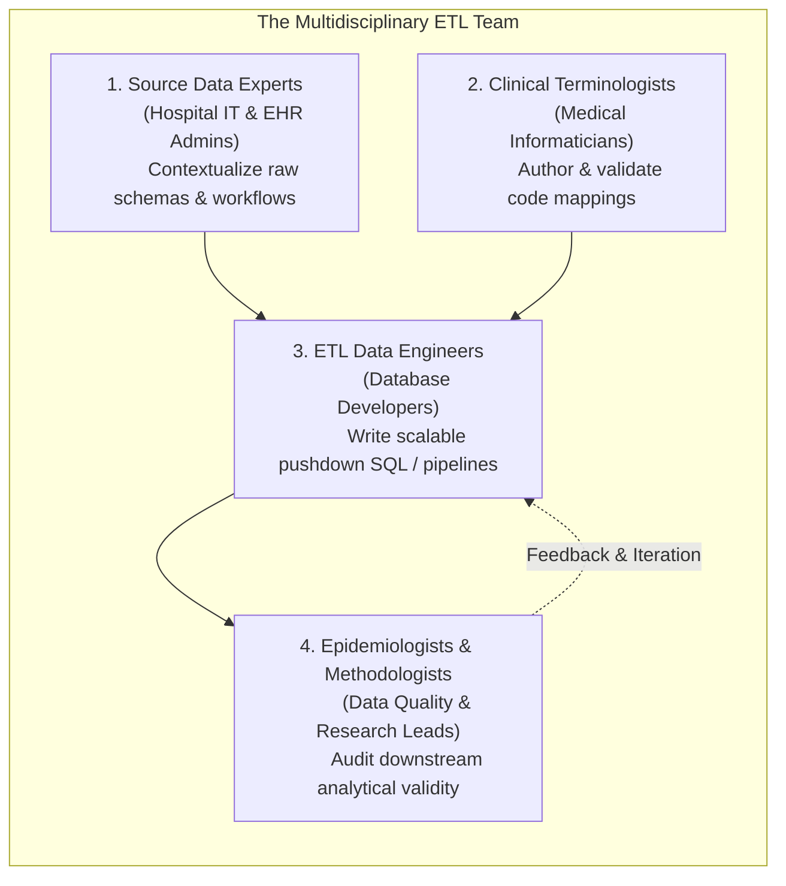
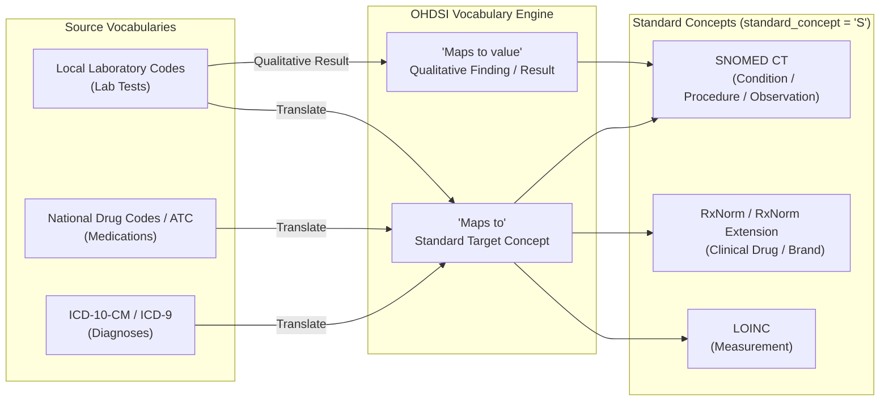
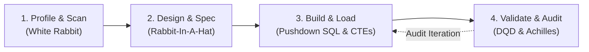
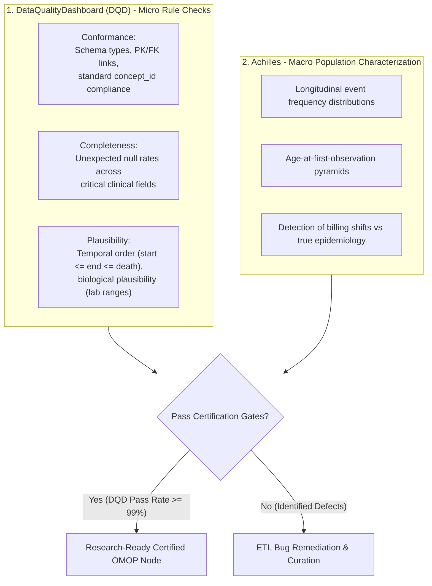

# Developing & Evaluating an OMOP ETL
{: .no_toc }

Extract, Transform, and Load (ETL) into the OMOP Common Data Model is the engineering pipeline that converts heterogeneous, raw clinical data into an auditable, research-grade asset. Rather than a purely technical data migration, an OMOP ETL is a multidisciplinary translation process that unifies database schemas, standardizes clinical terminologies, and guarantees longitudinal data quality.

1. TOC
{:toc}

## 1. The ETL Philosophy: Multidisciplinary Collaboration

A common failure mode in health informatics is treating an OMOP conversion as an isolated database task assigned solely to IT engineers. Because clinical documentation reflects localized hospital workflows, billing quirks, and diagnostic nuances, an effective ETL requires four distinct disciplines working in unison:



*   **Source Data Experts:** Clarify hospital-specific documentation practices, distinguish between primary discharge diagnoses and billing flags, and identify hidden encounter tables.
*   **Clinical Terminologists:** Map local lab batteries, hospital-specific pharmacy formulates, and non-standard diagnosis codes to standard vocabularies (SNOMED CT, RxNorm, LOINC).
*   **ETL Engineers:** Build high-performance pushdown SQL scripts, manage intermediate staging tables, and optimize indexing for multi-million-row databases.
*   **Epidemiologists & Methodologists:** Execute validation studies, verify demographic and disease distributions against expected population baselines, and review quality dashboard metrics.

## 2. The OMOP Vocabulary Engine & Mapping Mechanics

The [OMOP Standardized Vocabularies](https://ohdsi.github.io/CommonDataModel/vocabulary.html) act as the central semantic engine of the CDM. Every medical term from source systems must be resolved through standardized relationships in the `CONCEPT_RELATIONSHIP` table.



### 2.1 Concept Classification Rules

In the `CONCEPT` table, every concept is categorized by its standard status:
*   **Standard Concepts (`standard_concept = 'S'`):** Mandatory target concepts for all standardized analytics, cohort building, and HADES packages.
*   **Non-Standard Concepts (`standard_concept IS NULL`):** Source terms (e.g., ICD-10, local hospital billing codes) preserved in `_source_concept_id` columns to maintain complete lineage.
*   **Classification Concepts (`standard_concept = 'C'`):** Hierarchical grouping nodes (e.g., ATC therapeutic drug classes, MedDRA High-Level Terms) used for cohort definitions and phenotype rollups.

### 2.2 Mapping Terminology Dialects with Usagi

When source databases rely on proprietary hospital codes or non-English terminology systems not present in ATHENA, teams utilize **Usagi**:

*   **Term Similarity Matching:** Employs Apache Lucene fuzzy search algorithms to suggest standard target concepts based on textual descriptions.
*   **Domain & Hierarchy Filters:** Restricts searches to specific target domains (`Condition`, `Drug`, `Measurement`) or parent classes (e.g., specific ATC drug classes).
*   **Human-in-the-Loop Curation:** Terminologists review suggested matches, inspect parent-child hierarchies, and approve mappings.
*   **Export:** Generates an official `SOURCE_TO_CONCEPT_MAP` table export ready for automated ETL injection.

## 3. The 4-Phase ETL Lifecycle

An enterprise OMOP ETL follows a four-phase engineering methodology:



## 4. Phase 1: Source Database Profiling (White Rabbit)

The first rule of OMOP ETL engineering is **zero assumptions**. Source databases routinely contain undocumented null values, impossible historical dates (e.g., `1899-12-30`), truncated strings, and recycled patient identifiers.

### White Rabbit Profiling Mechanics

[White Rabbit](https://github.com/OHDSI/WhiteRabbit) connects directly to source relational databases (PostgreSQL, SQL Server, Oracle, MySQL, Redshift) or flat CSV files to profile the structure and contents without exposing patient-identifiable data:


*   **Privacy-Preserving Cell Suppression:** Enforces a minimum cell count threshold (default $\ge 5$). Any distinct value appearing fewer than 5 times is truncated from the report to eliminate Personal Identifiable Information (PII).
*   **Comprehensive `ScanReport.xlsx` Output:**
    *   *Overview Tab:* Total row counts, field count, data types, and null percentages per column.
    *   *Field Value Distribution:* Frequency counts for all distinct values across every column, immediately highlighting anomalous codes, inverted dates, or unmapped categorical flags.
    *   *Min/Max Boundary Scans:* Flags out-of-range temporal outliers and impossible physiological values before mapping design begins.

## 5. Phase 2: Transformation Design (Rabbit-In-A-Hat)

Designing an ETL requires separating **conceptual mapping logic** from **technical SQL optimization**. Trying to write SQL code before formalizing the mapping specification leads to unmaintainable pipelines.

### Rabbit-In-A-Hat Visual Specification

[Rabbit-In-A-Hat](https://github.com/OHDSI/WhiteRabbit) ingests the `ScanReport.xlsx` generated by White Rabbit and presents an interactive interface for connecting source columns to destination OMOP tables:


### Canonical Sequence of Table Construction

When architecting an ETL, tables must be designed in a strict dependency order:

1.  **`PERSON`:** The master anchor. Establish logic for patient deduplication, biological sex mapping, and dropping records missing mandatory birth year fields.
2.  **`OBSERVATION_PERIOD`:** Derive valid longitudinal time spans. For EHR data, calculate spans between first and last recorded clinical interactions with defined lookback buffers.
3.  **Health System Dimensions (`LOCATION`, `CARE_SITE`, `PROVIDER`):** Establish foreign keys for hospital departments, outpatient clinics, and attending clinicians.
4.  **`VISIT_OCCURRENCE`:** Typically the most complex logic. Consolidate raw department transfers and billing claims into discrete inpatient stays, emergency room encounters, or outpatient visits.
5.  **Clinical Domain Tables (`CONDITION_OCCURRENCE`, `DRUG_EXPOSURE`, `MEASUREMENT`, `PROCEDURE_OCCURRENCE`):** Map clinical events using vocabulary `domain_id` routing rules.

## 6. Phase 3: Pushdown Implementation & Unit Testing

### 6.1 Canonical Source-to-Standard SQL CTE Pattern

In production pipelines, vocabulary lookups are executed via optimized Common Table Expressions (CTEs) that resolve non-standard source codes into standard `concept_id` values while maintaining source traceability:

```sql
WITH CTE_VOCAB_MAP AS (
    -- Pre-filter and cache active standard vocabulary mappings
    SELECT 
        c.concept_code       AS source_code,
        c.concept_id         AS source_concept_id,
        c.concept_name       AS source_code_description,
        c.vocabulary_id      AS source_vocabulary_id,
        c2.concept_id        AS target_concept_id,
        c2.concept_name      AS target_concept_name,
        c2.domain_id         AS target_domain_id,
        c2.concept_class_id  AS target_concept_class_id
    FROM cdm.concept c
    JOIN cdm.concept_relationship cr 
      ON c.concept_id = cr.concept_id_1
     AND cr.relationship_id = 'Maps to'
     AND cr.invalid_reason IS NULL
    JOIN cdm.concept c2 
      ON cr.concept_id_2 = c2.concept_id
     AND c2.standard_concept = 'S'
     AND c2.invalid_reason IS NULL
    WHERE c.vocabulary_id = 'ICD10CM'
)
SELECT 
    src.patient_id               AS person_id,
    COALESCE(map.target_concept_id, 0) AS condition_concept_id,
    src.diagnosis_date           AS condition_start_date,
    CAST(NULL AS DATE)           AS condition_end_date,
    32817                        AS condition_type_concept_id, -- Inpatient discharge diagnosis
    src.diagnosis_code           AS condition_source_value,
    map.source_concept_id        AS condition_source_concept_id,
    v.visit_occurrence_id        AS visit_occurrence_id
FROM raw_staging.hospital_diagnoses src
LEFT JOIN CTE_VOCAB_MAP map
       ON src.diagnosis_code = map.source_code
LEFT JOIN cdm.visit_occurrence v
       ON src.encounter_id = v.visit_source_value
      AND src.patient_id = v.person_id;
```

### 6.2 Unit Testing with Synthetic Micro-Fixtures

Before loading production datasets, robust ETL engineering requires building a suite of **deterministic unit tests**:
*   **Fixture-Based Testing:** Create synthetic micro-datasets representing known edge cases (e.g., patient with missing birth year, patient with death date preceding encounter, visit with end date before start date).
*   **Automated Assertions:** Execute the ETL against the test fixture and assert expected behaviors (e.g., confirming the patient without a birth year is dropped per THEMIS conventions, or checking that an unmapped code routes to `concept_id = 0` with preserved `_source_value`).

## 7. Phase 4: Multi-Tier Quality Assurance & Certification

A transformed database cannot be certified for scientific research until it passes both rule-based data quality checks and macroscopic epidemiological characterization.



### 7.1 The DataQualityDashboard (DQD) Kahn Framework

Built upon the Kahn data quality framework, [DataQualityDashboard](https://ohdsi.github.io/DataQualityDashboard/) executes over 3,500 automated SQL checks across three fundamental pillars:


1.  **Conformance:**
    *   *Relational Conformance:* Foreign key references link to existing master rows in `PERSON` and `VISIT_OCCURRENCE`.
    *   *Computational Conformance:* Data types and field lengths conform to ANSI SQL CDM v5.4 DDLs.
    *   *Value Conformance:* Concept IDs exist in the `CONCEPT` table and belong to the correct domain.
2.  **Completeness:** Evaluates the proportion of unmapped records (`concept_id = 0`) and flags unexpected null values in critical clinical fields.
3.  **Plausibility:**
    *   *Temporal Plausibility:* `visit_start_date <= visit_end_date`, `condition_start_date <= death_date`.
    *   *Biological Plausibility:* Numeric laboratory results (`value_as_number`) must fall within physiologically viable human ranges (e.g., blood pH between 6.8 and 7.8).

### 7.2 Achilles: Population-Level Profiling & Anomaly Detection

While DQD checks individual rows against defined rules, [Achilles](https://ohdsi.github.io/Achilles/) analyzes population-level aggregate statistics across the entire database:


*   **Temporal Anomaly Detection:** Plots longitudinal event volume over time to identify dropped data batches or missing years.
*   **Policy Shift vs. True Epidemiology:** Distinguishes between sudden changes caused by healthcare coding system revisions (e.g., transitioning from ICD-9 to ICD-10 in 2015) and actual clinical trends.
*   **Demographic Consistency:** Validates population pyramids (age/sex distributions) against national census baselines.

### 7.3 Community Conventions: The THEMIS Working Group

When encountering ambiguous edge cases (e.g., how to handle conflicting discharge dates across overlapping departmental visits), developers adhere to standardized conventions established by the OHDSI **THEMIS Working Group**:


*   *Rule on Missing Birth Dates:* If `year_of_birth` is missing, the person record must be dropped. If `month_of_birth` or `day_of_birth` is missing, set to `NULL` (or default to mid-year where justified).
*   *Rule on Observation Windows:* Every patient must have at least one valid `OBSERVATION_PERIOD` spanning all clinical events.
*   *Rule on Multi-Day Dispensations:* If `days_supply` is missing, calculate from `quantity` and daily dose when available, or infer from standard clinical guidelines.

## 8. Continuous Maintenance & Operational Best Practices

### The 80/20 Rule in Terminology Mapping
In healthcare databases, a small number of high-frequency codes account for the overwhelming majority of clinical encounters:
*   Mapping the top **20% of unique codes** routinely covers **$>85\%$ of total record volume**.
*   Prioritize high-frequency terms first to achieve rapid data readiness, leaving ultra-rare codes for targeted study use cases.

### Disciplined Data Exclusion
Not all raw hospital data is suitable for scientific research. Records with irreconcilable corruption (e.g., impossible timestamps, unlinked encounter IDs, contradictory sexes) should be systematically filtered out during the staging phase rather than contaminating downstream causal inference models.

### Continuous ETL Maintenance Lifecycle
An OMOP ETL is a living software pipeline that requires scheduled maintenance triggered by three events:
*   **Source System Upgrades:** Modifications to hospital EHR database tables or local lab battery nomenclatures.
*   **ATHENA Vocabulary Releases:** Updating vocabulary tables semi-annually to incorporate new standard SNOMED/RxNorm concepts.
*   **CDM Specification Updates:** Migrating to updated CDM versions (e.g., from v5.3 to v5.4) as required by network study protocols.

## 9. Next Steps & Related Documentation

*   **OMOP Architecture & Domains:** Review the underlying relational schema and domain routing rules in [OMOP CDM Architecture](./01_omop_cdm_architecture.md).
*   **AI in Data Enablement:** Explore how Automated Terminology Mapping and multimodal clinical NLP accelerate ETL pipelines in [AI in OMOP CDM](./03_ai_in_omop_cdm.md).
*   **Institutional Data Quality Certification:** Learn how hospital nodes achieve federated readiness in [Data Quality & Mediation](../data_mediation/quality.md).

## References

1. **Blacketer C, Voss E.** (2021). *The Book of OHDSI: Chapter 6 - Extract Transform Load.* [https://book.ohdsi.org](https://book.ohdsi.org).
2. **Kahn MG, Callahan TJ, Barnard J, et al.** (2016). *A Harmonized Data Quality Assessment Terminology and Framework for the Observational Health Data Sciences and Informatics (OHDSI) Network.* EGEMS (Wash DC), 4(1), 1244. [doi:10.13063/2327-9214.1244](https://doi.org/10.13063/2327-9214.1244).
3. **Blacketer C, Defalco FJ, Ryan PB, Rijnbeek PR.** (2021). *Increasing trust in real-world evidence through evaluation of observational data quality.* JAMIA, 28(10), 2251–2257. [doi:10.1093/jamia/ocab132](https://doi.org/10.1093/jamia/ocab132).
4. **OHDSI THEMIS Working Group.** (2024). *THEMIS Conventions Library.* [https://ohdsi.github.io/CommonDataModel/themis.html](https://ohdsi.github.io/CommonDataModel/themis.html).
5. **OHDSI Vocabulary Working Group.** (2024). *OMOP Standardized Vocabularies Specification.* [https://ohdsi.github.io/CommonDataModel/vocabulary.html](https://ohdsi.github.io/CommonDataModel/vocabulary.html).
