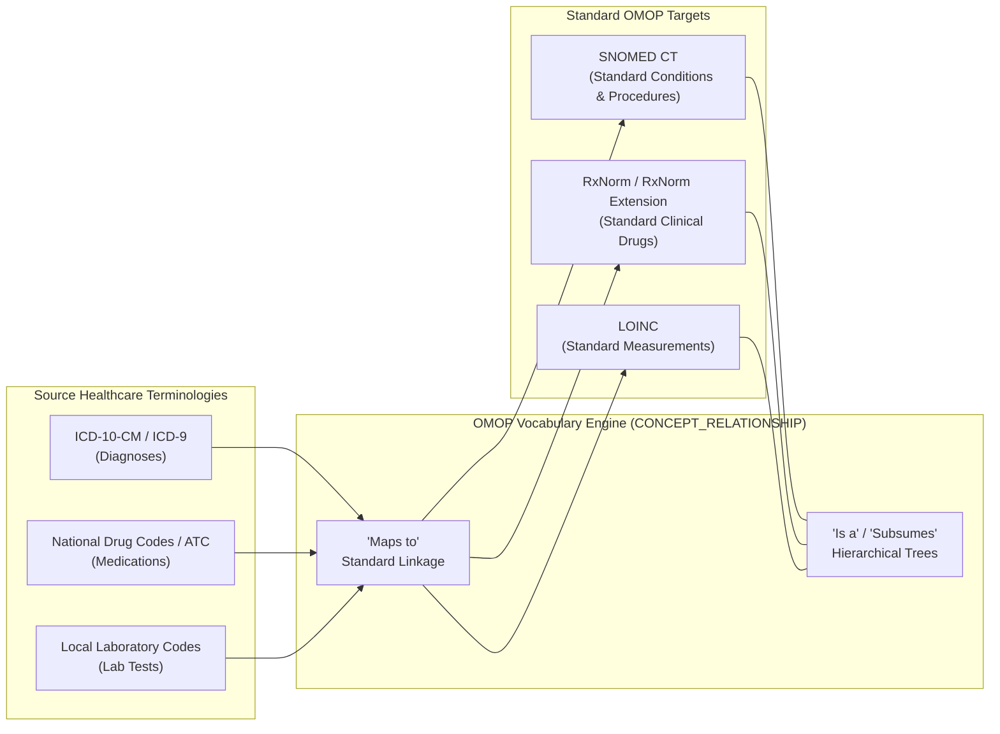
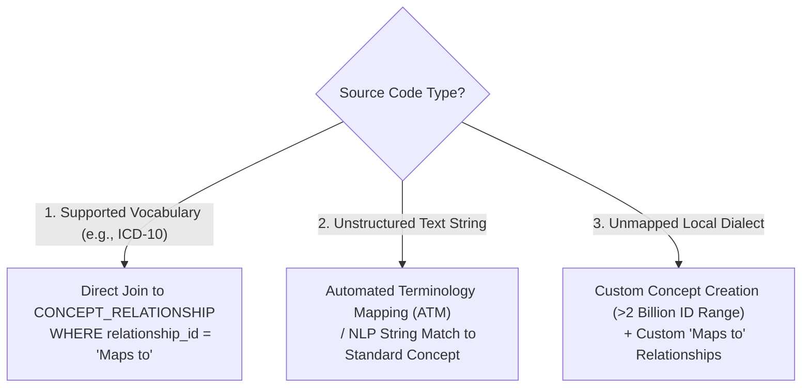
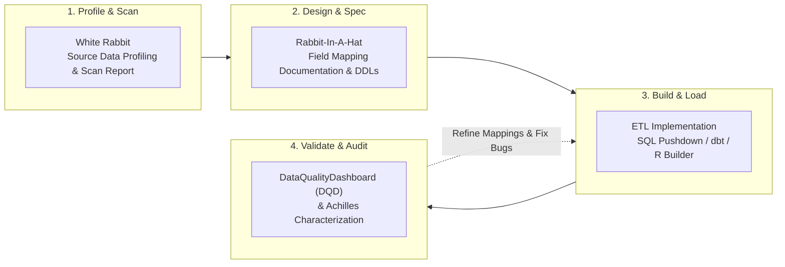
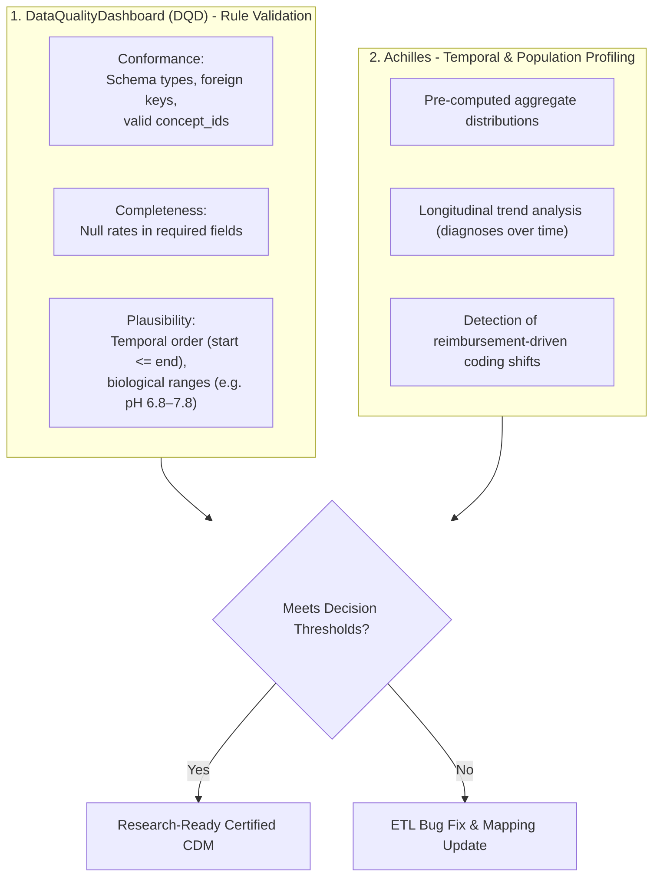

# Developing & Evaluating an OMOP ETL
{: .no_toc }

Extract, Transform, and Load (ETL) into the OMOP Common Data Model is the engineering pipeline that turns heterogeneous source data into an auditable, research-ready asset. This guide covers the complete ETL lifecycle: vocabulary mapping logic, source profiling with White Rabbit, design with Rabbit-In-A-Hat, implementation, and quality auditing with DataQualityDashboard (DQD) and Achilles.

1. TOC
{:toc}

## 1. The OMOP Vocabulary Architecture

The OMOP vocabulary serves as the master reference data engine for the entire CDM. It normalizes hundreds of international coding systems into a single standardized graph of concepts.



### 1.1 Categories of Concepts
In the `CONCEPT` table, every code is assigned a `standard_concept` classification:
*   **Standard Concepts (`standard_concept = 'S'`):** Authoritative identifiers used for all standardized analyses, cohort building, and statistical packages.
*   **Non-Standard Concepts (`standard_concept IS NULL`):** Source terms (e.g., ICD-10, local hospital codes) retained for provenance. They map to standard concepts via the `Maps to` relationship.
*   **Classification Concepts (`standard_concept = 'C'`):** Hierarchical categories (e.g., ATC drug classes, MedDRA High-Level Terms) used for cohort grouping.

### 1.2 Source-to-Standard Mapping Scenarios



## 2. The 4-Phase ETL Lifecycle

A validated OMOP ETL follows a four-stage engineering lifecycle:



## 3. Profiling & Design Tools: White Rabbit & Rabbit-In-A-Hat

### 3.1 White Rabbit: Source Database Profiling
**White Rabbit** connects directly to source databases (or flat CSV/SAS files) to profile tables without extracting sensitive clinical information.


White Rabbit generates a comprehensive `ScanReport.xlsx` containing:
*   Table record counts and row volumes.
*   Column data types, distinct values, and null percentages.
*   Frequency distribution of top 100 values for every column.
*   Minimum and maximum date values to detect impossible temporal entries (e.g., year 1800 or 2099).

### 3.2 Rabbit-In-A-Hat: Visual Transformation Specification
**Rabbit-In-A-Hat** ingests the `ScanReport.xlsx` and provides an interactive graphical interface to map source tables to OMOP target domains.


*   **Visual Mapping:** Connects source columns (e.g., `ADMISSION_DATE`, `DIAG_CODE`) directly to OMOP destination fields (`visit_start_date`, `condition_source_value`).
*   **Logic Documentation:** Records custom SQL logic, conditional filtering, and domain movements.
*   **Export:** Automatically exports an interactive HTML/Markdown ETL specification document for review by clinicians and data engineers.

## 4. The Canonical Source-to-Standard SQL Mapping

The following Common Table Expression (CTE) represents the standard SQL query pattern used across production ETL pipelines to resolve source codes into target OMOP concept IDs:

```sql
WITH CTE_VOCAB_MAP AS (
    SELECT 
        c.concept_code       AS source_code,
        c.concept_id         AS source_concept_id,
        c.concept_name       AS source_code_description,
        c.vocabulary_id      AS source_vocabulary_id,
        c.domain_id          AS source_domain_id,
        c2.concept_id        AS target_concept_id,
        c2.concept_name      AS target_concept_name,
        c2.vocabulary_id     AS target_vocabulary_id,
        c2.domain_id         AS target_domain_id,
        c2.concept_class_id  AS target_concept_class_id
    FROM concept c
    JOIN concept_relationship cr 
      ON c.concept_id = cr.concept_id_1
     AND cr.relationship_id = 'Maps to'
     AND cr.invalid_reason IS NULL
    JOIN concept c2 
      ON cr.concept_id_2 = c2.concept_id
     AND c2.standard_concept = 'S'
     AND c2.invalid_reason IS NULL
    WHERE c.vocabulary_id = 'ICD10CM'
)
SELECT 
    src.patient_id               AS person_id,
    map.target_concept_id        AS condition_concept_id,
    src.diagnosis_date           AS condition_start_date,
    32817                        AS condition_type_concept_id, -- Inpatient discharge
    src.diagnosis_code           AS condition_source_value,
    map.source_concept_id        AS condition_source_concept_id
FROM raw_inpatient_diagnoses src
LEFT JOIN CTE_VOCAB_MAP map
       ON src.diagnosis_code = map.source_code;
```

## 5. Quality Assurance: DataQualityDashboard (DQD) & Achilles

A transformed OMOP instance cannot be released for clinical research until it passes standardized quality validation.



### 5.1 The DataQualityDashboard (DQD) Framework
Built on the Kahn quality framework, DQD executes over 3,500 automated checks across three pillars:
*   **Conformance:** Verifies that tables and columns adhere to OMOP CDM specifications (e.g., non-null primary keys, valid foreign key references to `PERSON`).
*   **Completeness:** Identifies unexpected null values in critical fields.
*   **Plausibility:** Evaluates clinical and physical plausibility:
    *   *Temporal Plausibility:* `condition_start_date` must precede or equal `condition_end_date` and occur before `death_date`.
    *   *Biological Plausibility:* Laboratory measurements must fall within clinically viable human ranges.


### 5.2 Achilles Characterization & Anomaly Detection
**Achilles** runs pre-computed descriptive analyses across the database to detect population-level anomalies:
*   **Historical Timeline Scans:** Identifies erroneous pre-1900 or future records.
*   **Policy Shift Detection:** Visualizes sharp coding shifts caused by regional changes in billing reimbursement rules (e.g., transition from ICD-9 to ICD-10) versus true epidemiological changes.


## 6. Hard-Won ETL Lessons & Best Practices

1.  **The 80/20 Rule for Vocabulary Mapping:** In clinical databases, 20% of unique medical codes account for >80% of all recorded patient encounters. Prioritize mapping high-frequency terms first to maximize clinical data coverage quickly.
2.  **Comfort with Disciplined Data Exclusion:** Not all raw hospital data is of research quality. Data that fails core conformance or integrity checks should be cleaned or excluded during ETL rather than corrupting downstream causal inference models.
3.  **Adhere to THEMIS Conventions:** When encountering ambiguity regarding where a clinical event belongs, follow conventions documented by the OHDSI [THEMIS Working Group](https://ohdsi.github.io/CommonDataModel/).

## References

1. **Blacketer C, Defalco FJ, Ryan PB, Rijnbeek PR.** (2021). *Increasing trust in real-world evidence through evaluation of observational data quality.* J Am Med Inform Assoc, 28(10), 2251–2257. [doi:10.1093/jamia/ocab132](https://doi.org/10.1093/jamia/ocab132).
2. **Kahn MG, Callahan TJ, Barnard J, et al.** (2016). *A Harmonized Data Quality Assessment Terminology and Framework for the Observational Health Data Sciences and Informatics (OHDSI) Network.* EGEMS (Wash DC), 4(1), 1244. [doi:10.13063/2327-9214.1244](https://doi.org/10.13063/2327-9214.1244).
3. **OHDSI THEMIS Working Group.** (2024). *THEMIS Conventions Library.* [https://ohdsi.github.io/CommonDataModel/themis.html](https://ohdsi.github.io/CommonDataModel/themis.html).
