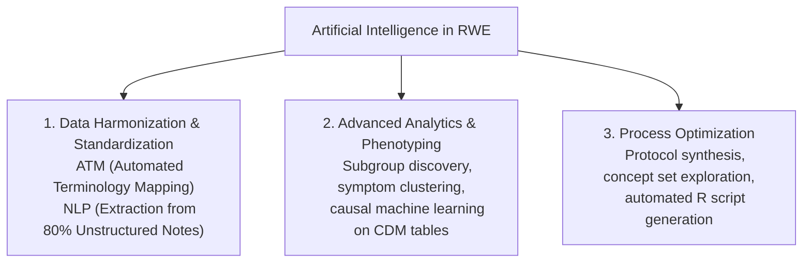
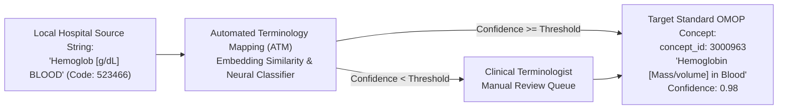
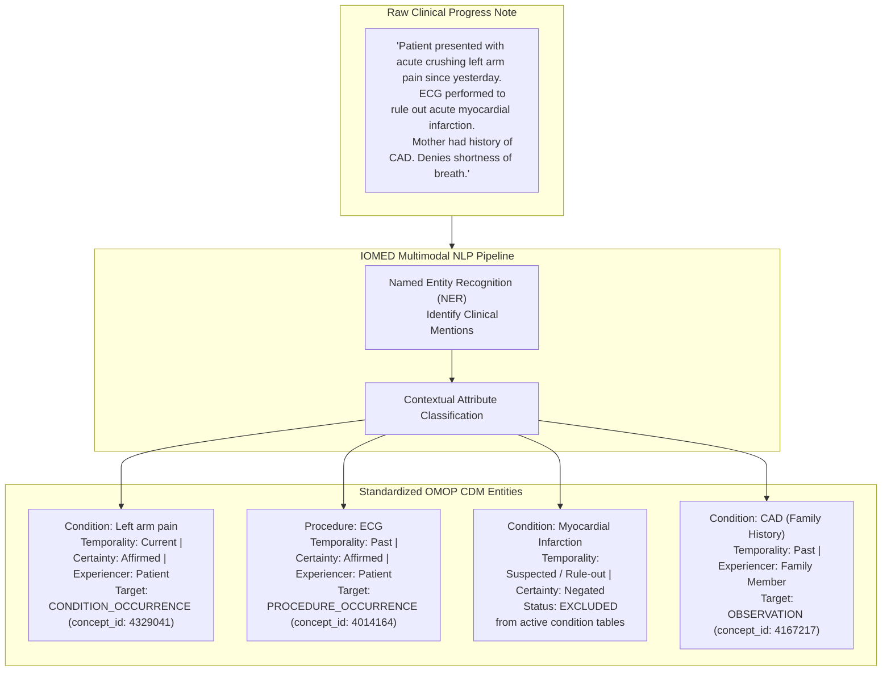
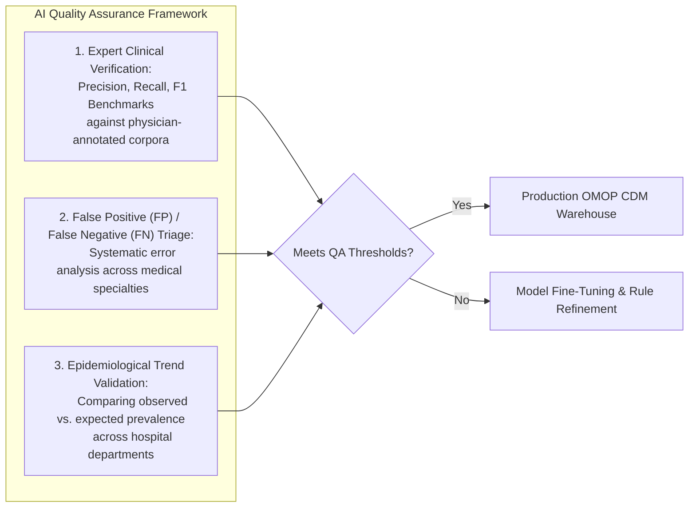
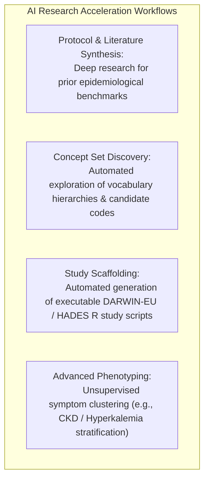

# Artificial Intelligence in the OMOP CDM: ATM, NLP & QA
{: .no_toc }

Artificial Intelligence serves as the core automation engine for transforming massive volumes of unstructured hospital data into standardized, research-ready OMOP Common Data Model repositories.

1. TOC
{:toc}

## 1. The Strategic Role of AI in Real-World Evidence

In real-world health data science, the objective of AI is not to replace clinical judgment, but to serve as the scalable operational muscle that solves three foundational bottlenecks:

## 2. Automated Terminology Mapping (ATM) for Structured Data

Hospital information systems frequently utilize proprietary, localized coding systems for laboratory tests, drug orders, and clinical departments.

*   **Continuous Embedding & Semantic Matching:** Transforms non-standard source strings into high-dimensional semantic vector spaces to match against standard OMOP vocabularies.
*   **Confidence Scoring & Human-in-the-Loop:** High-confidence mappings are automatically assigned; ambiguous or low-confidence mappings are routed to clinical terminologists for review, continuously retraining the underlying model.

## 3. Natural Language Processing (NLP) for Unstructured Clinical Notes

Up to **80% of clinically actionable information**—such as disease severity, histological staging, functional scores, treatment responses, and symptom onset—is documented exclusively in free-text clinical notes, pathology reports, and discharge summaries.

### Contextual Attribute Extraction
Standardizing clinical text requires more than simple keyword matching. The NLP pipeline classifies four essential contextual attributes for every extracted entity:

1.  **Temporality:** Distinguishes whether the event is *Current* (active complaint), *Past* (historical diagnosis), or *Future / Plan* (scheduled surgery).
2.  **Certainty & Negation:** Identifies whether the condition is *Affirmed* ("patient has asthma"), *Negated* ("denies chest pain"), or *Suspected / Hypothetical* ("rule out pulmonary embolism").
3.  **Experiencer:** Separates diagnoses concerning the *Patient* from *Family History* (e.g., maternal diabetes).
4.  **Severity & Anatomical Laterality:** Captures modifiers such as left/right, mild/severe, or acute/chronic.

## 4. AI Quality Assurance & Validation Framework

To ensure that AI-extracted data meets regulatory requirements for observational research, data pipelines undergo continuous verification:

*   **Gold-Standard Benchmarking:** Regular evaluation against blinded double-annotated clinical datasets to ensure precision and recall exceed validated thresholds.
*   **Epidemiological Trend Auditing:** Compares aggregate extraction rates over time against known demographic and disease incidence benchmarks to detect systemic sensor drift or documentation shifts.

## 5. AI in Advanced Analytics & Research Acceleration

Beyond data ingestion, AI accelerates the execution of real-world studies across the OHDSI ecosystem:

*   **Subgroup & Symptom Clustering:** Unsupervised machine learning models uncover novel clinical phenotypes and multimorbidity trajectories directly from longitudinal OMOP records.
*   **Study Scaffolding & Code Generation:** Large Language Model (LLM) agents assist epidemiologists by translating clinical study protocols into validated R packages using `CohortConstructor`, `PatientProfiles`, and `CohortCharacteristics`.

## References

1. **Rajkomar A, Oren E, Chen K, et al.** (2018). *Scalable and accurate deep learning with electronic health records.* NPJ Digit Med, 1, 18. [doi:10.1038/s41746-018-0029-1](https://doi.org/10.1038/s41746-018-0029-1).
2. **Topol EJ.** (2019). *High-performance medicine: the convergence of human and artificial intelligence.* Nature Medicine, 25(1), 44–56. [doi:10.1038/s41591-018-0300-7](https://doi.org/10.1038/s41591-018-0300-7).
3. **Beam AL, Kohane IS.** (2023). *Translating Artificial Intelligence to Clinical Practice.* New England Journal of Medicine, 389(4), 348–358. [doi:10.1056/NEJMra2204673](https://doi.org/10.1056/NEJMra2204673).
