# Introduction to Real-World Data & Real-World Evidence
{: .no_toc }

This comprehensive guide introduces the foundational principles of observational health research: the taxonomy of clinical research methodologies, the rationale for Real-World Evidence (RWE), epidemiological bias mitigation, data source classifications, and the European and Spanish legal governance frameworks.

1. TOC
{:toc}

## 1. Clinical Research & the Hierarchy of Evidence

### 1.1 Foundations of Evidence-Based Medicine

**Evidence-Based Medicine (EBM)** is the conscientious, explicit, and judicious use of current best evidence in making decisions about the care of individual patients. It bridges the gap between laboratory discovery, controlled clinical experimentation, and routine clinical practice.

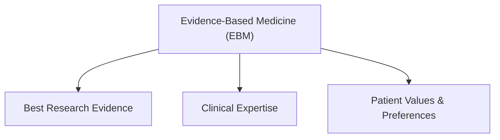

Within EBM, clinical research methodologies generate the empirical data needed to evaluate whether interventions (pharmacotherapies, surgical procedures, diagnostic tests, or medical devices) produce meaningful clinical benefits without unacceptable risks.

### 1.2 Taxonomy of Clinical Research Methodologies

Clinical research is fundamentally divided based on whether the investigator assigns the exposure (intervention) or simply observes what occurs in routine practice.

As established in the classical taxonomy by **Grimes & Schulz (*The Lancet*, 2002)**, clinical studies are categorized into two primary branches:

#### Experimental (Interventional) Studies
In an experimental study, the investigator actively controls the exposure and allocates participants into study arms:
*   **Randomized Controlled Trials (RCTs):** Participants are allocated to treatment or control arms through a random process. Randomization is the gold standard for minimizing **confounding factors** (both measured and unmeasured), ensuring that any difference in outcomes between groups can be attributed to the intervention.
*   **Non-Randomized Trials (Quasi-Experiments):** Allocation is determined by convenience, time periods, or clinician preference rather than formal randomization, increasing the risk of allocation bias.

#### Observational (Non-Interventional) Studies
In observational studies, the investigator does not intervene or dictate therapy. Treatment decisions occur naturally during clinical practice between healthcare providers and patients:
*   **Descriptive Studies:** Characterize the occurrence, distribution, and patterns of disease without formal hypothesis testing against a control group (e.g., *Case Reports, Case Series, Cross-Sectional Surveys*).
*   **Analytical Studies:** Formally test epidemiological hypotheses by comparing exposed and unexposed groups (e.g., *Cohort Studies, Case-Control Studies, Cross-Sectional Analytical Studies*).

### 1.3 The Evidence Generation Pathway

The journey from initial therapeutic hypothesis to established clinical standard follows a multi-phase pathway transitioning from discovery and tightly controlled clinical trials to broad real-world practice:

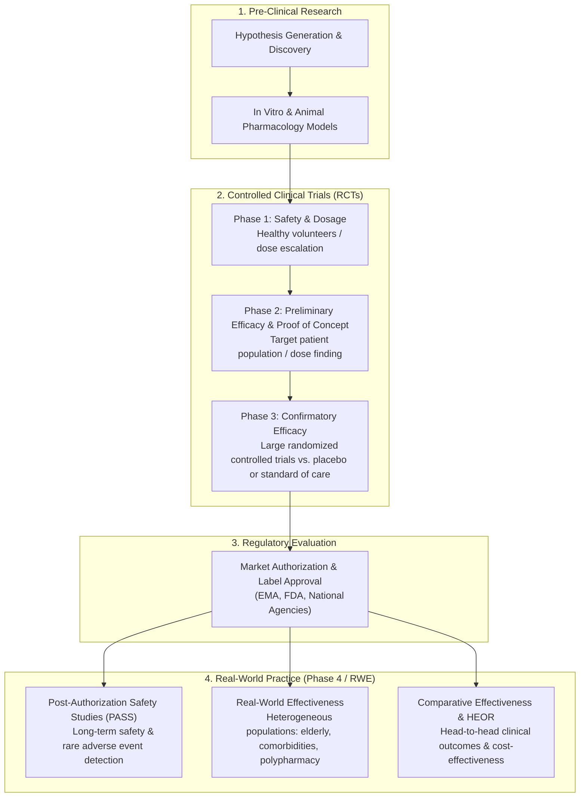

### 1.4 The Hierarchy of Evidence

The **Hierarchy of Evidence** ranks research designs according to the relative strength and reliability of their conclusions, primarily reflecting their vulnerability to systematic bias and confounding:

According to the classical evidence pyramid (*Burns, Rohrich, & Chung, 2011*):

| Level | Study Design | Key Strengths | Key Vulnerabilities |
| :---: | :--- | :--- | :--- |
| **Level I** | **Systematic Reviews & Meta-Analyses of RCTs** | Highest statistical power; aggregates multiple randomized studies; minimizes single-study random error. | Publication bias; heterogeneity across trial protocols. |
| **Level II** | **Individual Randomized Controlled Trials (RCTs)** | Randomization balances known and unknown confounders; blinding minimizes observer bias. | Strict exclusion criteria; limited generalizability; short follow-up; high cost. |
| **Level III** | **Controlled Observational Studies (Cohort & Case-Control)** | Reflects real-world clinical populations; long longitudinal follow-up; evaluates rare outcomes. | Susceptible to confounding by indication, selection bias, and information bias. |
| **Level IV** | **Case Series & Uncontrolled Descriptive Studies** | Identifies new clinical signals or rare adverse events early. | No control group; cannot establish causality or calculate relative risk. |
| **Level V** | **Expert Opinion & Mechanistic Reasoning** | Provides clinical context when empirical data is unavailable. | Highest risk of subjective bias and cognitive heuristics. |

### 1.5 Experimental vs. Observational Comparative Matrix

| Dimension | Randomized Controlled Trials (RCTs) | Observational RWD / RWE |
| :--- | :--- | :--- |
| **Primary Question** | *"Can the treatment work under ideal, controlled conditions?"* (**Efficacy**) | *"Does the treatment work in routine, unselected clinical practice?"* (**Effectiveness**) |
| **Population** | Highly selected, homogeneous; strict inclusion/exclusion criteria. | Broad, heterogeneous; includes frail, elderly, multimorbid, and polypharmacy patients. |
| **Assignment of Exposure** | Random allocation by protocol. | Clinician-patient shared decision-making based on clinical indications. |
| **Control of Confounding** | Balanced at baseline through **randomization** (known & unknown confounders). | Adjusted statistically using **propensity scores, multivariable regression, and negative controls**. |
| **Sample Size & Follow-up** | Typically hundreds to thousands of patients; follow-up often limited to months or 1–2 years. | Millions of longitudinal patient records; follow-up can span decades. |
| **Cost & Execution Speed** | Very high cost ($10M–$100M+); years to recruit and complete. | Highly cost-effective; rapid execution across federated databases. |
| **Primary Use Cases** | Regulatory market authorization; primary efficacy proofs. | Post-market safety (PASS), comparative effectiveness, treatment pathways, health economics (HEOR). |

## 2. Real-World Evidence: Concepts, Rationale & Lifecycle

### 2.1 Defining RWD and RWE

The distinction between data and evidence is fundamental:
*   **Real-World Data (RWD):** Data relating to patient health status and the delivery of health care routinely collected from a variety of sources outside traditional clinical trials (e.g., electronic health records, claims, registries).
*   **Real-World Evidence (RWE):** The clinical evidence regarding the usage, potential benefits, and risks of a medical product derived from the analysis of RWD using rigorous, transparent epidemiological and statistical methods.

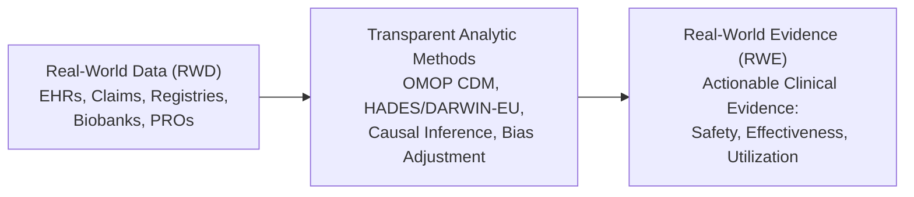

### 2.2 Why Real-World Evidence is Essential

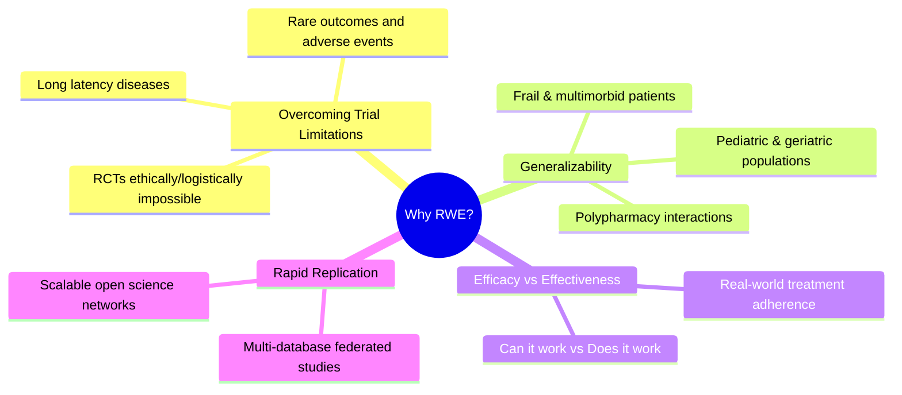

#### The "Parachute Paradox" & Methodological Constraints
In some scenarios, conducting an RCT is logistically impossible or ethically impermissible. 

In their landmark paper, **Smith & Pell (*BMJ*, 2003)** famously highlighted that no randomized controlled trial had ever evaluated the efficacy of parachutes to prevent gravitational trauma. When the effect of an intervention is large, or when withholding treatment from a control arm causes demonstrable harm, observational evidence and mechanistic understanding must guide clinical practice.

Beyond ethical constraints, RCTs frequently fail to detect:
*   **Rare adverse drug reactions** (occurring in <1 in 10,000 patients) due to limited trial sample sizes ($N \approx 500 - 3,000$).
*   **Long-term clinical outcomes** due to constrained follow-up windows (typically 6–24 months).
*   **Drug-drug interactions** caused by polypharmacy, as patients taking complex medication regimens are routinely excluded from trial enrollment.

#### Efficacy vs. Effectiveness: The Generalizability Gap
The performance of an intervention differs substantially depending on the environment in which it is administered:

| Concept | Core Question | Study Environment | Population Characteristics |
| :--- | :--- | :--- | :--- |
| **Efficacy** | *"Can the treatment work under optimal conditions?"* | Controlled trial sites, forced adherence, strict protocols | Selected, young, few comorbidities, no competing medications |
| **Effectiveness** | *"Does the treatment work in routine medical practice?"* | Hospitals, primary care, real-world prescribing variation | Unselected, elderly, multimorbid, non-adherent, polypharmacy |

#### Case Study: Immunotherapy in Advanced NSCLC
A study by **Cramer-van der Welle et al. (*Scientific Reports*, 2021)** evaluated the real-world outcomes of checkpoint inhibitor immunotherapy in stage IV non-small cell lung cancer (NSCLC) patients in the Netherlands compared to pivotal clinical trials:

The findings demonstrated the real-world generalizability gap:
*   **Trial Population:** Patients had high performance status (ECOG 0–1), no brain metastases, and normal renal/hepatic function.
*   **Real-World Population:** Over 40% of real-world patients treated in routine practice would have been excluded from the registration trials due to poor performance status, autoimmune comorbidities, or CNS involvement.
*   **Outcome:** While real-world patients derived significant clinical benefit, overall survival in the unselected real-world cohort was lower than reported in the registrational trials, underscoring the necessity of real-world effectiveness benchmarks for prognosis and reimbursement.

### 2.3 RWE Across the Treatment Product Lifecycle

Real-World Evidence generates value across every phase of a therapeutic product's development and commercial lifecycle, evolving from early disease characterization to post-market safety surveillance:

```mermaid
flowchart LR
    subgraph P1["1. Pre-Clinical & Discovery"]
        direction TB
        A1["Disease Natural History"]
        A2["Incidence & Prevalence"]
        A3["Unmet Need & Target Sizing"]
    end

    subgraph P2["2. Clinical Development (Ph I–III)"]
        direction TB
        B1["Protocol Feasibility Simulation"]
        B2["External / Synthetic Control Arms"]
        B3["Pragmatic Trial Extensions"]
    end

    subgraph P3["3. Regulatory Approval & Launch"]
        direction TB
        C1["Label Expansions & Submissions"]
        C2["Health Economics (HEOR / HTA)"]
        C3["Budget Impact & Pricing Dossiers"]
    end

    subgraph P4["4. Post-Marketing Surveillance (Ph IV)"]
        direction TB
        D1["Post-Auth Safety Studies (PASS)"]
        D2["Comparative Effectiveness"]
        D3["Treatment Pathways & Adherence"]
    end

    P1 -->|"Translational Evidence"| P2
    P2 -->|"Pivotal & Supplementary Data"| P3
    P3 -->|"Real-World Monitoring"| P4
```

#### Lifecycle Stage Deliverables & Regulatory Applications

| Lifecycle Phase | Core RWE Objectives | Typical Methodologies & Analytics | Regulatory & Commercial Impact |
| :--- | :--- | :--- | :--- |
| **1. Pre-Clinical & Discovery** | Establish disease burden, characterize natural history, and identify underserved patient subpopulations. | Descriptive incidence/prevalence, patient characterization, biomarker stratification. | Strategic portfolio prioritization, target population sizing, and unmet need definition. |
| **2. Clinical Development (Ph I–III)** | Optimize trial enrollment criteria, simulate protocol feasibility, and construct comparator cohorts. | External Control Arms (ECA), synthetic controls for single-arm trials, EHR trial screening simulation. | Accelerated recruitment, regulatory precedent for rare disease approvals, and reduced trial costs. |
| **3. Regulatory Approval & Launch** | Demonstrate comparative clinical and economic value to health technology assessment (HTA) bodies. | Health Economics & Outcomes Research (HEOR), cost-effectiveness modeling, budget impact analysis. | Favorable reimbursement pricing, inclusion in clinical guidelines, and label expansion support. |
| **4. Post-Marketing (Phase IV)** | Monitor long-term safety, detect rare adverse events, and evaluate real-world comparative effectiveness. | Post-Authorization Safety Studies (PASS), active-comparator new-user cohorts (ACNU), drug utilization studies (DUS). | Regulatory safety commitments (EMA/FDA mandates), black-box warning evaluations, and line-of-therapy positioning. |

## 3. Methodological Biases & Strengths of RWE

### 3.1 Core Epidemiological Biases & Mitigations

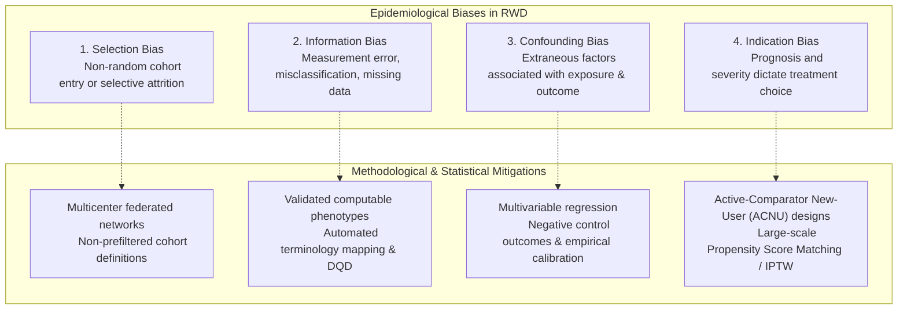

1.  **Selection Bias:** Occurs when the study population differs systematically from the target population due to non-random entry or loss to follow-up. Mitigated through **inception cohorts (new-user design)**, multicenter network studies, and transparent attrition tracking.
2.  **Information Bias & Misclassification:** Arises from errors in measuring or coding exposures, outcomes, or covariates. Mitigated through **standardized terminology mapping**, NLP extraction of clinical notes, and computable phenotype validation (`PhenotypeR`).
3.  **Confounding Bias:** Arises when an extraneous risk factor is associated with both the exposure and outcome. Mitigated through multivariable regression, **negative control outcomes**, and empirical p-value calibration.
4.  **Indication Bias (Confounding by Indication):** In clinical practice, treatments are prescribed based on severity and frailty. Mitigated using the **Active-Comparator New-User (ACNU)** design, Propensity Score Matching (PSM), and Inverse Probability of Treatment Weighting (IPTW).

### 3.2 Summary Matrix of Biases & OMOP/OHDSI Solutions

| Bias Type | Core Mechanism | Real-World Clinical Example | OMOP / OHDSI Solution |
| :--- | :--- | :--- | :--- |
| **Selection Bias** | Non-representative entry or selective dropout | Evaluating only patients surviving >1 year on chemotherapy | `CohortConstructor` new-user cohort definitions, attrition flowcharts |
| **Information Bias** | Coding variation, missingness, measurement noise | Outcome documented only in free text discharge notes | Automated Terminology Mapping, NLP extraction, `PhenotypeR` |
| **Confounding Bias** | Baseline risk factors unbalanced between groups | Age and baseline renal function skew treatment choice | Multivariable Cox regression, `PatientProfiles` feature extraction |
| **Indication Bias** | Sicker patients assigned to newer/stronger drug | Second-line drug given to refractory patients | Active-Comparator New-User design, Propensity Score Matching (`CohortSurvival`) |

### 3.3 Core Strengths of Real-World Evidence

*   **Statistical Power & Rare Outcomes:** Datasets encompassing tens of millions of patients enable the detection of rare adverse drug reactions and provide adequate sample sizes for nuanced subgroup analyses.
*   **Longitudinal Follow-up:** Electronic health records track patient journeys across 10–20+ years, capturing long-term survival and late sequelae that trials cannot afford to monitor.
*   **Unselected, Multimorbid Populations:** RWE reflects true clinical practice by including patients who are routinely excluded from randomized trials: the elderly, patients with chronic kidney disease, pregnant women, and patients on multiple concomitant medications.
*   **Rapid Execution & Cost Efficiency:** Retrospective federated queries across standardized OMOP networks (e.g., DARWIN EU) can generate multinational evidence in weeks to months at a fraction of the cost of prospective studies.

## 4. Real-World Data: Taxonomy, Sources & Characteristics

### 4.1 Primary Operational Collection vs. Secondary Research Use

A core defining characteristic of Real-World Data is that its **primary collection purpose is not clinical research**.

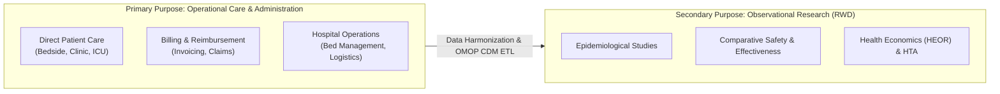

### 4.2 Taxonomy of Real-World Data Sources

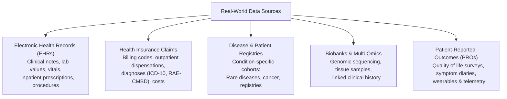

*   **Electronic Health Records (EHRs):** Granular clinical documentation (physician progress notes, lab values, vital signs, inpatient medications). High clinical depth, but ~80% of data is stored in unstructured free text.
*   **Health Claims & Billing Data:** Adjudicated administrative records (ICD-10, RAE-CMBD, pharmacy claims). Comprehensive capture across providers, but lacks deep clinical nuance (no vitals or lab values).
*   **Disease & Patient Registries:** Condition-specific cohorts (e.g., cancer registries) with protocolized variables, but costly to maintain.
*   **Biobanks & Multi-Omics:** Biological samples paired with genomic and phenotype data for precision medicine.
*   **Patient-Reported Outcomes (PROs) & Wearables:** Direct patient feedback on symptoms, quality of life (EQ-5D), and continuous device telemetry.

### 4.3 Metadata Discovery & The EMA Catalogues

The **European Medicines Agency (EMA)** and **DARWIN EU** maintain centralized metadata catalogues to facilitate data partner discovery and qualification across Europe:

The [EMA RWD Catalogues](https://catalogues.ema.europa.eu) provide standardized metadata on population sizes, healthcare settings, OMOP CDM mapping status, and access governance rules.

### 4.4 Structural Characteristics of RWD

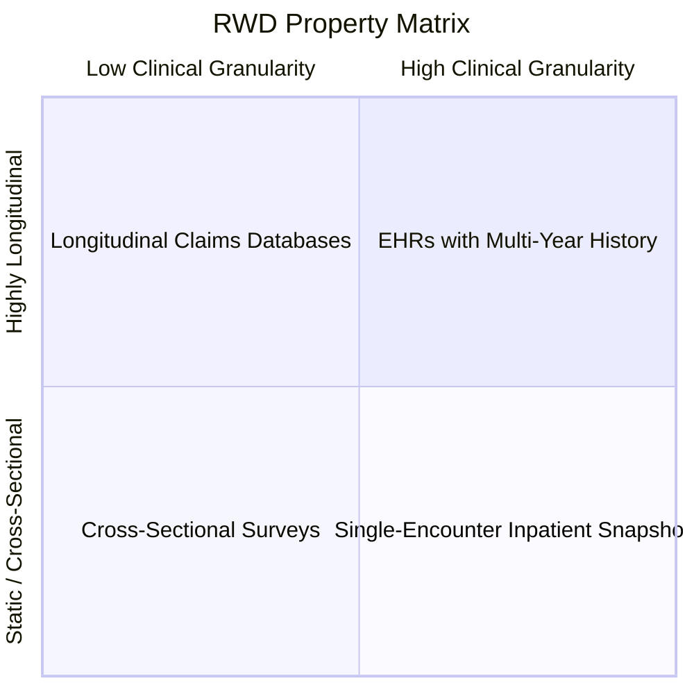

*   **High Heterogeneity:** Data exists in hundreds of proprietary relational schemas and message formats, resolved by transformation into the OMOP Common Data Model.
*   **Temporal Longitudinality:** Enables time-to-event analysis (`CohortSurvival`), sequence symmetry analysis (`CohortSymmetry`), and treatment pathways (`DrugUtilisation`).
*   **Coded Nature:** Standardizes disparate source vocabularies (ICD-10, SNOMED CT, RxNorm, ATC, LOINC) into standard OMOP concept IDs.
*   **Privacy Regimes:** Distinguishes between **pseudonymized data** (re-identifiable via protected keys, subject to GDPR) and **fully anonymized data** (irreversible de-identification, enabling secure multi-center research).

## 5. Legal & Governance Framework for Health Data Research

### 5.1 The European Foundation: GDPR

Under the European Union General Data Protection Regulation (GDPR - Regulation 2016/679), health data is classified as a "special category of personal data" (Article 9(1)), which is subject to a general prohibition of processing unless a specific legal exception applies:

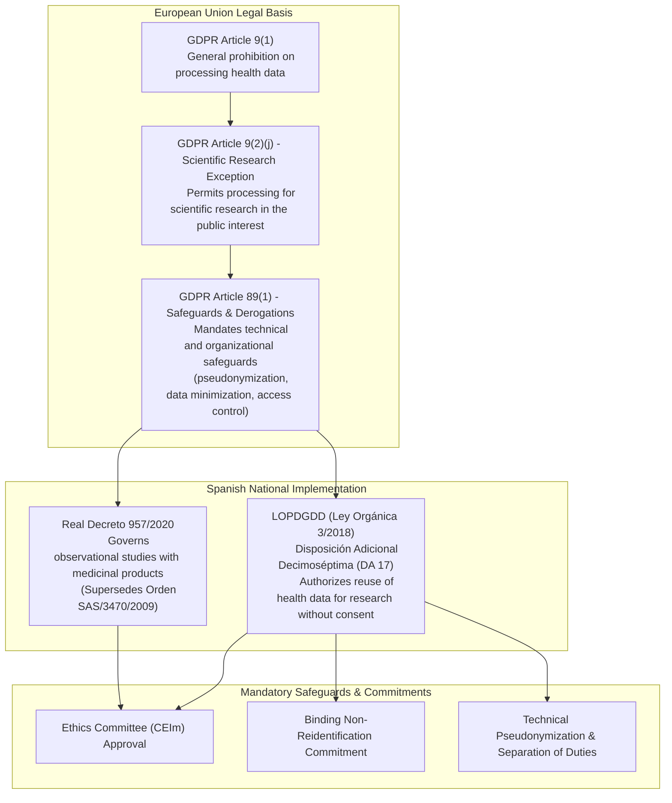

*   **GDPR Article 9(2)(j):** The primary legal exemption authorizing non-consent health data processing when necessary for scientific research in the public interest.
*   **GDPR Article 89(1) Safeguards:** Mandates technical and organizational measures: data minimization, pseudonymization, encryption, and privacy by design.

### 5.2 Spanish National Legislation

*   **LOPDGDD Disposición Adicional Decimoséptima (DA 17):** Authorizes the reuse of health data collected in clinical care for biomedical research without individual consent under strict conditions: technical pseudonymization with separation of custody, an approved scientific protocol evaluated by a CEIm, and a legally binding non-reidentification and confidentiality commitment signed by researchers.
*   **Real Decreto 957/2020:** The governing decree for observational studies with medicines for human use (superseding Orden SAS/3470/2009), centralizing single-CEIm evaluations across participating centers.

### 5.3 Federated Governance Architecture

To satisfy European and national legal mandates, modern observational research utilizes **federated analysis architectures**:

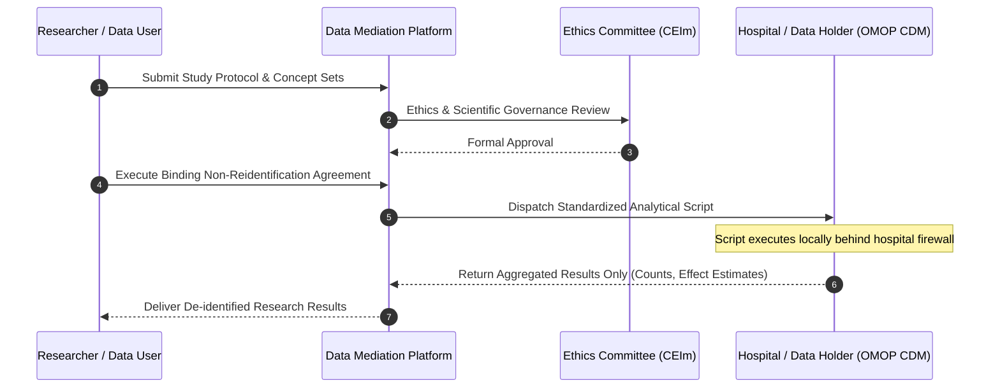

In this federated model:
*   **Data Stays Local:** Patient-level clinical records never leave the hospital's secure environment.
*   **Code-to-Data Paradigm:** Only validated R analysis scripts are transmitted to data nodes.
*   **Zero Patient-Level Exposure:** Only aggregated, non-identifiable summary tables and effect estimates are returned, satisfying GDPR privacy-by-design requirements.

## References

1. **Grimes DA, Schulz KF.** (2002). *An overview of clinical research: the lay of the land.* The Lancet, 359(9300), 57–61. [doi:10.1016/S0140-6736(02)07283-5](https://doi.org/10.1016/S0140-6736(02)07283-5).
2. **Burns PB, Rohrich RJ, Chung KC.** (2011). *The Levels of Evidence and Their Role in Evidence-Based Medicine.* Plastic and Reconstructive Surgery, 128(1), 305–310. [doi:10.1097/PRS.0b013e318219c171](https://doi.org/10.1097/PRS.0b013e318219c171).
3. **Prieto-Alhambra D.** (2024). *Real World Evidence: Why Do We Care?* University of Oxford Pharmacoepidemiology Seminar Series.
4. **Smith GCS, Pell JP.** (2003). *Parachute use to prevent death and major trauma related to gravitational challenge: systematic review of randomised controlled trials.* BMJ, 327(7429), 1459–1461. [doi:10.1136/bmj.327.7429.1459](https://doi.org/10.1136/bmj.327.7429.1459).
5. **Cramer-van der Welle CM, Verschueren MV, Tonn M, et al.** (2021). *Real-world outcomes versus clinical trial results of immunotherapy in stage IV non-small cell lung cancer (NSCLC) in the Netherlands.* Sci Rep, 11(1), 6306. [doi:10.1038/s41598-021-85696-3](https://doi.org/10.1038/s41598-021-85696-3).
6. **Schuemie MJ, Ryan PB, DuMouchel W, Suchard MA, Madigan D.** (2014). *Interpreting observational studies: why empirical calibration is needed to correct p-values.* Statistics in Medicine, 33(2), 209–218. [doi:10.1002/sim.5925](https://doi.org/10.1002/sim.5925).
7. **European Medicines Agency (EMA).** (2024). *Catalogues of Real-World Data Sources and Studies.* [https://catalogues.ema.europa.eu](https://catalogues.ema.europa.eu).
8. **Jefatura del Estado (España).** (2018). *Ley Orgánica 3/2018 (LOPDGDD) - Disposición Adicional Decimoséptima.* BOE núm. 294.
9. **Ministerio de Sanidad (España).** (2020). *Real Decreto 957/2020, por el que se regulan los estudios observacionales con medicamentos de uso humano.* BOE núm. 293.
