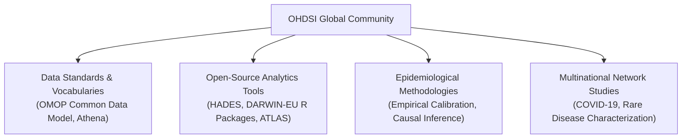
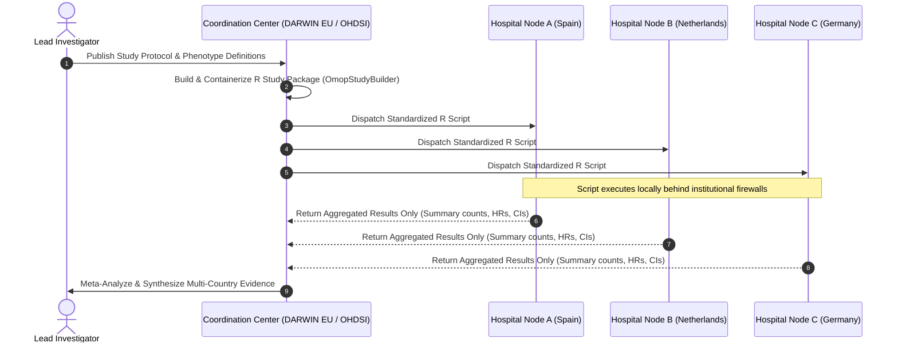
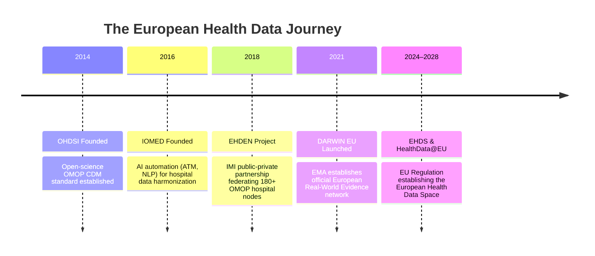
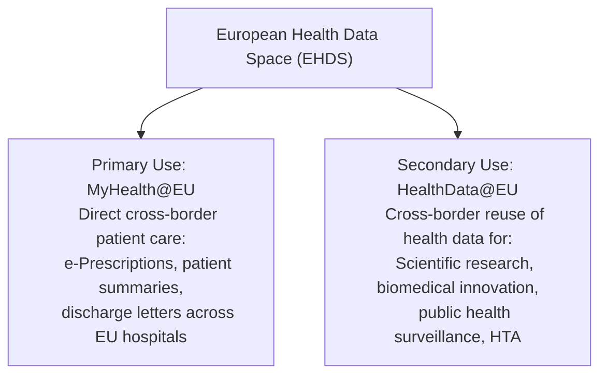
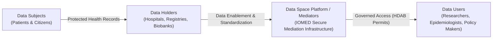
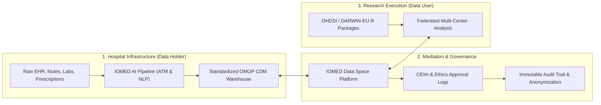

# The Open Science Ecosystem: OHDSI, DARWIN EU & EHDS
{: .no_toc }

Generating reliable, reproducible Real-World Evidence at global scale requires open standards, shared vocabularies, and federated research networks where patient data remains protected behind hospital firewalls.

1. TOC
{:toc}

## 1. The Global OHDSI Community

Observational health research cannot be solved by any single institution:
*   *No single company* can develop, benchmark, and validate the entire spectrum of causal inference algorithms.
*   *No single laboratory* can maintain millions of medical concept mappings across hundreds of international vocabularies.
*   *No single hospital* has the resources to build custom data exports for every external research request.

In response, the **Observational Health Data Sciences and Informatics (OHDSI)** initiative was founded in 2013 as a multi-stakeholder, international open-science collaboration:

Today, OHDSI represents a global federated community of over **5,000 researchers, epidemiologists, clinicians, and computer scientists**, standardizing data across **540+ data holders** covering more than **1 billion patient records** across 88 countries.

## 2. The Federated "Code-to-Data" Paradigm

Traditional health research relied on centralizing raw patient records into external databases—a model that introduces significant patient privacy risks, high security costs, and complex cross-border legal challenges.

OHDSI and DARWIN EU replace this with the **Federated Research Model**:

### Key Principles of the Federated Paradigm
1.  **Data Stays Local:** Patient-level clinical records remain permanently inside each hospital's accredited infrastructure.
2.  **Standardized Schemas (OMOP CDM):** Because all participating nodes standardize their data to the OMOP CDM, the exact same R code executes seamlessly at every site.
3.  **Aggregated Results Only:** Participating centers only transmit summary tables, hazard ratios, and calibrated p-values back to the coordination center. No personally identifiable information (PII) ever leaves the institution.

## 3. The European Health Data Roadmap

Over the past decade, Europe has pioneered the transition from open-science pilots to formal regulatory infrastructure:

### 3.1 EHDEN (European Health Data & Evidence Network)
Funded under the EU Innovative Medicines Initiative (IMI), **EHDEN (2018–2024)** proved the viability of federated health data science across Europe. It certified dozens of Small and Medium Enterprises (SMEs) to convert over 180 healthcare databases across 29 countries into the OMOP Common Data Model, creating the foundation for large-scale European network studies.

### 3.2 DARWIN EU® (Data Analysis and Real World Interrogation Network)
Established by the **European Medicines Agency (EMA)** and operated by Erasmus University Medical Center, **DARWIN EU®** is the official federated network providing timely and reliable Real-World Evidence to support regulatory decision-making across the medicine product lifecycle:

*   **Study Execution:** Regulators and scientific committees (CHMP, PRAC) submit clinical questions to DARWIN EU.
*   **Rapid Interrogation:** DARWIN EU coordinates with accredited Data Partners across European member states to execute standardized epidemiological studies using the `DARWIN-EU` R package suite.
*   **Regulatory Decisions:** Informs marketing authorizations, post-authorization safety reviews, and public health crisis responses.

## 4. The European Health Data Space (EHDS)

The **European Health Data Space (EHDS)** is a landmark regulation by the European Union designed to unleash the full potential of health data across two complementary pillars:

### EHDS Governance & Stakeholders

The EHDS establishes a legally governed ecosystem connecting four key groups:

1.  **Data Subjects (Patients):** Retain rights and transparency over how their medical records are protected and utilized.
2.  **Data Holders (Hospitals & Health Systems):** Maintain custody and control over raw clinical systems while preparing them for standardized secondary use.
3.  **Health Data Access Bodies (HDABs) & Mediators:** Public authorities and accredited technology platforms that evaluate study permits, ensure GDPR compliance, and manage secure processing environments.
4.  **Data Users (Researchers & Innovators):** Gain streamlined, secure access to multi-country research datasets under standardized permits.

## 5. The IOMED Data Space Platform

The **IOMED Data Space Platform** acts as the critical bridge enabling hospitals and healthcare organizations to participate in this European ecosystem:

*   **Data Space Enabler:** Deploys within hospital infrastructure to extract structured and unstructured clinical data (via Automated Terminology Mapping and NLP) into the OMOP CDM.
*   **Data Space Mediator:** Manages study requests, ethics governance workflows, automated data quality assurance (DQD), and privacy-preserving federated execution.

## References

1. **Hripcsak G, Duke JD, Shah NH, et al.** (2015). *Observational Health Data Sciences and Informatics (OHDSI): Opportunities for Observational Researchers.* Stud Health Technol Inform, 216, 574–578. [PMID: 26262116](https://pubmed.ncbi.nlm.nih.gov/26262116/).
2. **European Medicines Agency (EMA).** (2023). *DARWIN EU® - Data Analysis and Real World Interrogation Network: Operational Overview and Governance.* [https://www.darwin-eu.org](https://www.darwin-eu.org).
3. **European Commission.** (2022). *Proposal for a Regulation on the European Health Data Space (EHDS).* COM(2022) 197 final.
4. **Agencia Española de Protección de Datos (AEPD).** (2023). *Approach to Data Spaces from a GDPR Perspective.* Innovation and Technology Division.
