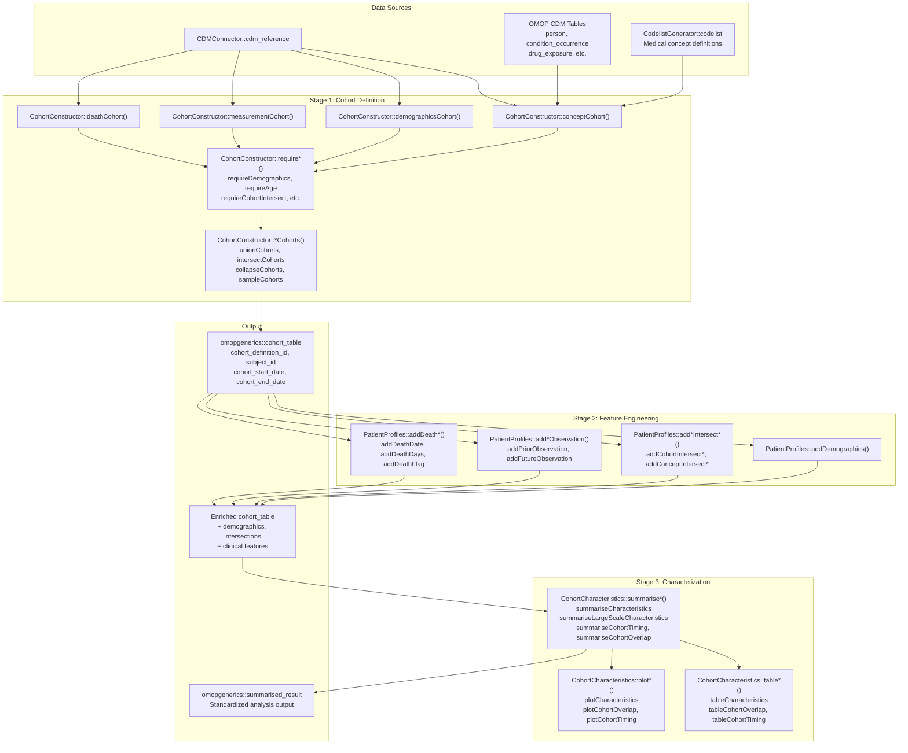
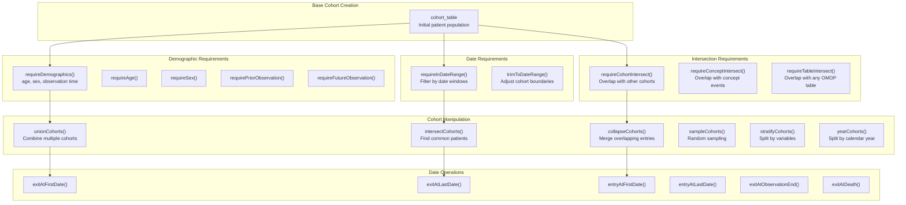
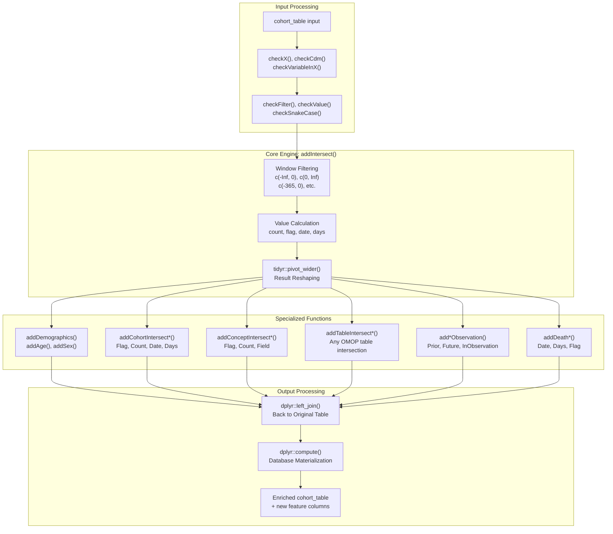
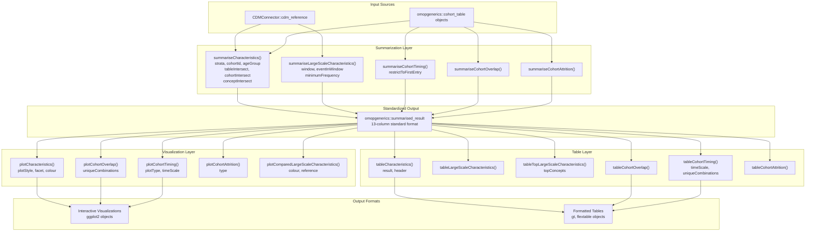

# Page: Cohort Management Packages

# Cohort Management Packages

Relevant source files

The following files were used as context for generating this wiki page:

- [docs/data_analysis/package_reference/PatientProfiles.md](docs/data_analysis/package_reference/PatientProfiles.md)
- [docs/data_analysis/package_reference/cdmconnector.md](docs/data_analysis/package_reference/cdmconnector.md)
- [docs/data_analysis/package_reference/cohortcharacteristics.md](docs/data_analysis/package_reference/cohortcharacteristics.md)
- [docs/data_analysis/package_reference/cohortconstructor.md](docs/data_analysis/package_reference/cohortconstructor.md)
- [docs/data_analysis/package_reference/omock.md](docs/data_analysis/package_reference/omock.md)
- [docs/data_analysis/package_reference/omopgenerics.md](docs/data_analysis/package_reference/omopgenerics.md)
- [docs/data_analysis/package_reference/omopsketch.md](docs/data_analysis/package_reference/omopsketch.md)

This document covers the three core packages responsible for cohort definition, feature engineering, and characterization within the OMOP analytics ecosystem: `CohortConstructor`, `PatientProfiles`, and `CohortCharacteristics`. These packages provide the foundational tools for creating patient cohorts, enriching them with clinical features, and generating comprehensive summaries for analysis.

For foundational database connectivity and CDM management, see [Core Infrastructure Packages](#3.3.1). For analysis-specific packages that consume the output from cohort management, see [Specialized Analysis Packages](#3.3.3).

## Package Architecture and Relationships

The cohort management packages follow a three-stage pipeline architecture where each package has a distinct role in the cohort analysis workflow.

### Cohort Management Pipeline

Sources: [docs/data_analysis/package_reference/cohortconstructor.md:19-52](), [docs/data_analysis/package_reference/PatientProfiles.md:20-48](), [docs/data_analysis/package_reference/cohortcharacteristics.md:54-77]()

## CohortConstructor: Cohort Definition and Manipulation

`CohortConstructor` provides the foundational tools for creating patient cohorts from OMOP CDM data. It implements a systematic approach to cohort building through base cohort generation, requirement application, and cohort manipulation operations.

### Core Cohort Building Functions

The package provides four primary methods for creating base cohorts, each targeting different clinical data sources:

| Function | Purpose | Primary Tables |
|----------|---------|----------------|
| `conceptCohort()` | Create cohorts from concept sets | `condition_occurrence`, `drug_exposure`, `procedure_occurrence`, `device_exposure`, `measurement`, `observation`, `visit_occurrence` |
| `demographicsCohort()` | Create cohorts based on patient characteristics | `person`, `observation_period` |
| `measurementCohort()` | Create cohorts with value-based measurement filtering | `measurement` |
| `deathCohort()` | Create cohorts based on death records | `death` |

### Requirement System Architecture

Sources: [docs/data_analysis/package_reference/cohortconstructor.md:113-202](), [docs/data_analysis/package_reference/cohortconstructor.md:220-235]()

### Advanced Features

The package includes specialized functionality for complex cohort scenarios:

- **`matchCohorts()`**: Generates matched control cohorts based on demographic characteristics like sex and year of birth
- **`benchmarkCohortConstructor()`**: Performance comparison against traditional CIRCE/ATLAS cohort generation
- **Attrition tracking**: All operations automatically track patient attrition with `attrition()` function
- **Settings management**: Cohort metadata preserved through `settings()` function

Sources: [docs/data_analysis/package_reference/cohortconstructor.md:237-252]()

## PatientProfiles: Feature Engineering and Enrichment

`PatientProfiles` specializes in adding clinical features and characteristics to existing cohort tables. It implements a unified intersection system for analyzing temporal relationships between different clinical data sources.

### Core Intersection Engine

The package's core functionality revolves around the `addIntersect()` engine, which provides temporal filtering and value calculation across OMOP tables:

Sources: [docs/data_analysis/package_reference/PatientProfiles.md:96-149]()

### Function Categories and APIs

| Category | Functions | Purpose |
|----------|-----------|---------|
| Demographics | `addDemographics()`, `addAge()`, `addSex()` | Add age, sex, observation period information |
| Cohort Intersections | `addCohortIntersectFlag()`, `addCohortIntersectCount()`, `addCohortIntersectDate()`, `addCohortIntersectDays()` | Analyze overlaps with other cohorts |
| Concept Intersections | `addConceptIntersectFlag()`, `addConceptIntersectCount()`, `addConceptIntersectField()` | Find intersections with OMOP concept sets |
| Observation Periods | `addInObservation()`, `addPriorObservation()`, `addFutureObservation()`, `addObservationPeriodId()` | Handle temporal constraints |
| Mortality | `addDeathDate()`, `addDeathDays()`, `addDeathFlag()` | Incorporate death data |

### Statistical Summarization

The `summariseResult()` function provides comprehensive statistical analysis with support for grouping, stratification, and various statistical estimates.

Sources: [docs/data_analysis/package_reference/PatientProfiles.md:188-321]()

## CohortCharacteristics: Summarization and Visualization

`CohortCharacteristics` implements a standardized three-tier analysis pattern: `summarise*()` → `plot*()` → `table*()` for consistent cohort analysis and reporting.

### Analysis Pipeline Architecture

Sources: [docs/data_analysis/package_reference/cohortcharacteristics.md:54-109]()

### Function Categories

| Analysis Type | Summarization | Visualization | Tables |
|---------------|---------------|---------------|---------|
| Core Characteristics | `summariseCharacteristics()` | `plotCharacteristics()` | `tableCharacteristics()` |
| Large-Scale Analysis | `summariseLargeScaleCharacteristics()` | `plotComparedLargeScaleCharacteristics()` | `tableLargeScaleCharacteristics()`, `tableTopLargeScaleCharacteristics()` |
| Temporal Analysis | `summariseCohortTiming()` | `plotCohortTiming()` | `tableCohortTiming()` |
| Cohort Overlap | `summariseCohortOverlap()` | `plotCohortOverlap()` | `tableCohortOverlap()` |
| Attrition Analysis | `summariseCohortAttrition()` | `plotCohortAttrition()` | `tableCohortAttrition()` |

Sources: [docs/data_analysis/package_reference/cohortcharacteristics.md:80-109]()

## Integration with OMOP Ecosystem

### Data Class Dependencies

The cohort management packages rely heavily on standardized data classes from `omopgenerics`:

- **`cdm_reference`**: Database connection and table references from `CDMConnector`
- **`cohort_table`**: Core cohort structure with required columns (`cohort_definition_id`, `subject_id`, `cohort_start_date`, `cohort_end_date`)
- **`summarised_result`**: Standardized 13-column output format for all analysis results

### Mock Data Integration

All packages provide mock data functionality for testing and development:

- `CohortConstructor::mockCohortConstructor()`
- `PatientProfiles::mockPatientProfiles()`
- `CohortCharacteristics::mockCohortCharacteristics()`

These functions create synthetic CDM instances with realistic patient data for package development and user testing.

Sources: [docs/data_analysis/package_reference/cohortconstructor.md:87-88](), [docs/data_analysis/package_reference/PatientProfiles.md:72-74](), [docs/data_analysis/package_reference/cohortcharacteristics.md:41-43](), [docs/data_analysis/package_reference/omopgenerics.md:12-33]()