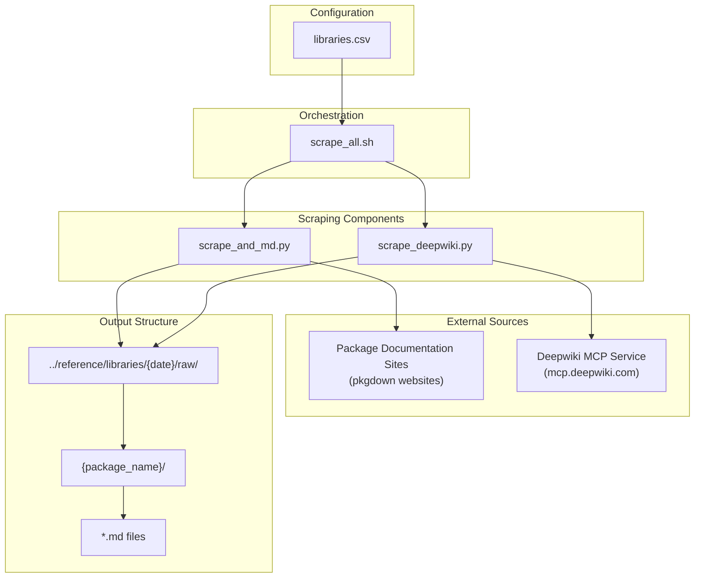
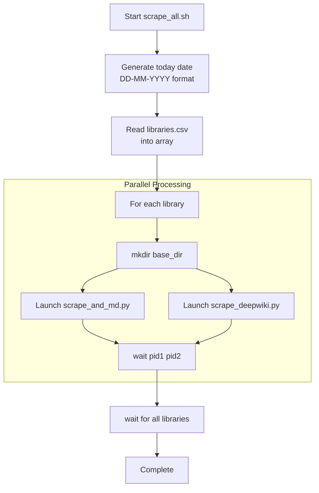
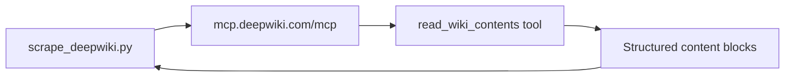

# Page: Content Scraping and Generation

# Content Scraping and Generation

<details>
<summary>Relevant source files</summary>

The following files were used as context for generating this wiki page:

- [utils/libraries.csv](utils/libraries.csv)
- [utils/scrape_all.sh](utils/scrape_all.sh)
- [utils/scrape_and_md.py](utils/scrape_and_md.py)
- [utils/scrape_deepwiki.py](utils/scrape_deepwiki.py)

</details>


This document describes the automated content scraping system that collects documentation from external R package websites and generates standardized content for the OMOP Analytics Guide. The system orchestrates parallel scraping operations to gather both traditional HTML documentation and enriched content from the deepwiki service.

For information about how this scraped content integrates with the Jekyll site build process, see [Jekyll Site Configuration](#5.2).

## System Architecture

The content scraping system consists of three main components orchestrated by a shell script that processes a CSV configuration file:



Sources: [utils/scrape_all.sh:1-36](), [utils/libraries.csv:1-15](), [utils/scrape_deepwiki.py:1-122](), [utils/scrape_and_md.py:1-129]()

## Library Configuration

The system uses a CSV configuration file to define which R packages to scrape:

| Field | Description | Example |
|-------|-------------|---------|
| `repo` | GitHub repository path | `darwin-eu/CohortSurvival` |
| `url` | Package documentation website | `https://darwin-eu-dev.github.io/CohortSurvival/` |
| `name` | Package directory name | `CohortSurvival` |

The configuration covers all major OMOP analytics packages including core infrastructure (CDMConnector, omopgenerics), cohort management (CohortConstructor, CohortCharacteristics), and specialized analysis packages (IncidencePrevalence, DrugUtilisation, CohortSurvival).

Sources: [utils/libraries.csv:1-15]()

## Orchestration Workflow

The `scrape_all.sh` script implements the main workflow:



The script processes each library by:
1. Creating a date-stamped directory structure: `../reference/libraries/{today}/raw/{name}/`
2. Launching both scrapers in parallel as background processes
3. Using process IDs (`pid1`, `pid2`) to synchronize completion
4. Waiting for all library processing to complete

Sources: [utils/scrape_all.sh:5-36]()

## HTML to Markdown Conversion

The `scrape_and_md.py` component performs recursive website crawling and HTML-to-Markdown conversion:

### Core Functions

| Function | Purpose | Key Parameters |
|----------|---------|----------------|
| `crawl_and_convert_to_markdown()` | Main crawling logic | `base_url`, `output_dir` |
| `sanitize_filename()` | Clean titles for filesystem | Uses regex `r'[^\w\s-]'` |

### Crawling Strategy

```mermaid
graph TD
    INIT[Initialize with base_url]
    PARSE_DOMAIN[Extract base_domain<br/>and base_path]
    
    subgraph "URL Processing Loop"
        POP_URL[Pop URL from queue]
        CHECK_PROCESSED[Check if in collected_urls]
        FETCH[HTTP GET request]
        PARSE_HTML[BeautifulSoup parsing]
        EXTRACT_LINKS[Find all <a href> tags]
        FILTER_LINKS[Filter by domain/path/<br/>no query/no file extensions]
        ADD_QUEUE[Add new URLs to queue]
    end
    
    CONVERT[html2text conversion]
    SAVE_MD[Save as {title}.md]
    DELAY[time.sleep(1)]
    
    INIT --> PARSE_DOMAIN
    PARSE_DOMAIN --> POP_URL
    POP_URL --> CHECK_PROCESSED
    CHECK_PROCESSED --> FETCH
    FETCH --> PARSE_HTML
    PARSE_HTML --> EXTRACT_LINKS
    EXTRACT_LINKS --> FILTER_LINKS
    FILTER_LINKS --> ADD_QUEUE
    ADD_QUEUE --> CONVERT
    CONVERT --> SAVE_MD
    SAVE_MD --> DELAY
    DELAY --> POP_URL
```

The crawler implements several filtering mechanisms:
- Domain restriction: `parsed_url.netloc == base_domain`
- Path restriction: `parsed_url.path.startswith(base_path)`
- File type exclusion: `.pdf`, `.jpg`, `.png`, `.zip`, `.tar`
- Duplicate prevention using `collected_urls` set

Sources: [utils/scrape_and_md.py:17-113]()

## Deepwiki Content Extraction

The `scrape_deepwiki.py` component uses Model Context Protocol (MCP) to fetch enriched documentation:

### MCP Integration



### Async Processing Flow

The script implements asynchronous MCP communication:

| Component | Function | Implementation |
|-----------|----------|---------------|
| `fetch_deepwiki_content_async()` | MCP client session | `streamablehttp_client()`, `ClientSession()` |
| `process_and_save_content()` | Content parsing | Split on `"