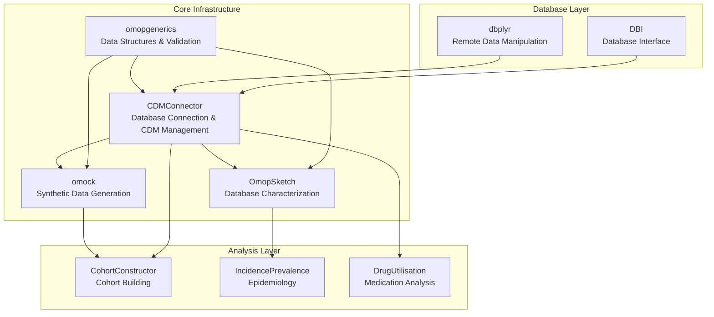
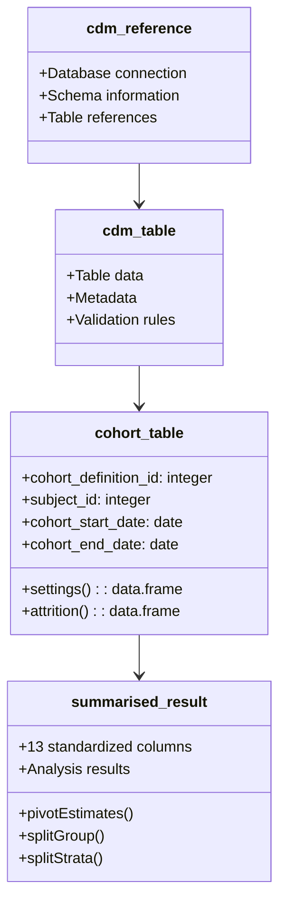
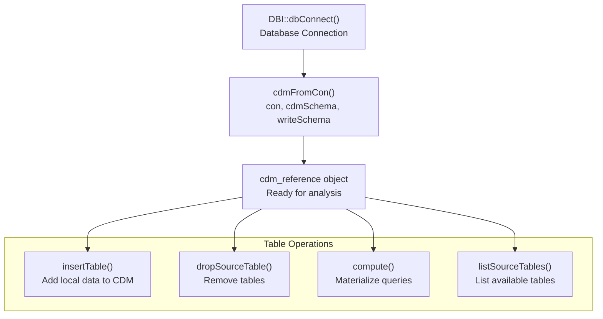
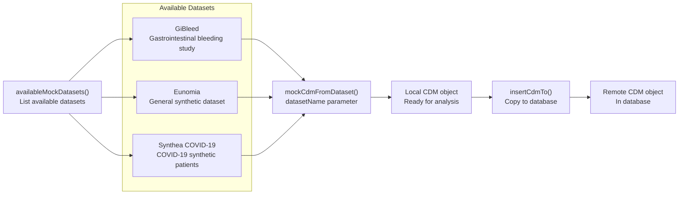
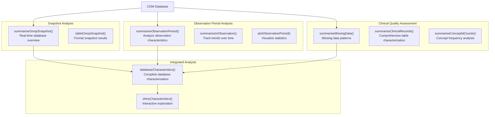
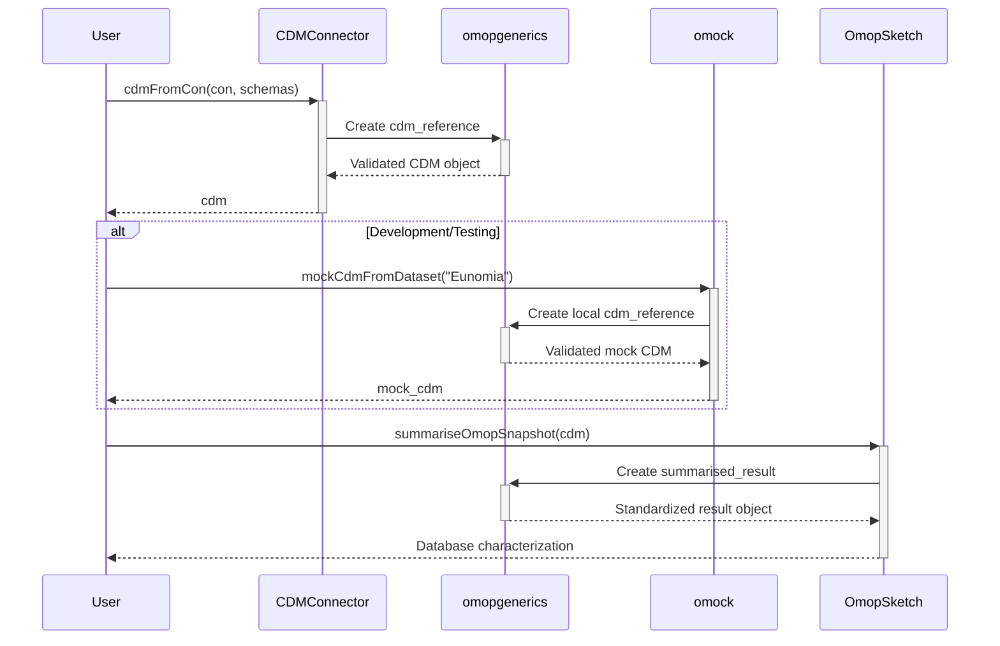

# Page: Core Infrastructure Packages

# Core Infrastructure Packages

Relevant source files

The following files were used as context for generating this wiki page:

- [docs/data_analysis/package_reference/cdmconnector.md](docs/data_analysis/package_reference/cdmconnector.md)
- [docs/data_analysis/package_reference/cohortconstructor.md](docs/data_analysis/package_reference/cohortconstructor.md)
- [docs/data_analysis/package_reference/omock.md](docs/data_analysis/package_reference/omock.md)
- [docs/data_analysis/package_reference/omopgenerics.md](docs/data_analysis/package_reference/omopgenerics.md)
- [docs/data_analysis/package_reference/omopsketch.md](docs/data_analysis/package_reference/omopsketch.md)

This document covers the four foundational packages that provide essential infrastructure for OMOP CDM data analysis: `CDMConnector`, `omopgenerics`, `omock`, and `OmopSketch`. These packages establish database connectivity, define core data structures, provide synthetic testing data, and enable database characterization. For cohort-specific operations, see [Cohort Management Packages](#3.3.2). For specialized analytical functions, see [Specialized Analysis Packages](#3.3.3).

## Package Architecture Overview

The core infrastructure packages form the foundation layer of the OMOP analytics ecosystem. Each package serves a distinct role while integrating seamlessly with the others.

**Core Infrastructure Package Relationships**

**Sources:** docs/data_analysis/package_reference/cdmconnector.md, docs/data_analysis/package_reference/omopgenerics.md, docs/data_analysis/package_reference/omock.md, docs/data_analysis/package_reference/omopsketch.md

## omopgenerics: Core Data Structures

The `omopgenerics` package defines the fundamental data classes and generic functions that standardize data representation across the entire ecosystem.

**Key Data Classes**

### Generic Functions

The package provides standardized functions that work across all OMOP data objects:

| Function | Purpose | Returns |
|----------|---------|---------|
| `settings()` | Access cohort settings and metadata | `data.frame` |
| `attrition()` | Access cohort attrition information | `data.frame` |
| `cohortCount()` | Get cohort record and subject counts | `data.frame` |
| `splitGroup()`, `splitStrata()`, `splitAdditional()` | Split grouped columns | Modified object |
| `pivotEstimates()` | Pivot estimate columns to wide format | `data.frame` |
| `filterStrata()` | Filter by strata conditions | Filtered object |

**Sources:** [docs/data_analysis/package_reference/omopgenerics.md:10-34]()

## CDMConnector: Database Management

`CDMConnector` provides the essential interface between R and OMOP CDM databases, managing connections and table operations.

**Database Connection Workflow**

### Core Functions

| Function | Parameters | Purpose |
|----------|------------|---------|
| `cdmFromCon()` | `con`, `cdmSchema`, `writeSchema`, `writePrefix` | Create CDM reference from database connection |
| `insertTable()` | `cdm`, `name`, `table` | Insert local tibble into CDM |
| `dropSourceTable()` | `cdm`, `name` | Remove tables from CDM and database |
| `compute()` | `name`, `temporary` | Materialize query results as tables |
| `listSourceTables()` | `cdm` | List all available source tables |

**Sources:** [docs/data_analysis/package_reference/cdmconnector.md:14-31]()

## omock: Synthetic Data Generation

The `omock` package generates realistic synthetic OMOP CDM datasets for development, testing, and demonstration purposes.

**Mock Data Generation Process**

### Available Mock Datasets

| Dataset | Description | Use Case |
|---------|-------------|----------|
| **GiBleed** | Gastrointestinal bleeding study dataset | Clinical study simulation |
| **Eunomia** | General synthetic dataset | General development and testing |
| **Synthea COVID-19** | COVID-19 synthetic patient data | Pandemic-related studies |

**Sources:** [docs/data_analysis/package_reference/omock.md:12-22]()

## OmopSketch: Database Characterization

`OmopSketch` provides comprehensive database profiling and quality assessment capabilities for OMOP CDM databases.

**Database Characterization Workflow**

### Analysis Functions by Category

| Category | Functions | Purpose |
|----------|-----------|---------|
| **Snapshot** | `summariseOmopSnapshot()`, `tableOmopSnapshot()` | Database overview, vocabulary version, table sizes |
| **Temporal** | `summariseObservationPeriod()`, `summariseInObservation()` | Observation period analysis, temporal trends |
| **Quality** | `summariseMissingData()`, `summariseClinicalRecords()` | Missing data patterns, record quality assessment |
| **Concepts** | `summariseConceptIdCounts()`, `tableConceptIdCounts()` | Concept frequency and usage analysis |
| **Integrated** | `databaseCharacteristics()`, `shinyCharacteristics()` | Complete characterization with interactive exploration |

**Sources:** [docs/data_analysis/package_reference/omopsketch.md:14-47]()

## Package Integration Patterns

The core infrastructure packages work together through standardized interfaces and shared data structures.

**Typical Analysis Workflow Integration**

This integration ensures that:
- All CDM objects follow consistent validation rules from `omopgenerics`
- Database connections are managed uniformly through `CDMConnector`
- Testing environments are easily created with `omock`
- Database quality is assessed systematically with `OmopSketch`

**Sources:** [docs/data_analysis/package_reference/cdmconnector.md:14-31](), [docs/data_analysis/package_reference/omopgenerics.md:10-34](), [docs/data_analysis/package_reference/omock.md:12-22](), [docs/data_analysis/package_reference/omopsketch.md:14-47]()