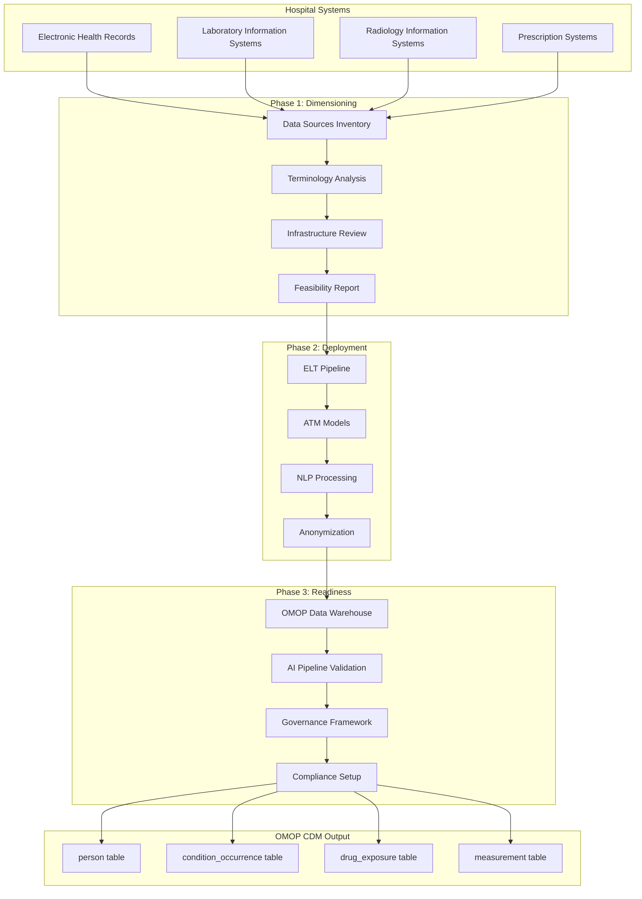
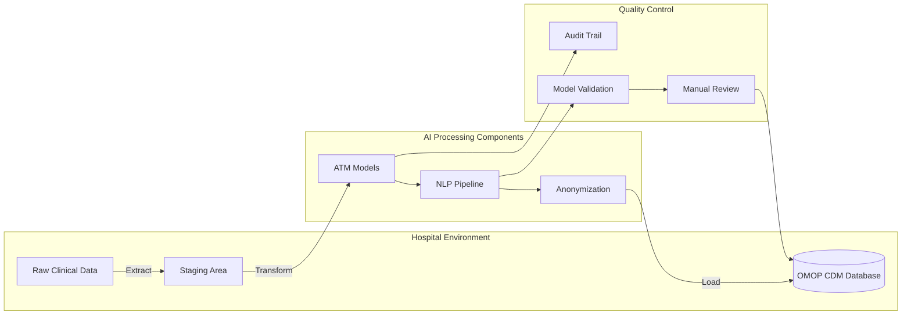
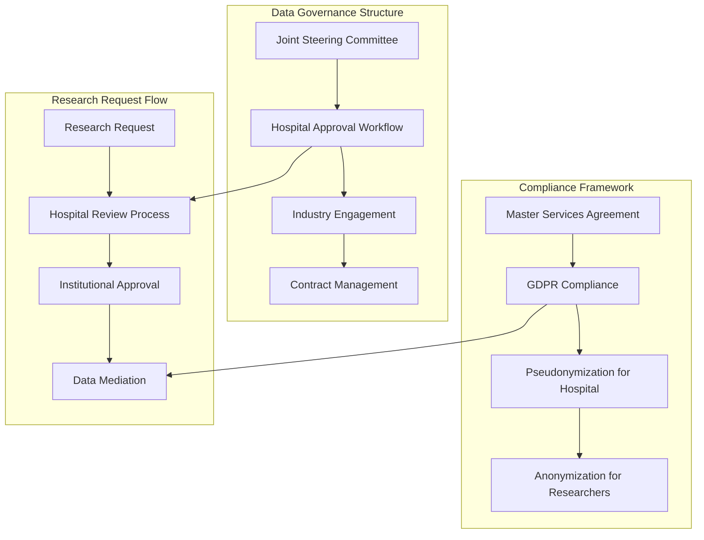

# Page: Data Enablement Process

# Data Enablement Process

Relevant source files

The following files were used as context for generating this wiki page:

- [AGENTS.md](AGENTS.md)
- [README.md](README.md)
- [_includes/nav_footer_custom.html](_includes/nav_footer_custom.html)
- [docs/data_enablement/index.md](docs/data_enablement/index.md)

## Purpose and Scope

The Data Enablement Process transforms raw clinical data from healthcare institutions into research-ready OMOP CDM format through a systematic three-phase approach. This document details the technical architecture and methodology for converting hospital data systems into standardized, analyzable datasets suitable for observational research.

For information about the subsequent research request processing workflow, see [Data Mediation Workflow](#2.2). For details about the OMOP analytics framework used to analyze the resulting datasets, see [OMOP Analytics Framework](#3).

Sources: [docs/data_enablement/index.md:1-118](), [README.md:1-45]()

## Process Overview

The Data Enablement Process consists of three sequential phases that systematically transform a healthcare institution's clinical data infrastructure:

| Phase | Purpose | Key Deliverables |
|-------|---------|------------------|
| **Dimensioning** | Feasibility assessment and data landscape analysis | Data Landscape & Feasibility Report |
| **Deployment** | ELT pipeline implementation and AI model deployment | Operational OMOP CDM database |
| **Readiness** | Environment finalization and governance establishment | Production-ready research platform |

### Data Enablement Architecture

Sources: [docs/data_enablement/index.md:14-18](), [docs/data_enablement/index.md:55-118]()

## Phase 1: Dimensioning

Dimensioning functions as a comprehensive feasibility study that systematically catalogs and evaluates the hospital's clinical data landscape. This phase de-risks the deployment by establishing a complete understanding of data availability, quality, and accessibility.

### Data Sources Assessment

The dimensioning process inventories all clinical systems containing patient data, analyzing their structure and research utility:

| System Type | Description | Assessment Focus |
|-------------|-------------|------------------|
| **EHR Systems** | Complete medical history from providers | Data completeness, coding standards |
| **LIS Systems** | Laboratory test management and storage | Result format, units validation |
| **RIS Systems** | Imaging data and associated reports | Report structure, imaging metadata |
| **Prescription Systems** | Medication orders and administration | Coding systems, dosage information |

### Terminology and Coding Analysis

A critical component involves evaluating how clinical information is structured and coded within each system:

- **Standard Terminology Usage**: Assessment of SNOMED CT, LOINC, ICD-10 implementation
- **Local Coding Systems**: Documentation of internal hospital codes and data dictionaries
- **Unstructured Data Evaluation**: Analysis of clinical notes format and NLP extraction potential

### Infrastructure and Governance Review

Technical and administrative environment assessment includes:

- **Data Location Analysis**: On-premise, cloud, or third-party infrastructure mapping
- **Governance Policy Review**: Existing data policies and privacy protocols
- **Approval Process Documentation**: IRB/EC workflows and ethical approval mechanisms

Sources: [docs/data_enablement/index.md:20-54]()

## Phase 2: Deployment

The deployment phase implements the core ELT (Extract, Load, Transform) pipeline that converts raw clinical data into OMOP CDM format using AI-powered processing components.

### ELT Pipeline Architecture

### Automated Terminology Mapping (ATM)

The ATM system maps diverse coding systems to standardized OMOP vocabulary concepts:

- **Model Performance**: 98% automated mapping accuracy with confidence thresholding
- **Manual Review Workflow**: Sub-threshold mappings flagged for clinical terminologist review
- **Audit Trail**: Complete logging of all mapping decisions and confidence scores

### Natural Language Processing Pipeline

NLP models extract structured information from unstructured clinical text:

- **Concept Extraction**: Identification of diagnoses, medications, symptoms from free text
- **Context Understanding**: Negation detection, temporal relationships, family history classification
- **OMOP Mapping**: Direct extraction to appropriate OMOP concept identifiers

### Anonymization Process

Two-step anonymization ensures patient privacy compliance:

1. **Identifier Hashing**: Personal identifiers detected, hashed, and removed
2. **Text Anonymization**: Pattern matching and probabilistic models remove personal data from clinical notes

Sources: [docs/data_enablement/index.md:55-93]()

## Phase 3: Readiness

The readiness phase finalizes the research environment across technical, AI, governance, and compliance dimensions to enable production data mediation workflows.

### Technical Readiness Components

| Component | Implementation | Validation |
|-----------|----------------|------------|
| **OMOP Data Warehouse** | All hospital sources normalized to OMOP CDM | Data quality checks, completeness validation |
| **Query Infrastructure** | SQL-based research query capabilities | Performance testing, concurrent access |
| **Data Refresh Pipelines** | Automated ETL scheduling and monitoring | Pipeline reliability, error handling |

### AI Pipeline Validation

- **ATM Model Deployment**: Production-ready terminology mapping with continuous monitoring
- **NLP Pipeline Activation**: Real-time processing of incoming unstructured data
- **Model Performance Tracking**: Ongoing accuracy monitoring and retraining workflows

### Governance Framework Establishment

### Compliance Readiness

- **Master Services Agreement**: Legal framework governing platform deployment and usage
- **Regulatory Alignment**: GDPR-compliant data processing with dual anonymization approach
- **Ethical Oversight**: Integration with existing IRB/EC approval workflows

Sources: [docs/data_enablement/index.md:94-118]()