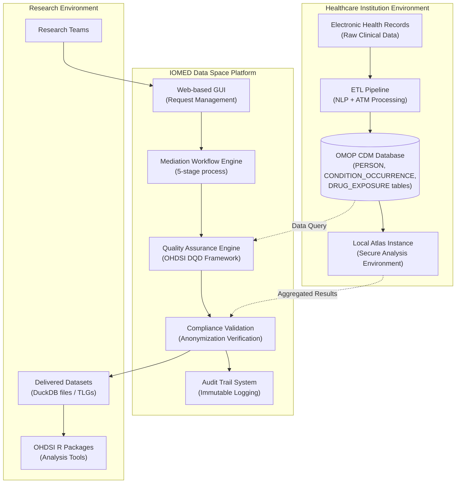
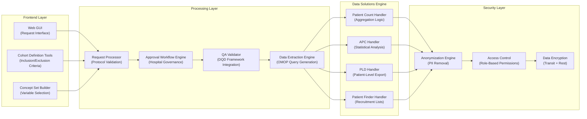

# Page: Data Mediation Platform

# Data Mediation Platform

Relevant source files

The following files were used as context for generating this wiki page:

- [assets/images/anonymization.svg](assets/images/anonymization.svg)
- [docs/data_mediation/data_solutions.md](docs/data_mediation/data_solutions.md)
- [docs/data_mediation/index.md](docs/data_mediation/index.md)
- [index.md](index.md)

## Purpose and Scope

The Data Mediation Platform is IOMED's core infrastructure system that transforms raw clinical data into research-ready, standardized datasets compliant with privacy regulations. This platform orchestrates the entire data lifecycle from initial hospital data preparation through final research data delivery.

This document covers the technical architecture, core components, and data flow of the mediation platform. For detailed information about the data preparation process, see [Data Enablement Process](#2.1). For the step-by-step research request workflow, see [Data Mediation Workflow](#2.2).

## Platform Architecture

The IOMED Data Space Platform serves as the central orchestration system connecting data holders (hospitals) with data users (researchers) through a secure, auditable workflow.

### High-Level System Architecture

Sources: [index.md:28-113](), [docs/data_mediation/index.md:1-66]()

## Core Technical Components

### Data Space Platform Components

Sources: [docs/data_mediation/index.md:19-61](), [docs/data_mediation/data_solutions.md:15-119]()

## Data Solution Types and Technical Implementation

The platform supports four distinct data solution types, each with specific technical implementations:

| Solution Type | Technical Handler | Output Format | Security Level |
|---------------|------------------|---------------|----------------|
| **Patient Count (PC)** | `PC_HANDLER` | Aggregated integers | High (count-only) |
| **Aggregated Patient Characterisation (APC)** | `APC_HANDLER` | Statistical tables, visualizations | High (aggregated only) |
| **Patient-Level Data (PLD)** | `PLD_HANDLER` | DuckDB files (OMOP CDM format) | Maximum (full anonymization) |
| **Patient Finder (PF)** | `PF_HANDLER` | Internal patient lists (hospital-only) | Maximum (no data export) |

Sources: [docs/data_mediation/data_solutions.md:22-105]()

## Data Processing Flow

### End-to-End Data Mediation Process

```mermaid
flowchart TD
    START["Research Request Initiated"]
    
    subgraph "Stage 1: Request Processing"
        PROTOCOL_UPLOAD["Protocol Upload<br/>(Study Documentation)"]
        COHORT_DEF["Cohort Definition<br/>(Inclusion/Exclusion Logic)"]
        CONCEPT_SELECTION["Concept Set Selection<br/>(Variable Specification)"]
        SOLUTION_SELECT["Data Solution Selection<br/>(PC/APC/PLD/PF)"]
    end
    
    subgraph "Stage 2: Approval Workflow"
        HOSPITAL_REVIEW["Hospital Ethics Review<br/>(Data Governance Board)"]
        CONTRACT_EXEC["Contract Execution<br/>(Legal Agreements)"]
    end
    
    subgraph "Stage 3: Quality Assurance"
        DQD_CHECKS["OHDSI DQD Framework<br/>(Conformance/Completeness/Plausibility)"]
        INCIDENT_MGMT["Incident Management<br/>(Query Resolution System)"]
        QA_DASHBOARD["Live Quality Dashboard<br/>(Interactive Results)"]
    end
    
    subgraph "Stage 4: Data Processing"
        OMOP_QUERY["OMOP CDM Query Generation<br/>(SQL Generation)"]
        DATA_EXTRACT["Data Extraction<br/>(Hospital Database)"]
        ANONYMIZATION["Anonymization Process<br/>(PII Removal)"]
    end
    
    subgraph "Stage 5: Delivery"
        COMPLIANCE_CHECK["Final Compliance Scan<br/>(Anonymization Verification)"]
        SECURE_DELIVERY["Secure Data Delivery<br/>(Encrypted Transfer)"]
        AUDIT_LOG["Audit Trail Creation<br/>(Immutable Records)"]
    end
    
    START --> PROTOCOL_UPLOAD
    PROTOCOL_UPLOAD --> COHORT_DEF
    COHORT_DEF --> CONCEPT_SELECTION
    CONCEPT_SELECTION --> SOLUTION_SELECT
    
    SOLUTION_SELECT --> HOSPITAL_REVIEW
    HOSPITAL_REVIEW --> CONTRACT_EXEC
    
    CONTRACT_EXEC --> DQD_CHECKS
    DQD_CHECKS --> INCIDENT_MGMT
    INCIDENT_MGMT --> QA_DASHBOARD
    
    QA_DASHBOARD --> OMOP_QUERY
    OMOP_QUERY --> DATA_EXTRACT
    DATA_EXTRACT --> ANONYMIZATION
    
    ANONYMIZATION --> COMPLIANCE_CHECK
    COMPLIANCE_CHECK --> SECURE_DELIVERY
    SECURE_DELIVERY --> AUDIT_LOG
    
    AUDIT_LOG --> END["Research Data Delivered"]
```

Sources: [docs/data_mediation/index.md:17-61]()

## Technical Infrastructure Components

### OMOP CDM Integration

The platform operates on standardized OMOP CDM tables that organize clinical data into consistent structures:

- **`PERSON`** - Patient demographics and basic information
- **`CONDITION_OCCURRENCE`** - Diagnosis records and clinical conditions  
- **`DRUG_EXPOSURE`** - Medication prescriptions and administration records
- **`MEASUREMENT`** - Laboratory results and clinical measurements
- **`PROCEDURE_OCCURRENCE`** - Medical procedures and interventions

### Quality Assurance Framework

The system implements the OHDSI Data Quality Dashboard (DQD) framework with three validation categories:

- **Conformance Checks** - OMOP CDM structure validation (data types, key integrity)
- **Completeness Checks** - Missing value detection in critical fields
- **Plausibility Checks** - Clinical logic validation (temporal consistency, clinical feasibility)

### Data Delivery Formats

Based on the selected data solution, the platform generates different output formats:

- **DuckDB Files** - Self-contained database files for patient-level data analysis
- **Statistical Tables** - Aggregated results in tabular format
- **Interactive Dashboards** - Web-based visualization interfaces
- **Atlas Integration** - Seamless connection to OHDSI Atlas instances

Sources: [index.md:42-43](), [docs/data_mediation/index.md:39-48](), [docs/data_mediation/index.md:55-58]()

## Security and Compliance Architecture

The platform implements multiple security layers to ensure data protection and regulatory compliance:

### Privacy Protection Mechanisms

- **Automated Anonymization** - PII removal using validated algorithms
- **Access Control** - Role-based permissions for data access
- **Audit Logging** - Immutable record of all platform activities
- **Encryption** - Data protection in transit and at rest

### Regulatory Compliance

The system maintains compliance with privacy regulations through:

- **GDPR Compliance** - European data protection standards
- **Anonymization Verification** - Automated PII detection and removal
- **Data Governance** - Hospital-controlled approval workflows
- **Audit Trails** - Complete traceability of data access and processing

Sources: [index.md:43-48](), [docs/data_mediation/index.md:54-61]()