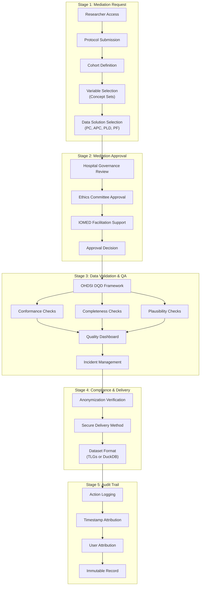
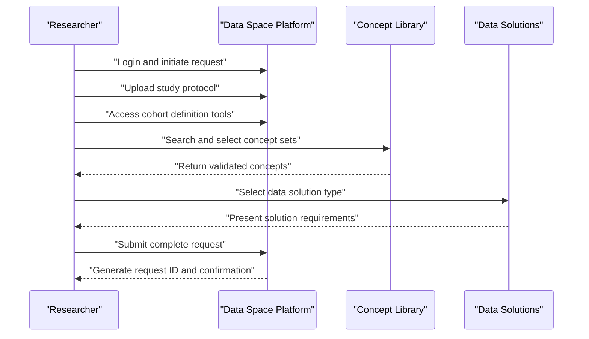
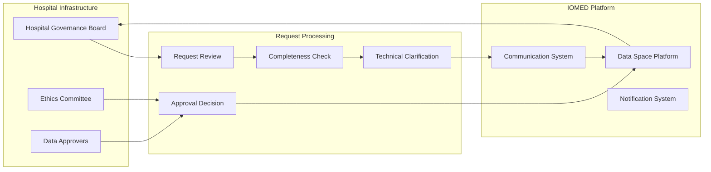
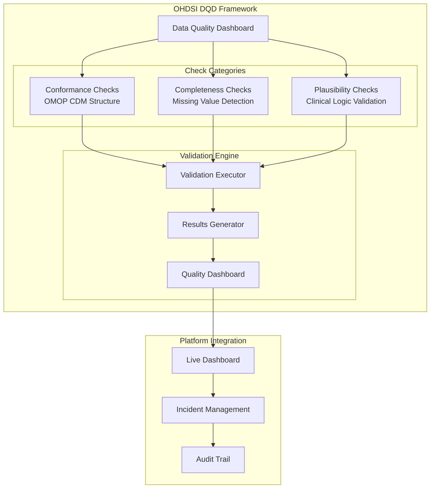
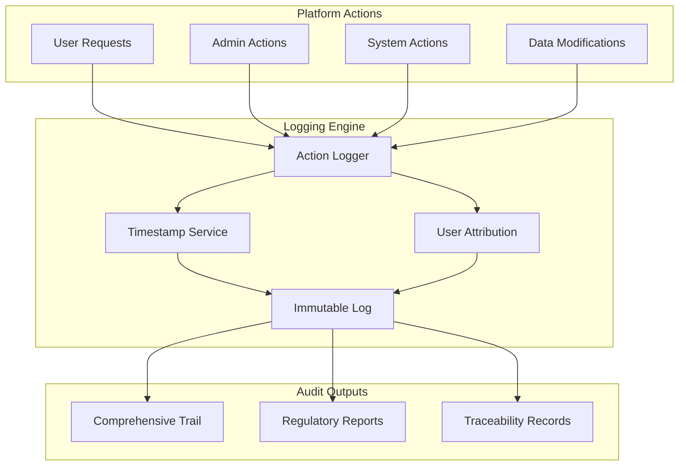

# Page: Data Mediation Workflow

# Data Mediation Workflow

<details>
<summary>Relevant source files</summary>

The following files were used as context for generating this wiki page:

- [assets/images/anonymization.svg](assets/images/anonymization.svg)
- [docs/data_mediation/data_solutions.md](docs/data_mediation/data_solutions.md)
- [docs/data_mediation/index.md](docs/data_mediation/index.md)
- [index.md](index.md)

</details>


This document details the technical implementation of the 5-stage mediation workflow that processes research data requests from submission to delivery. This workflow operates on data that has already been standardized through the Data Enablement process (see [Data Enablement Process](#2.1)) and delivers one of four standardized Data Solutions to researchers.

The workflow is implemented through the **IOMED Data Space Platform** and integrates with the **OHDSI Data Quality Dashboard (DQD) framework** for automated validation. For information about the specific types of datasets delivered, see the Data Solutions documentation referenced in this workflow.

## Workflow Overview

The Data Mediation Workflow consists of five sequential, auditable stages that transform a research request into a validated, compliant dataset delivery:



**Sources:** [docs/data_mediation/index.md:17-61](), [index.md:65-92]()

## Stage 1: Mediation Request

The request process is initiated through the **IOMED Data Space Platform**, a secure web-based interface that guides researchers through structured data request creation:

### Request Components

| Component | Technical Implementation | Purpose |
|-----------|-------------------------|---------|
| **Protocol Submission** | File upload system within platform | Scientific rationale and methodology documentation |
| **Cohort Definition** | Built-in cohort construction tools | Precise inclusion/exclusion criteria specification |
| **Concept Sets** | Integrated concept library and search | Clinical variable selection (equivalent to clinical trial code lists) |
| **Data Solution Selection** | Solution template system | Choice between PC, APC, PLD, or PF delivery formats |

### Technical Workflow



**Sources:** [docs/data_mediation/index.md:19-27](), [docs/data_mediation/data_solutions.md:22-105]()

## Stage 2: Mediation Approval

The approval stage implements a hospital-controlled governance workflow with platform-mediated communication:

### Approval Architecture



The platform provides automated request routing, status tracking, and communication facilitation between data holders and researchers while maintaining hospital autonomy over approval decisions.

**Sources:** [docs/data_mediation/index.md:29-34]()

## Stage 3: Data Validation and Quality Assurance

This stage implements the **OHDSI Data Quality Dashboard (DQD) framework** for automated dataset validation:

### QA Framework Implementation



### Technical Validation Categories

| Category | Implementation | Example Checks |
|----------|----------------|----------------|
| **Conformance** | OMOP CDM structure validation | Data types, primary/foreign key integrity |
| **Completeness** | Null value analysis | Missing critical fields identification |
| **Plausibility** | Clinical logic validation | `drug_exposure_start_date` before `drug_exposure_end_date` |

The system provides interactive incident management through the platform, allowing researchers to raise queries directly within the validation interface, similar to clinical trial data query systems.

**Sources:** [docs/data_mediation/index.md:35-48]()

## Stage 4: Compliance and Delivery

The final delivery stage implements automated compliance verification and secure data transfer:

### Delivery Pipeline

```mermaid
flowchart LR
    subgraph "Compliance Verification"
        AV["Anonymization Verification"]
        AS["Automated Scan"]
        PII["PII Detection Check"]
    end
    
    subgraph "Delivery Methods"
        SD["Secure Delivery"]
        
        subgraph "Output Formats"
            TLG["TLGs<br/>(Tables, Listings, Graphs)"]
            DUCK["DuckDB Files<br/>(Patient-level Data)"]
        end
    end
    
    subgraph "Data Solutions Mapping"
        PC["Patient Count → Aggregated Results"]
        APC["APC → TLGs"]
        PLD["Patient-Level Data → DuckDB"]
        PF["Patient Finder → Internal List"]
    end
    
    AV --> AS
    AS --> PII
    PII --> SD
    
    SD --> TLG
    SD --> DUCK
    
    PC --> TLG
    APC --> TLG
    PLD --> DUCK
    PF -.-> "Hospital Internal System"
```

### Technical Delivery Specifications

- **DuckDB Format**: Self-contained database files for patient-level datasets, optimized for local analysis without server connections
- **TLG Format**: Summary tables, listings, and graphs for aggregated results
- **Security**: Pre-defined secure delivery channels with encryption and access controls

**Sources:** [docs/data_mediation/index.md:50-58](), [docs/data_mediation/data_solutions.md:55-84]()

## Stage 5: Audit Trail

The platform implements comprehensive logging for regulatory compliance and traceability:

### Audit System Architecture



All platform actions are logged with:
- **Timestamp attribution**: Precise action timing
- **User attribution**: Complete user identity tracking  
- **Action details**: Full context of each operation
- **Immutability**: Tamper-proof record preservation

This creates a complete audit trail meeting GDPR and other regulatory compliance requirements.

**Sources:** [docs/data_mediation/index.md:59-62]()

## Technical Integration Points

The Data Mediation Workflow integrates with several key technical systems:

| Integration | Technical Component | Purpose |
|-------------|-------------------|---------|
| **OMOP CDM** | Standardized data model | Consistent data structure across all deliveries |
| **OHDSI DQD** | Quality validation framework | Automated data quality assessment |
| **Atlas** | Web-based analysis tool | Optional analysis execution environment |
| **R Packages** | OHDSI analytics suite | Standardized analysis pipeline execution |
| **Data Space Platform** | Web application | Request management and communication |

**Sources:** [docs/data_mediation/index.md:1-66](), [index.md:94-112]()