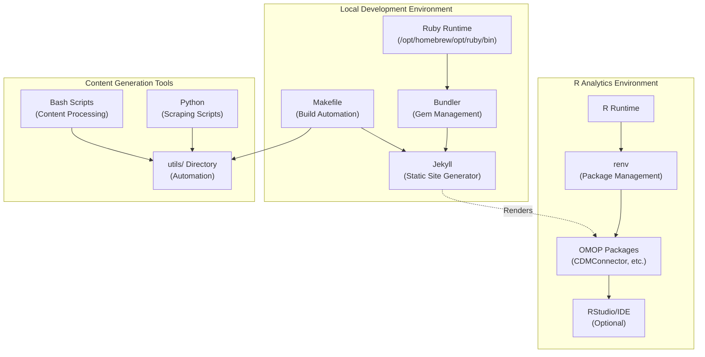
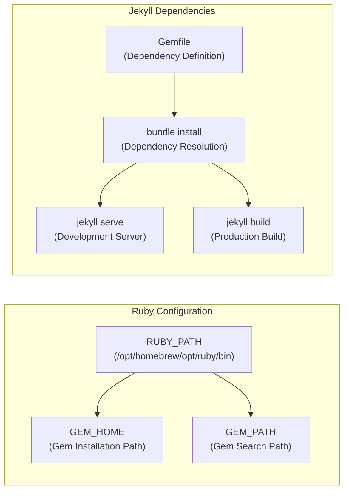
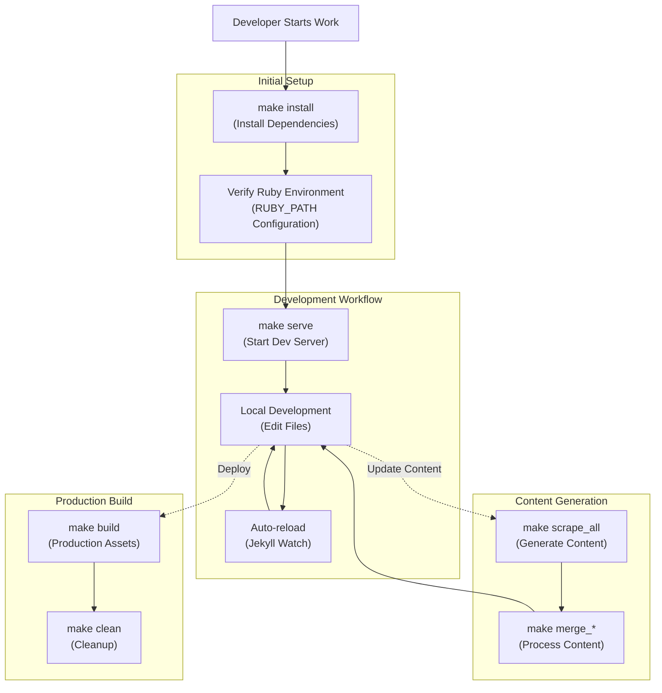
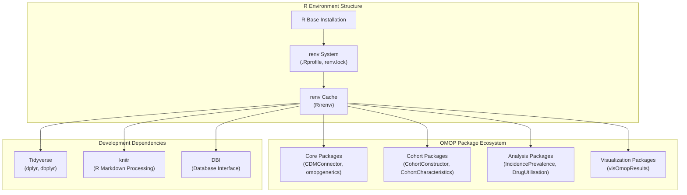
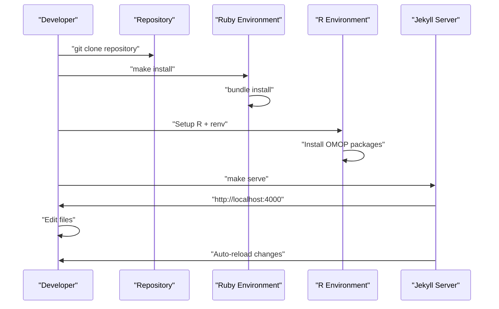
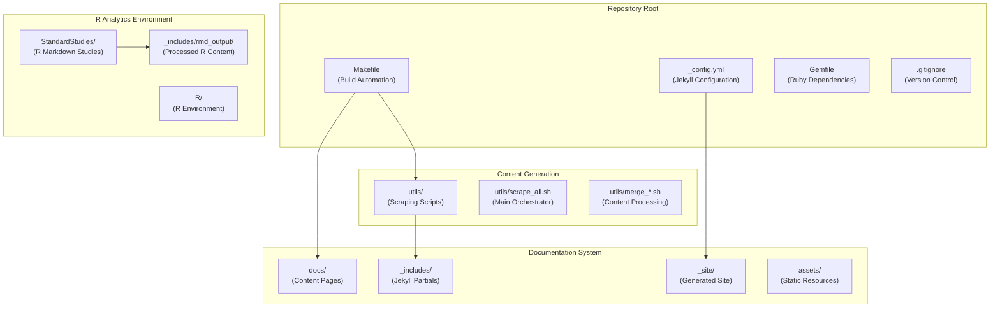

# Page: Development Environment

# Development Environment

<details>
<summary>Relevant source files</summary>

The following files were used as context for generating this wiki page:

- [.gitignore](.gitignore)
- [Makefile](Makefile)
- [StandardStudies/.Rhistory](StandardStudies/.Rhistory)
- [assets/images/android-chrome-192x192.png](assets/images/android-chrome-192x192.png)
- [assets/images/android-chrome-512x512.png](assets/images/android-chrome-512x512.png)
- [assets/images/apple-touch-icon.png](assets/images/apple-touch-icon.png)
- [docs/data_analysis/performing_analysis.md](docs/data_analysis/performing_analysis.md)

</details>


This document provides a comprehensive guide for setting up the local development environment needed to contribute to the OMOP Analytics Guide repository. It covers the Jekyll documentation system, R analytics environment, build automation tools, and local development workflows.

For information about the automated content generation system, see [Content Scraping and Generation](#5.1). For details on Jekyll site configuration and deployment, see [Jekyll Site Configuration](#5.2).

## Environment Components

The development environment consists of multiple interconnected systems that support both documentation generation and analytics development.

### Core Development Stack



Sources: [Makefile:1-66](), [.gitignore:1-25]()

### Ruby and Jekyll Setup

The documentation system requires Ruby and Jekyll for static site generation. The Makefile configures specific Ruby paths and gem management.



Sources: [Makefile:8-13](), [Makefile:31-46]()

## Makefile-Based Build System

The repository uses a comprehensive Makefile to automate common development tasks and provide a consistent interface for build operations.

### Available Make Targets

| Target | Description | Command |
|--------|-------------|---------|
| `install` | Install Ruby dependencies | `bundle install` |
| `serve` | Start Jekyll development server | `jekyll serve` |
| `build` | Build static site for production | `jekyll build` |
| `clean` | Clean Jekyll build artifacts | `jekyll clean` |
| `scrape_all` | Execute content scraping workflow | `bash scrape_all.sh` |
| `merge_interim` | Merge interim markdown files | `bash merge_interim.sh` |
| `merge_md` | Merge raw markdown files | `bash merge_md.sh` |
| `debug` | Display bundle executable path | `which bundle` |

Sources: [Makefile:17-62]()

### Build Workflow Architecture



Sources: [Makefile:35-62]()

## R Environment Setup

The analytics components require a properly configured R environment with specific packages for OMOP CDM analysis.

### R Package Management

The R environment uses `renv` for reproducible package management and includes specialized OMOP analytics packages.



Sources: [.gitignore:19-24](), [StandardStudies/.Rhistory:1-23]()

### Package Loading Pattern

The typical R environment setup follows a consistent pattern for loading OMOP analytics packages:

```r
# Load necessary libraries from the renv library
library(CDMConnector)
library(CohortCharacteristics) 
library(IncidencePrevalence)
library(PatientProfiles)
library(visOmopResults)
library(DrugUtilisation)
```

Sources: [StandardStudies/.Rhistory:1-6](), [docs/data_analysis/performing_analysis.md:60-82]()

## Local Development Workflow

### Development Environment Setup

The following sequence describes the complete setup process for new developers:



Sources: [Makefile:31-37]()

### File Structure for Development

The repository structure supports both documentation development and R analytics work:



Sources: [.gitignore:8-17](), [Makefile:52-61]()

### Ignored Files and Build Artifacts

The development environment produces various temporary and generated files that are excluded from version control:

| File Pattern | Purpose | Source |
|-------------|---------|---------|
| `_site/` | Jekyll generated site | Jekyll build process |
| `.sass-cache/` | Sass compilation cache | Jekyll preprocessing |
| `.jekyll-cache/` | Jekyll build cache | Jekyll optimization |
| `.jekyll-metadata` | Jekyll metadata | Jekyll internal |
| `R/renv/` | R package cache | renv package management |
| `.Rproj.user` | RStudio workspace | RStudio IDE |
| `StandardStudies/.RData` | R workspace data | R session state |
| `StandardStudies/.Rhistory` | R command history | R session logging |

Sources: [.gitignore:8-25]()

## Environment Variables and Configuration

### Ruby Path Configuration

The Makefile defines specific Ruby environment variables for consistent builds:

```bash
RUBY_PATH ?= /opt/homebrew/opt/ruby/bin
export PATH := $(RUBY_PATH):$(PATH)
export GEM_HOME := $(shell dirname $(shell dirname $(RUBY_PATH)))/lib/ruby/gems/$(shell $(RUBY_PATH)/ruby -e 'print RUBY_VERSION.split(".")[0..1].join(".")')
export GEM_PATH := $(GEM_HOME)
```

Sources: [Makefile:8-13]()

### Development Server Configuration

The Jekyll development server can be started with automatic reloading for efficient development:

```bash
make serve  # Starts Jekyll server on http://localhost:4000
```

This command executes `$(RUBY_PATH)/ruby -S bundle exec jekyll serve` with the configured Ruby environment.

Sources: [Makefile:35-37]()