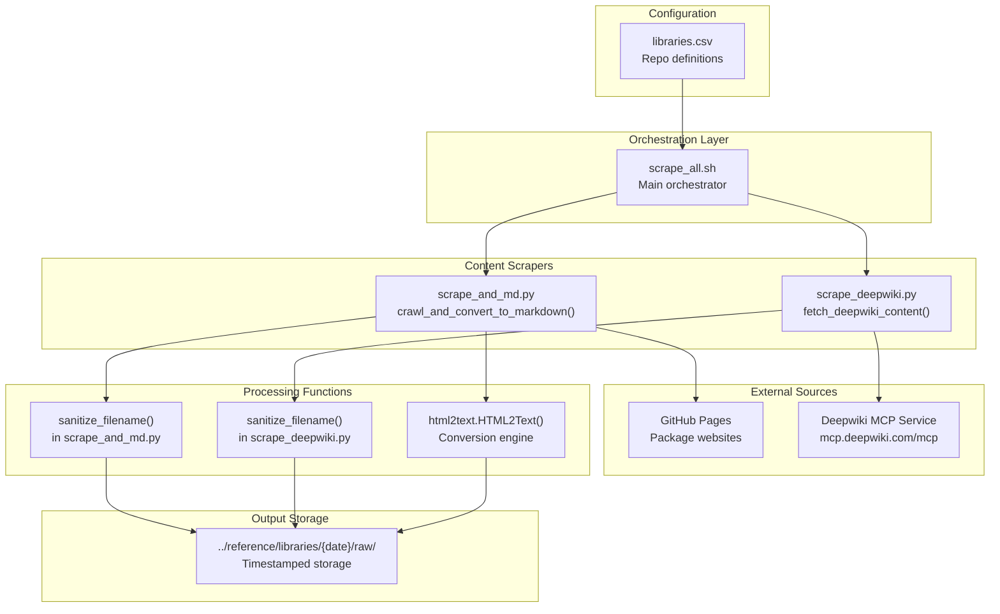
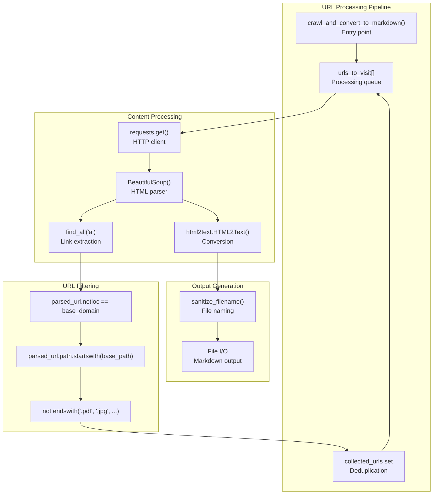

# Page: Development and Documentation System

# Development and Documentation System

Relevant source files

The following files were used as context for generating this wiki page:

- [utils/libraries.csv](utils/libraries.csv)
- [utils/scrape_all.sh](utils/scrape_all.sh)
- [utils/scrape_and_md.py](utils/scrape_and_md.py)
- [utils/scrape_deepwiki.py](utils/scrape_deepwiki.py)

This section covers the automated documentation generation and site building infrastructure that powers the OMOP Analytics Guide. The system handles content scraping from external sources, site generation using Jekyll, and deployment workflows.

For information about the specific study templates and R Markdown processing, see [Study Templates and Examples](#4.2). For Jekyll site configuration details, see [Jekyll Site Configuration](#5.2).

## System Architecture

The development and documentation system operates through three main components: content acquisition from external sources, processing and consolidation, and static site generation. The system is designed to automatically update documentation from multiple R package websites and generate a unified documentation site.

### Content Acquisition and Processing Workflow

Sources: [utils/scrape_all.sh:1-36](), [utils/scrape_and_md.py:17-125](), [utils/scrape_deepwiki.py:25-122]()

## Content Scraping Infrastructure

The content scraping system operates through a coordinated set of scripts that extract documentation from external R package websites and API services. The system is designed for parallel processing and handles multiple content sources simultaneously.

### Main Orchestration Process

The primary entry point is `scrape_all.sh`, which coordinates the entire scraping operation:

| Component | Function | Implementation |
|-----------|----------|----------------|
| Date Management | Generate timestamp for content versioning | `today=$(date +%d-%m-%Y)` |
| Library Loading | Read package definitions from CSV | `while IFS=',' read -r repo url name` |
| Parallel Processing | Execute scrapers concurrently | Background processes with `&` |
| Process Synchronization | Wait for completion | `wait $pid1 $pid2` |

The script processes each library entry from `libraries.csv` in parallel, spawning both web scraping and API scraping processes simultaneously for each package.

Sources: [utils/scrape_all.sh:5-33](), [utils/libraries.csv:1-15]()

### Web Content Extraction

The `scrape_and_md.py` module implements recursive web crawling with HTML-to-Markdown conversion:

Sources: [utils/scrape_and_md.py:17-112]()

### API Content Acquisition

The `scrape_deepwiki.py` module interfaces with the Deepwiki MCP service for enhanced documentation content:

| Function | Purpose | Implementation Details |
|----------|---------|----------------------|
| `fetch_deepwiki_content_async()` | Async MCP client interaction | Uses `streamablehttp_client` and `ClientSession` |
| `fetch_deepwiki_content()` | Synchronous wrapper | `asyncio.run()` execution |
| `process_and_save_content()` | Content processing and storage | Page splitting on `"