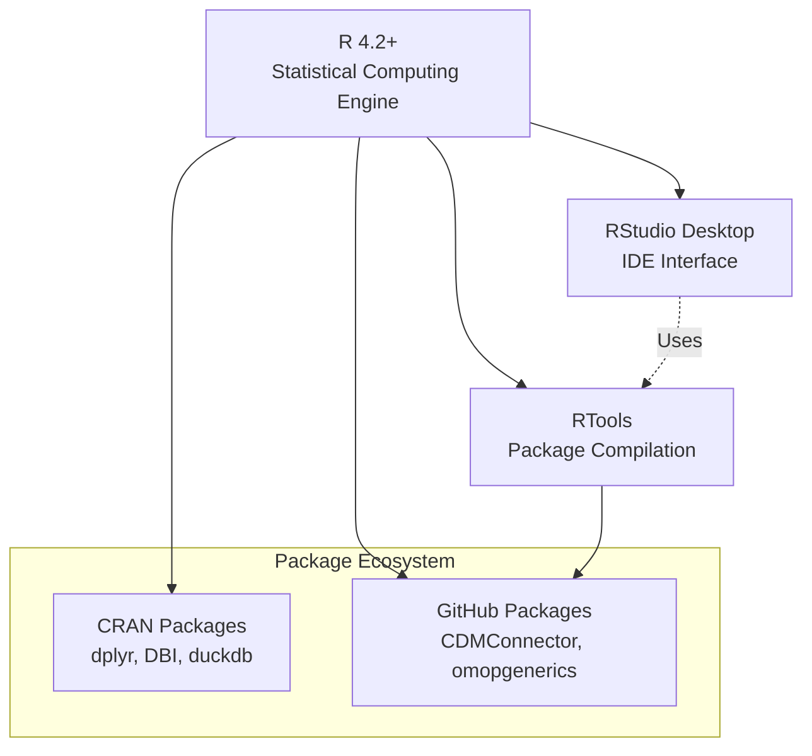
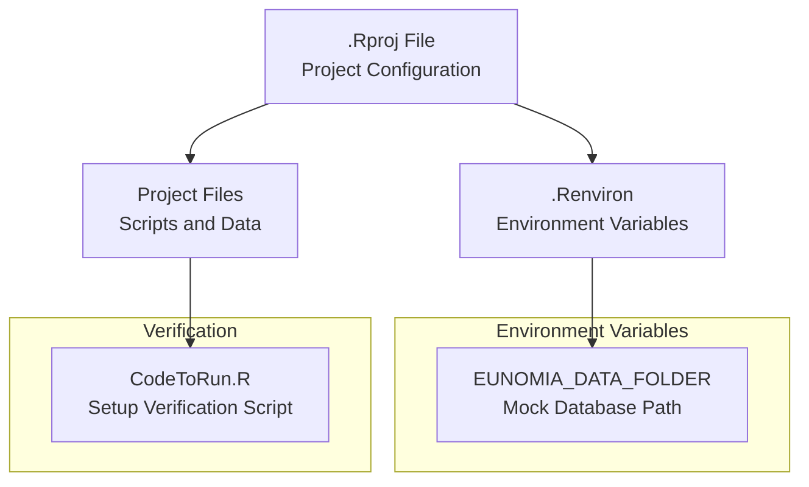
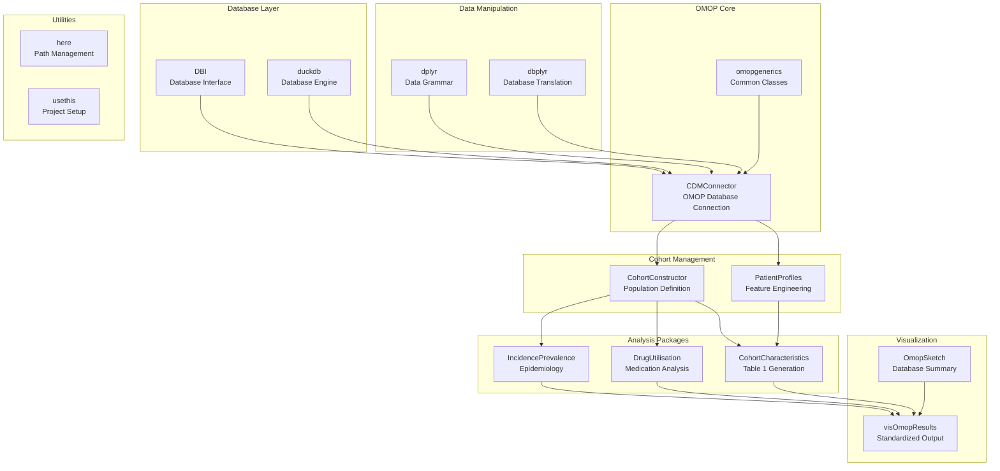
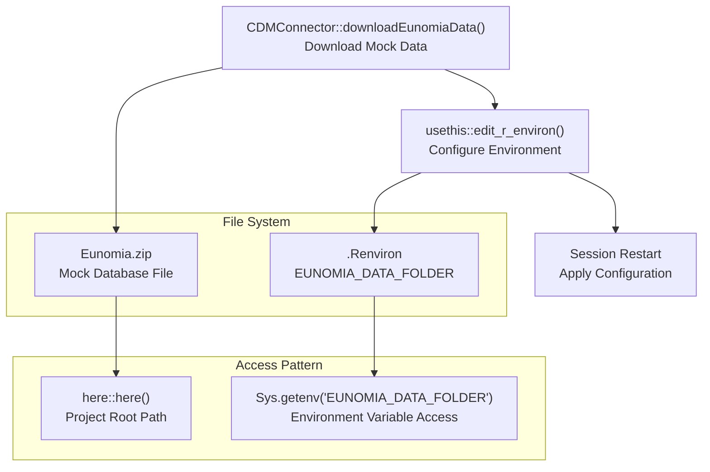
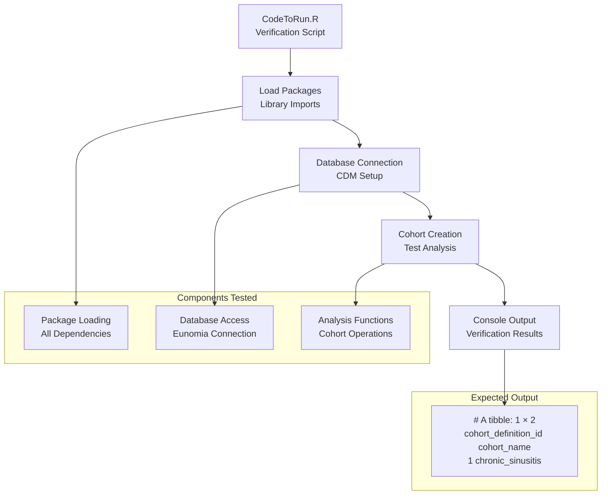
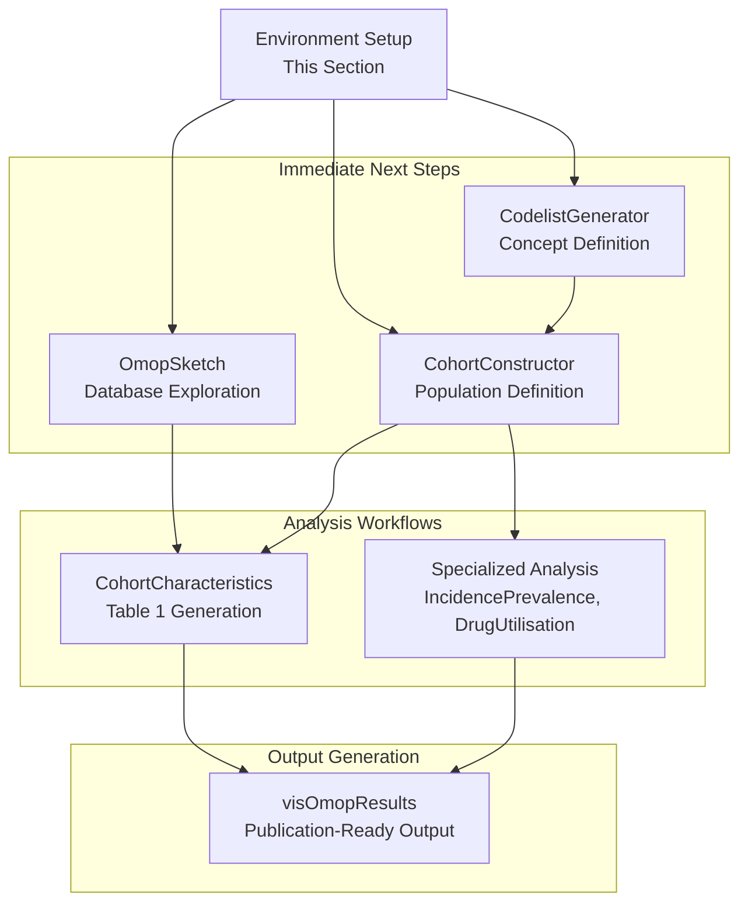

# Page: Environment Setup and Getting Started

# Environment Setup and Getting Started

Relevant source files

The following files were used as context for generating this wiki page:

- [docs/data_analysis/intro_to_observational_research.md](docs/data_analysis/intro_to_observational_research.md)
- [docs/data_analysis/package_reference/visomopresults.md](docs/data_analysis/package_reference/visomopresults.md)
- [docs/data_analysis/setup.md](docs/data_analysis/setup.md)

This document provides step-by-step instructions for configuring a local R development environment for OMOP CDM data analysis. It covers software installation, package management, project configuration, and environment verification to ensure you have all necessary components for running OMOP analytics workflows.

For information about the broader OMOP analytics framework and package ecosystem, see [R Package Reference](#3.3). For guidance on using tidyverse programming patterns with OMOP data, see [Tidyverse Programming with OMOP](#3.2).

## Software Prerequisites

The OMOP analytics environment requires three core software components that work together to provide a complete development environment.

### Required Software Stack

Sources: [docs/data_analysis/setup.md:12-18]()

- **R**: Core statistical computing language (version 4.2+)
- **RStudio Desktop**: Integrated development environment providing project management, script editing, and console access
- **RTools**: Compilation utilities required for building packages from source code

## Project Configuration

### RStudio Project Structure

The development environment uses RStudio Projects (`.Rproj` files) to manage workspace organization and ensure consistent working directories across sessions.

Sources: [docs/data_analysis/setup.md:20-27](), [docs/data_analysis/setup.md:67-80]()

The `.Renviron` file stores environment variables that persist across R sessions, particularly the path to mock database files used for development and testing.

## Package Installation Workflow

### Core Package Dependencies

The OMOP analytics ecosystem is built on a layered architecture of R packages, each serving specific functions in the analysis pipeline.

Sources: [docs/data_analysis/setup.md:37-53]()

### Installation Command

All required packages are installed using a single `install.packages()` command that handles dependency resolution automatically:

Sources: [docs/data_analysis/setup.md:37-53]()

## Mock Database Configuration

### Eunomia Setup Process

The development environment uses Eunomia, a synthetic OMOP CDM dataset, for testing and learning. The setup process involves downloading the data and configuring environment variables for consistent access.

Sources: [docs/data_analysis/setup.md:56-80]()

The `CDMConnector::downloadEunomiaData()` function retrieves the mock dataset, while `usethis::edit_r_environ()` provides a convenient interface for editing environment variables.

## Environment Verification

### Verification Script Workflow

The setup verification process uses a dedicated script that tests all components of the environment to ensure proper configuration.

Sources: [docs/data_analysis/setup.md:82-105]()

The verification script performs a complete end-to-end test by loading packages, connecting to the mock database, creating a simple cohort, and displaying the results. Successful execution indicates that all environment components are properly configured.

## Integration with Development Workflows

### Connection to Broader Analytics Framework

The environment setup establishes the foundation for the complete OMOP analytics workflow, connecting to downstream analysis and visualization components.

Sources: [docs/data_analysis/setup.md:109-115]()

The setup process enables immediate progression to database exploration, concept definition, and cohort building activities that form the core of OMOP analytics workflows.

## Configuration Files and Paths

| Configuration Element | File Path | Purpose |
|----------------------|-----------|---------|
| Project Definition | `.Rproj` | RStudio project configuration |
| Environment Variables | `.Renviron` | Persistent R session settings |
| Mock Database | `Eunomia.zip` | Synthetic OMOP CDM data |
| Verification Script | `docs/data_analysis/CodeToRun.R` | Environment testing |

Sources: [docs/data_analysis/setup.md:1-116]()

This configuration provides a complete, self-contained development environment for OMOP CDM analysis, with all necessary components properly integrated and verified.