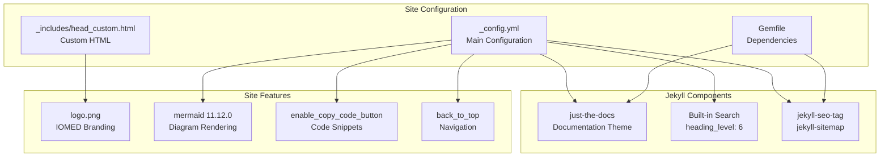
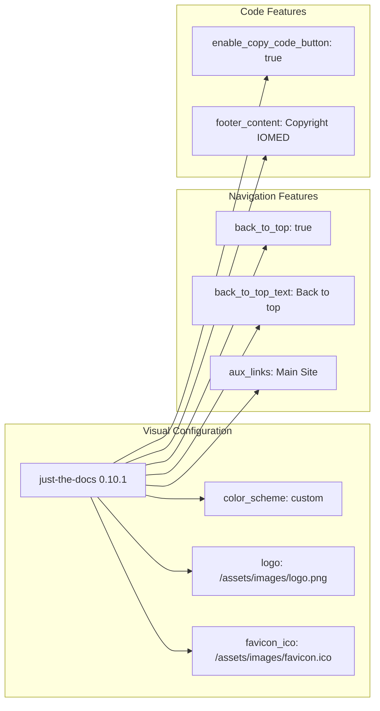
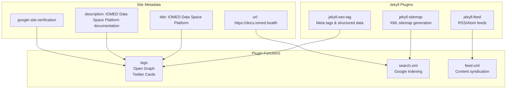

# Page: Jekyll Site Configuration

# Jekyll Site Configuration

<details>
<summary>Relevant source files</summary>

The following files were used as context for generating this wiki page:

- [Gemfile](Gemfile)
- [_config.yml](_config.yml)
- [_includes/head_custom.html](_includes/head_custom.html)

</details>


This document explains the Jekyll static site generator configuration used to build and deploy the OMOP Analytics Guide documentation website. It covers the site configuration, theme customization, plugin setup, and build dependencies that transform the repository's markdown content into a navigable documentation site.

For information about the content generation and scraping processes that populate this site, see [Content Scraping and Generation](#5.1). For details about the development environment and build tools, see [Development Environment](#5.3).

## Jekyll Configuration Overview

The Jekyll site is configured through the main configuration file [_config.yml:1-31]() which defines the site metadata, theme, and core functionality. The site uses the `just-the-docs` theme to provide a clean, searchable documentation layout optimized for technical reference materials.



**Sources:** [_config.yml:1-31](), [Gemfile:1-11](), [_includes/head_custom.html:1-2]()

## Theme and Visual Configuration

The site uses the `just-the-docs` theme version 0.10.1 with custom branding and color scheme configuration. The visual identity is established through logo placement and custom styling.

| Configuration | Value | Purpose |
|---------------|-------|---------|
| `theme` | `just-the-docs` | Clean documentation theme |
| `color_scheme` | `custom` | IOMED brand colors |
| `logo` | `/assets/images/logo.png` | IOMED branding |
| `favicon_ico` | `/assets/images/favicon.ico` | Browser tab icon |

The theme configuration includes navigation enhancements and user experience features:



**Sources:** [_config.yml:3-21](), [Gemfile:6]()

## Search Configuration

The built-in search functionality is configured to provide comprehensive content discovery across the documentation. The search system indexes content at multiple heading levels and provides contextual previews.

| Setting | Value | Function |
|---------|--------|----------|
| `heading_level` | `6` | Index headings up to h6 |
| `previews` | `4` | Show 4 preview results |
| `preview_words_before` | `4` | Context words before match |
| `focus_shortcut_key` | `'k'` | Keyboard shortcut for search |

The search configuration is optimized for technical documentation where users need to quickly locate specific functions, concepts, or code examples.

**Sources:** [_config.yml:11-15]()

## Plugin Configuration

The site uses essential Jekyll plugins to enhance SEO, navigation, and site functionality:



**Sources:** [_config.yml:28-30](), [Gemfile:9-10](), [_includes/head_custom.html:1]()

## Mermaid Diagram Integration

Mermaid diagram rendering is configured to support the extensive use of diagrams throughout the documentation. The configuration specifies the CDN version and ensures compatibility with the site's content.

```yaml
mermaid:
  version: "11.12.0"
```

This configuration enables the rendering of system architecture diagrams, workflow visualizations, and dependency graphs that are essential for explaining the OMOP analytics ecosystem.

**Sources:** [_config.yml:23-26]()

## Build Dependencies and Gemfile

The Ruby gem dependencies are managed through the `Gemfile` which specifies the exact versions of Jekyll and required plugins:

| Gem | Version | Purpose |
|-----|---------|---------|
| `jekyll` | `~> 4.4.1` | Static site generator |
| `just-the-docs` | `0.10.1` | Documentation theme |
| `jekyll-sitemap` | Latest | XML sitemap generation |
| `jekyll-feed` | Latest | RSS feed generation |

The pinned version of `just-the-docs` ensures consistent theme behavior across deployments, while Jekyll is constrained to the 4.4.x series for stability.

**Sources:** [Gemfile:1-11]()

## Custom HTML Integration

The site includes custom HTML head content through [_includes/head_custom.html:1]() which adds Google site verification for search console integration. This file demonstrates the extensibility of the Jekyll configuration for adding custom meta tags and tracking codes.

**Sources:** [_includes/head_custom.html:1-2]()