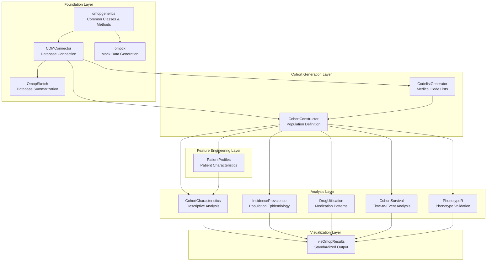
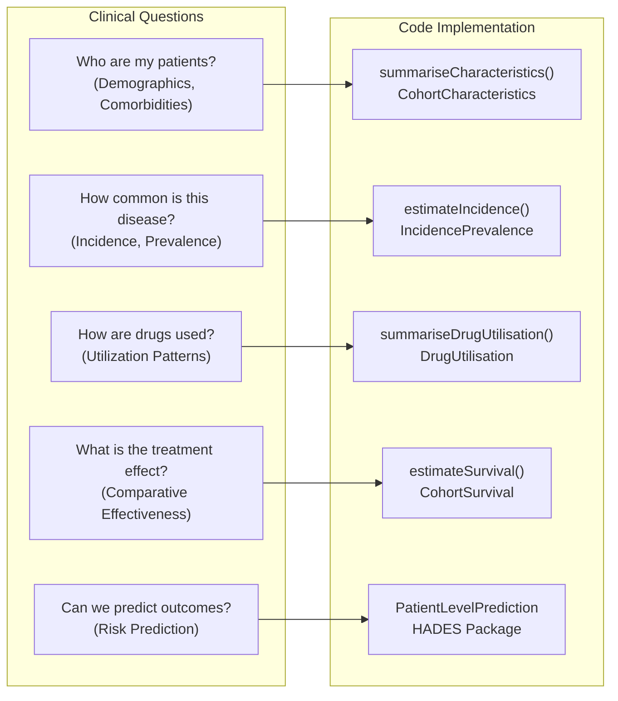
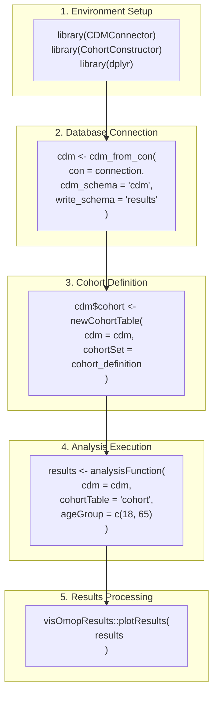
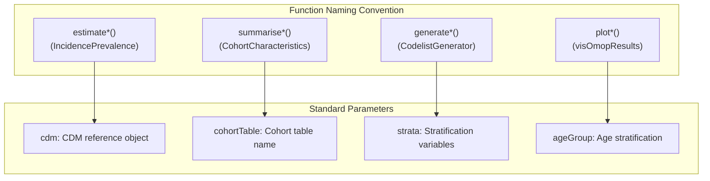
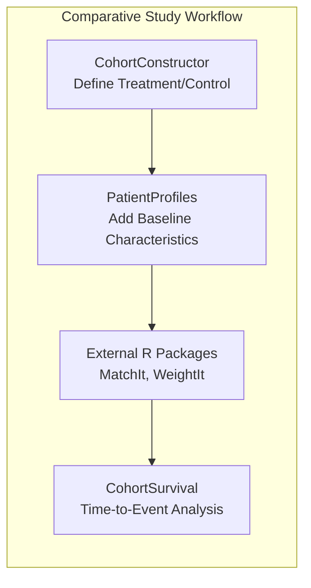

# Page: OMOP Analytics Framework

# OMOP Analytics Framework

Relevant source files

The following files were used as context for generating this wiki page:

- [docs/data_analysis/index.md](docs/data_analysis/index.md)
- [docs/data_analysis/package_reference/IncidencePrevalence.md](docs/data_analysis/package_reference/IncidencePrevalence.md)
- [docs/data_analysis/package_reference/index.md](docs/data_analysis/package_reference/index.md)

The OMOP Analytics Framework provides a comprehensive R package ecosystem for conducting observational health data studies using the OMOP Common Data Model (CDM). This framework enables researchers to perform regulatory-grade analyses from clinical question formulation through statistical analysis and visualization, following standardized methodologies promoted by OHDSI and DARWIN-EU initiatives.

This document covers the technical architecture, package dependencies, and integration patterns within the R ecosystem. For step-by-step implementation guidance, see [Environment Setup and Getting Started](#3.1). For detailed package documentation, see [R Package Reference](#3.3).

## Package Ecosystem Architecture

The framework follows a layered architecture where foundation packages provide core infrastructure, and specialized packages build upon them for domain-specific analyses. This design ensures modularity, reusability, and consistent data handling across different study types.

### Core Architecture Layers

Sources: [docs/data_analysis/package_reference/index.md:36-66]()

### Package Categories and Functions

The framework organizes packages into functional categories based on their role in the analysis workflow:

| Layer | Package | Primary Functions | Purpose |
|-------|---------|-------------------|---------|
| **Foundation** | `omopgenerics` | Class definitions, method dispatch | Provides common interface across packages |
| | `CDMConnector` | `cdm_from_con()`, connection management | Establishes database connections |
| | `omock` | `mockCdm()`, test data generation | Creates mock CDM for development |
| **Cohort Generation** | `CodelistGenerator` | `getCandidateCodes()`, codelist creation | Generates medical code sets |
| | `CohortConstructor` | `newCohortTable()`, cohort definition | Defines study populations |
| **Analysis** | `CohortCharacteristics` | `summariseCharacteristics()` | Generates Table 1 summaries |
| | `IncidencePrevalence` | `estimateIncidence()`, `estimatePrevalence()` | Calculates epidemiological measures |
| | `DrugUtilisation` | `summariseDrugUtilisation()` | Analyzes medication patterns |
| **Visualization** | `visOmopResults` | Standardized plotting functions | Creates consistent visualizations |

Sources: [docs/data_analysis/index.md:35-83]()

## Clinical Question to Code Workflow

The framework translates clinical research questions into executable code through a standardized workflow that maps study objectives to specific package functions.

### Study Type Mapping to Package Functions

Sources: [docs/data_analysis/package_reference/index.md:70-196]()

### Core Workflow Implementation

The standard analysis workflow follows this sequence of operations:

Sources: [docs/data_analysis/package_reference/IncidencePrevalence.md:38-84]()

## Package Integration Patterns

The framework uses consistent integration patterns to ensure seamless data flow between packages and maintain reproducibility across different analysis types.

### Standard Data Objects

All packages operate on standardized data objects that ensure consistency and interoperability:

| Object Type | Description | Key Attributes |
|-------------|-------------|----------------|
| `cdm` | CDM reference object | Database connection, table references |
| `cohort_table` | Cohort definitions | `cohort_definition_id`, `subject_id`, `cohort_start_date` |
| `summarised_result` | Analysis outputs | Standardized result format across packages |

### Common Function Patterns

The framework follows consistent function naming and parameter patterns:

Sources: [docs/data_analysis/package_reference/IncidencePrevalence.md:137-145]()

## Study Methodology Integration

The framework supports multiple study methodologies through specialized package combinations that address different research objectives.

### Descriptive Studies Implementation

For characterizing populations and describing disease patterns:

| Study Type | Primary Packages | Key Functions |
|------------|------------------|---------------|
| **Cohort Characterization** | `CohortCharacteristics`, `PatientProfiles` | `summariseCharacteristics()`, `addDemographics()` |
| **Incidence/Prevalence** | `IncidencePrevalence` | `estimateIncidence()`, `estimatePrevalence()` |
| **Drug Utilization** | `DrugUtilisation` | `summariseDrugUtilisation()`, `summariseDrugRestart()` |

### Comparative Studies Implementation  

For evaluating treatment effects and causal inference:

Sources: [docs/data_analysis/package_reference/index.md:114-151]()

### Validation Studies Implementation

For ensuring phenotype accuracy and study quality:

| Validation Type | Package | Key Functions |
|-----------------|---------|---------------|
| **Phenotype Validation** | `PhenotypeR` | Diagnostic functions for cohort definitions |
| **Database Quality** | `OmopSketch` | `summariseDataSnapshot()` for CDM profiling |

Sources: [docs/data_analysis/index.md:66-75](), [docs/data_analysis/package_reference/index.md:187-196]()