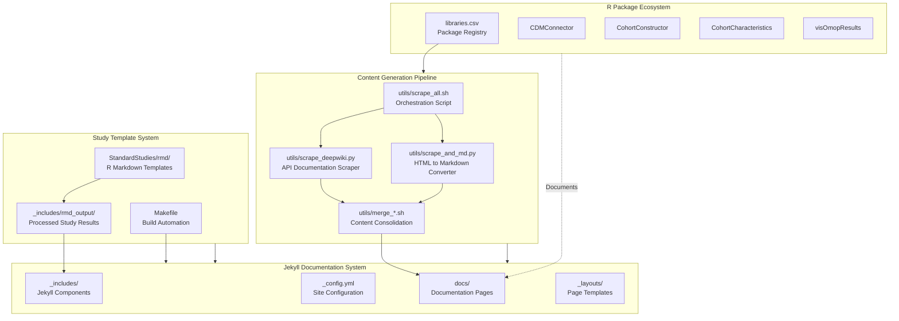
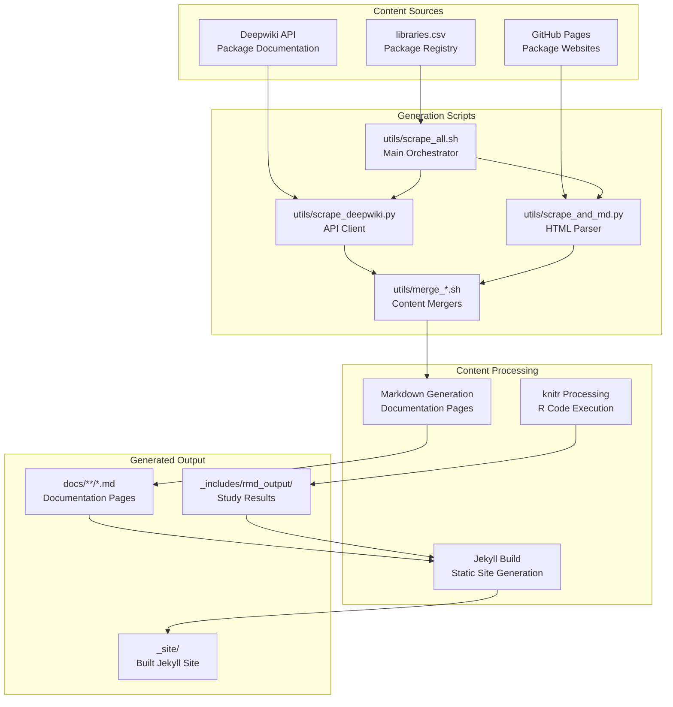

# Page: Overview

# Overview

<details>
<summary>Relevant source files</summary>

The following files were used as context for generating this wiki page:

- [AGENTS.md](AGENTS.md)
- [README.md](README.md)
- [_includes/nav_footer_custom.html](_includes/nav_footer_custom.html)
- [assets/images/anonymization.svg](assets/images/anonymization.svg)
- [docs/data_enablement/index.md](docs/data_enablement/index.md)
- [docs/data_mediation/data_solutions.md](docs/data_mediation/data_solutions.md)
- [docs/data_mediation/index.md](docs/data_mediation/index.md)
- [index.md](index.md)

</details>


## Purpose and Scope

This document provides an overview of the OMOP Analytics Guide repository, a comprehensive educational resource for conducting observational health data analysis using the OMOP Common Data Model (CDM). The repository encompasses four major systems: a data mediation platform for transforming raw clinical data, an R package ecosystem for analytics, standardized study methodologies, and an automated documentation generation system.

For detailed information about data transformation processes, see [Data Mediation Platform](#2). For R package implementation details, see [OMOP Analytics Framework](#3). For study execution guidance, see [Study Methodologies](#4). For documentation maintenance procedures, see [Development and Documentation System](#5).

## Repository Architecture

The repository is structured as a Jekyll documentation site that integrates multiple systems for both educational content and practical implementation of OMOP CDM analytics workflows.

### High-Level System Architecture



Sources: [_config.yml:1-5](), [docs/:1](), [utils/scrape_all.sh:1](), [StandardStudies/rmd/:1](), [README.md:14-35](), [Makefile:1]()

## Core System Components

### Data Mediation Platform

The IOMED Data Space Platform transforms raw clinical data from healthcare institutions into standardized, research-ready OMOP CDM format. This system operates through a three-phase enablement process followed by a five-stage mediation workflow.

The platform addresses three fundamental challenges in clinical data analysis: lack of standardization across healthcare systems, patient privacy requirements under regulations like GDPR, and operational barriers that prevent individual institutions from preparing research-ready datasets.

**Key Components:**
- Data enablement process with dimensioning, deployment, and readiness phases
- Five-stage mediation workflow from request to delivery
- Automated terminology mapping (ATM) and natural language processing (NLP)
- Quality assurance framework based on OHDSI Data Quality Dashboard

Sources: [index.md:28-48](), [docs/data_mediation/index.md:7-66](), [docs/data_enablement/index.md:8-118]()

### OMOP Analytics Framework

The analytics framework consists of a curated ecosystem of R packages designed for observational health data analysis using OMOP CDM. The framework follows a layered architecture from database connectivity through specialized analysis functions to visualization.

### R Package Ecosystem Structure

```mermaid
graph TD
    subgraph Foundation["Foundation Layer"]
        DBI["DBI<br/>Database Interface"]
        DPLYR["dplyr/dbplyr<br/>Data Manipulation"] 
        OMOPGENERICS["omopgenerics<br/>Common Classes & Methods"]
    end
    
    subgraph Connection["Connection Layer"] 
        CDMCONNECTOR["CDMConnector<br/>OMOP Database Access"]
        OMOCK["omock<br/>Mock Data Generation"]
    end
    
    subgraph Cohort["Cohort Management Layer"]
        CODELISTGEN["CodelistGenerator<br/>Medical Code Management"]
        COHORTCON["CohortConstructor<br/>Population Definition"]
        PATIENTPROFILES["PatientProfiles<br/>Feature Engineering"]
    end
    
    subgraph Analysis["Analysis Layer"]
        COHORTCHARS["CohortCharacteristics<br/>Table 1 Generation"]
        INCPREV["IncidencePrevalence<br/>Epidemiological Analysis"]
        DRUGUTIL["DrugUtilisation<br/>Medication Pattern Analysis"]
        SURVIVAL["CohortSurvival<br/>Time-to-Event Analysis"]
        PHENOTYPER["PhenotypeR<br/>Phenotype Validation"]
        OMOPSKETCH["OmopSketch<br/>Database Profiling"]
    end
    
    subgraph Visualization["Output Layer"]
        VISOMOP["visOmopResults<br/>Standardized Visualization"]
    end
    
    CDMCONNECTOR --> CODELISTGEN
    CDMCONNECTOR --> COHORTCON
    COHORTCON --> COHORTCHARS
    COHORTCON --> INCPREV
    COHORTCON --> DRUGUTIL
    COHORTCON --> SURVIVAL
    COHORTCHARS --> VISOMOP
    INCPREV --> VISOMOP
    DRUGUTIL --> VISOMOP
```

**Package Categories:**
- **Core Infrastructure**: `CDMConnector`, `omopgenerics`, `omock`, `OmopSketch`
- **Cohort Management**: `CohortConstructor`, `CohortCharacteristics`, `PatientProfiles`  
- **Specialized Analysis**: `IncidencePrevalence`, `DrugUtilisation`, `CohortSurvival`, `CodelistGenerator`, `PhenotypeR`
- **Visualization**: `visOmopResults`

Sources: [README.md:14-35](), [libraries.csv:1](), [docs/data_analysis:1]()

### Study Template System

The repository includes executable R Markdown templates demonstrating eight standardized study types for observational research. These templates provide working code examples that can be adapted for specific research questions.

**Study Types Covered:**
- Patient-Level Characterisation (PLC)
- Population-Level Epidemiology (PLE) 
- Drug Utilisation Studies (DUS)
- Comparative Cohort Studies (CCS)
- Self-Controlled Designs (SCD)
- Patient-Level Prediction (PLP)
- Treatment Pathway Analysis
- Impact Evaluation Studies

The templates are located in `StandardStudies/rmd/` and are processed through the Jekyll build system to generate interactive documentation with executed code examples.

Sources: [StandardStudies/rmd/:1](), [_includes/rmd_output/:1](), [docs/data_analysis:1]()

### Documentation Generation System

The Jekyll site employs an automated content generation pipeline that scrapes external R package documentation, processes study templates, and consolidates content into a unified documentation experience.

### Content Generation Workflow



**Key Automation Components:**
- `utils/scrape_all.sh`: Main orchestration script for content generation
- `utils/scrape_deepwiki.py`: Python client for Deepwiki API integration
- `utils/scrape_and_md.py`: HTML to Markdown conversion utility
- `Makefile`: Build automation with targets for installation, building, and serving

Sources: [utils/scrape_all.sh:1](), [utils/scrape_deepwiki.py:1](), [utils/scrape_and_md.py:1](), [Makefile:1](), [AGENTS.md:8-13]()

## Integration and Data Flow

The four major systems integrate to provide a complete educational and practical resource for OMOP CDM analytics:

1. **Data Preparation**: The data mediation platform transforms raw clinical data into OMOP CDM format
2. **Analysis Environment**: R packages provide the analytical capabilities for working with OMOP data
3. **Study Execution**: Standardized templates demonstrate best practices for common study types
4. **Documentation**: Automated systems maintain comprehensive, up-to-date documentation

| System Component | Primary Files | Purpose |
|------------------|---------------|---------|
| Jekyll Configuration | `_config.yml`, `_layouts/`, `_includes/` | Site structure and templating |
| Content Generation | `utils/scrape_*.sh`, `utils/scrape_*.py` | Automated documentation updates |
| Study Templates | `StandardStudies/rmd/`, `_includes/rmd_output/` | Executable research examples |
| Package Documentation | `docs/`, `libraries.csv` | R package reference materials |
| Build System | `Makefile`, `AGENTS.md` | Development and deployment |

The repository serves both as educational material for learning OMOP CDM analytics and as a practical toolkit for implementing observational studies in real-world research environments.

Sources: [index.md:1-122](), [_config.yml:1-5](), [README.md:1-45](), [docs/data_mediation/index.md:1-66]()