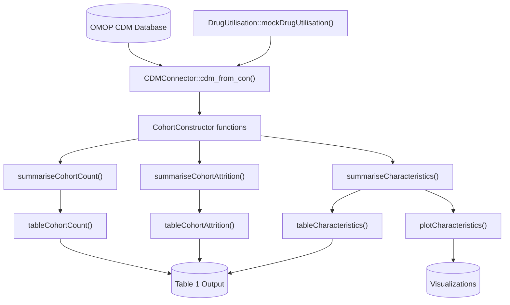
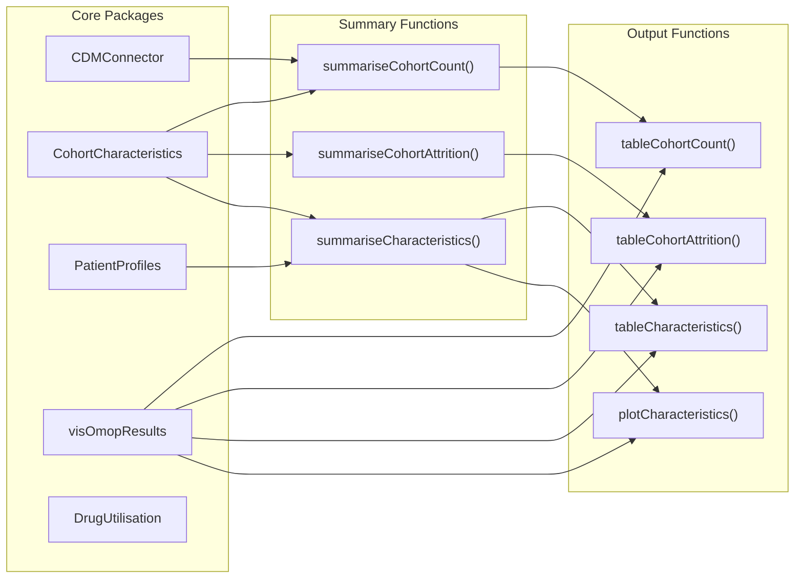
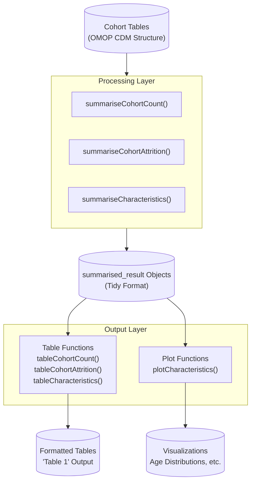

# Page: Patient-Level Characterisation

# Patient-Level Characterisation

<details>
<summary>Relevant source files</summary>

The following files were used as context for generating this wiki page:

- [StandardStudies/rmd/patient_level_characterisation.Rmd](StandardStudies/rmd/patient_level_characterisation.Rmd)
- [_includes/rmd_output/patient_level_characterisation.md](_includes/rmd_output/patient_level_characterisation.md)
- [_sass/custom/custom.scss](_sass/custom/custom.scss)
- [assets/images/rmd_output/calculate_incidence_and_plot-1.png](assets/images/rmd_output/calculate_incidence_and_plot-1.png)
- [assets/images/rmd_output/calculate_prevalence_and_plot-1.png](assets/images/rmd_output/calculate_prevalence_and_plot-1.png)
- [assets/images/rmd_output/plot-age-distribution-1.png](assets/images/rmd_output/plot-age-distribution-1.png)
- [docs/data_analysis/standard_studies/patient_level_characterisation.md](docs/data_analysis/standard_studies/patient_level_characterisation.md)

</details>


This document provides a detailed technical guide for implementing patient-level characterisation studies using the OMOP Analytics Framework. Patient-level characterisation generates comprehensive baseline demographic and clinical profiles ("Table 1") of defined patient cohorts to answer the fundamental question: "Who are these patients?"

For information about other study methodologies, see [Standard Study Types](#4.1). For broader study template examples, see [Study Templates and Examples](#4.2).

## Overview and Methodology

Patient-level characterisation is a descriptive cohort analysis that summarizes patient characteristics at or before a specific index date. This study type serves as the foundation for transparent observational research by providing comprehensive baseline descriptions of study populations.

**Study Design Components:**
- **Participants**: One or more cohorts defined by shared characteristics (diagnosis, medication initiation, procedures)
- **Covariates**: Demographics, clinical history, medication history, procedures
- **Outcomes**: Summary statistics (frequencies, percentages, means, medians) for all covariates
- **Time Frame**: Focuses on baseline period before index date, typically no follow-up required

**Analysis Approaches:**
1. **Large-Scale Characterisation**: Automated summarization of thousands of clinical features
2. **Pre-Specified Characterisation**: Focus on clinically important covariates defined in advance

Sources: [StandardStudies/rmd/patient_level_characterisation.Rmd:13-26](), [docs/data_analysis/standard_studies/patient_level_characterisation.md:11-58]()

## Core Technical Workflow

### Patient-Level Characterisation Implementation Architecture



### Key Package Dependencies and Functions



Sources: [StandardStudies/rmd/patient_level_characterisation.Rmd:40-46](), [StandardStudies/rmd/patient_level_characterisation.Rmd:15-20]()

## Implementation Steps

### Step 1: Environment Setup

The implementation begins with loading required packages and configuring the analysis environment:

| Package | Purpose |
|---------|---------|
| `CDMConnector` | Database connection and CDM interface |
| `CohortCharacteristics` | Core characterisation functions |
| `PatientProfiles` | Patient-level feature engineering |
| `visOmopResults` | Standardized visualization and tables |
| `DrugUtilisation` | Mock data generation and drug analysis |

Sources: [StandardStudies/rmd/patient_level_characterisation.Rmd:40-46]()

### Step 2: Data Preparation

**Mock Data Generation:**
```r
cdm <- DrugUtilisation::mockDrugUtilisation(numberIndividuals = 10000)
cdm <- generateIngredientCohortSet(cdm, name = "cohort", ingredient = "acetaminophen")
```

This creates a standardized OMOP CDM structure with synthetic patient data and defines cohorts based on specific criteria.

Sources: [StandardStudies/rmd/patient_level_characterisation.Rmd:52-64]()

### Step 3: Cohort Summary Generation

**Core Summary Functions:**

| Function | Purpose | Output |
|----------|---------|---------|
| `summariseCohortCount()` | Count subjects and records | Subject/record counts by cohort |
| `summariseCohortAttrition()` | Track cohort definition steps | Attrition flow with exclusions |
| `summariseCharacteristics()` | Generate baseline profiles | Comprehensive "Table 1" data |

**Data Flow Pattern:**
```
Cohort Tables → Summary Functions → summarised_result → Table/Plot Functions → Formatted Output
```

Sources: [StandardStudies/rmd/patient_level_characterisation.Rmd:70-82](), [StandardStudies/rmd/patient_level_characterisation.Rmd:88-94]()

### Step 4: Advanced Characterisation Features

**Custom Flag Generation with `conceptIntersectFlag`:**
```r
summariseCharacteristics(
  cdm$cohort,
  conceptIntersectFlag = list(
    "Concomitant disorders" = list(
      conceptSet = list(headache = 378253, asthma = 317009),
      window = c(-Inf, Inf)
    )
  )
)
```

This creates binary indicators for specific medical concepts, enabling targeted clinical assessments.

**Stratification and Grouping:**
- Supports stratification by demographic variables (e.g., `strata = list("sex")`)
- Enables cohort comparisons and subgroup analyses
- Configurable time windows for historical lookbacks

Sources: [StandardStudies/rmd/patient_level_characterisation.Rmd:108-127]()

## Core Function Reference

### Summary Functions

| Function | Key Parameters | Return Type |
|----------|----------------|-------------|
| `summariseCohortCount(cohort)` | cohort table | `summarised_result` |
| `summariseCohortAttrition(cohort)` | cohort table | `summarised_result` |
| `summariseCharacteristics(cohort, ...)` | cohort, demographics, strata, conceptIntersectFlag, window | `summarised_result` |

### Output Functions

| Function | Purpose | Input Type |
|----------|---------|------------|
| `tableCohortCount(result)` | Format count tables | `summarised_result` |
| `tableCohortAttrition(result)` | Format attrition tables | `summarised_result` |
| `tableCharacteristics(result, header, hide)` | Format baseline characteristics | `summarised_result` |
| `plotCharacteristics(result, plotType, colour)` | Generate visualizations | `summarised_result` |

### Key Workflow Principles

1. **Summarise → Table/Plot Pattern**: All functions follow the pattern of generating `summarised_result` objects that are consumed by formatting functions
2. **Cohorts In, Summaries Out**: Input cohort tables following OMOP CDM structure, output standardized summary statistics
3. **Window-Based Analysis**: Support for flexible time windows around index dates (e.g., `-365:-1`, `0:0`, `1:365`)
4. **Stratification Support**: Built-in support for grouping and stratification variables

Sources: [StandardStudies/rmd/patient_level_characterisation.Rmd:15-26]()

## Data Flow Architecture



**Key Data Transformations:**
1. **Input**: OMOP CDM cohort tables with person_id, cohort_start_date, cohort_end_date
2. **Processing**: Statistical summaries computed across defined time windows
3. **Output**: Standardized `summarised_result` format compatible with `visOmopResults`
4. **Presentation**: HTML tables and ggplot2 visualizations

Sources: [StandardStudies/rmd/patient_level_characterisation.Rmd:15-20](), [StandardStudies/rmd/patient_level_characterisation.Rmd:96-102]()

## Integration with OMOP Analytics Framework

Patient-Level Characterisation integrates with the broader OMOP Analytics ecosystem through:

**Upstream Dependencies:**
- **Cohort Definition**: Uses `CohortConstructor` for population definition
- **Data Connection**: Relies on `CDMConnector` for database interface
- **Feature Engineering**: Leverages `PatientProfiles` for advanced variables

**Downstream Integration:**
- **Results Framework**: Outputs compatible with `visOmopResults` standards
- **Study Templates**: Serves as foundation for comparative studies
- **Quality Assessment**: Provides baseline context for outcome analyses

**Common Usage Patterns:**
1. **Standalone Analysis**: Generate comprehensive cohort descriptions
2. **Study Preparation**: Baseline characterisation before comparative analysis
3. **Data Quality**: Assess cohort representativeness and data completeness
4. **Subgroup Analysis**: Stratified characterisation for targeted populations

Sources: [StandardStudies/rmd/patient_level_characterisation.Rmd:22-26](), [_includes/rmd_output/patient_level_characterisation.md:20-25]()