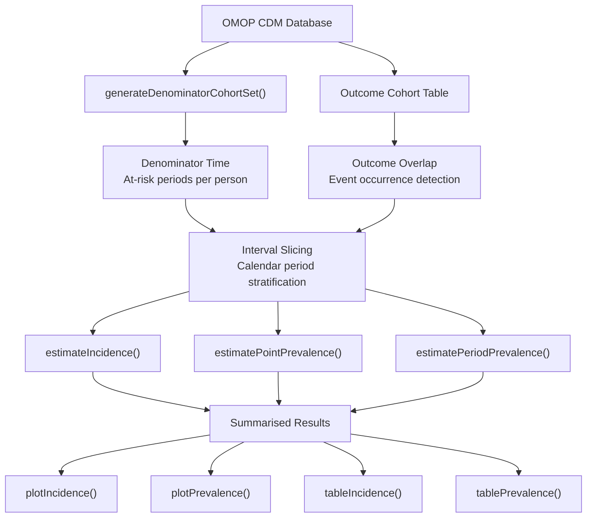
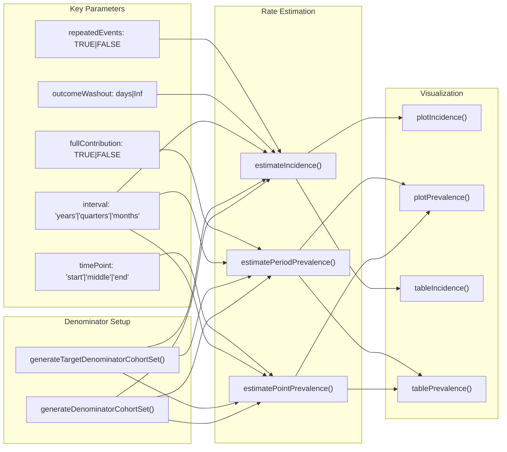
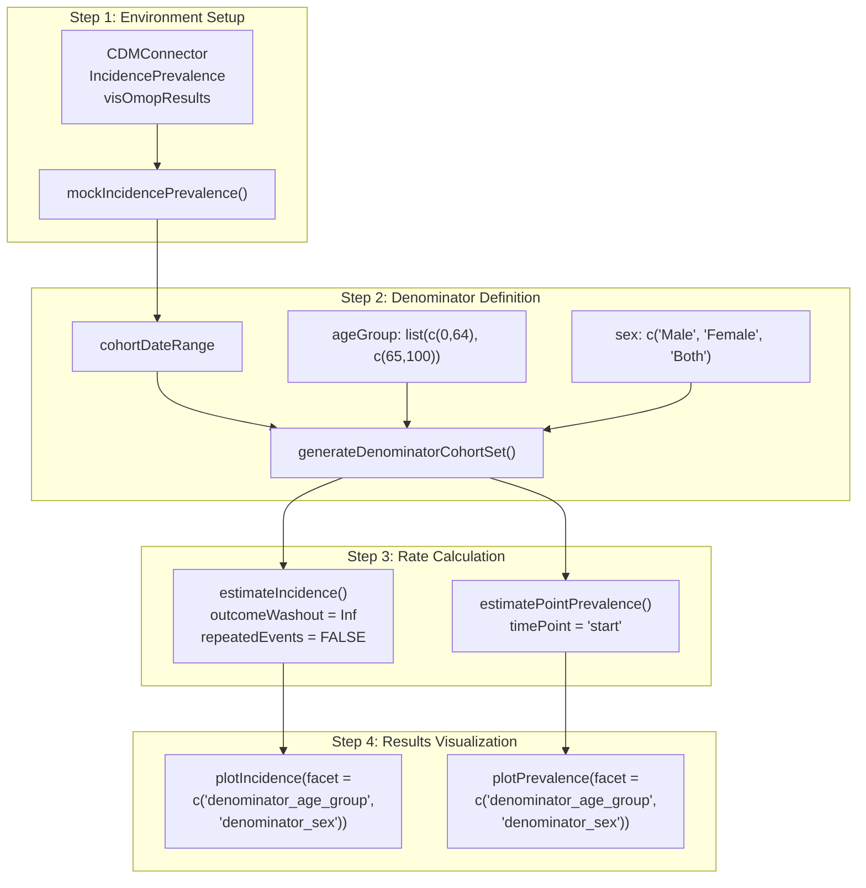

# Page: Population-Level Epidemiology

# Population-Level Epidemiology

Relevant source files

The following files were used as context for generating this wiki page:

- [StandardStudies/rmd/population_level_epidemiology.Rmd](StandardStudies/rmd/population_level_epidemiology.Rmd)
- [_includes/rmd_output/population_level_epidemiology.md](_includes/rmd_output/population_level_epidemiology.md)
- [assets/images/rmd_output/estimate_incidence-1.png](assets/images/rmd_output/estimate_incidence-1.png)
- [assets/images/rmd_output/estimate_prevalence-1.png](assets/images/rmd_output/estimate_prevalence-1.png)

Population-Level Epidemiology studies focus on calculating incidence and prevalence rates across defined populations over time. This guide demonstrates how to conduct these studies using the OHDSI `IncidencePrevalence` R package with OMOP CDM data, following standardized analytical workflows that produce stratified summaries of disease occurrence patterns.

For patient-level summary statistics and cohort characterization, see [Patient-Level Characterisation](#4.3). For other study methodologies, see [Standard Study Types](#4.1).

## Core Methodology

Population-level epidemiology analysis transforms OMOP CDM cohorts into time-stratified incidence and prevalence estimates through three fundamental operations:

**Conceptual Analysis Workflow**

Sources: [_includes/rmd_output/population_level_epidemiology.md:10-24](), [StandardStudies/rmd/population_level_epidemiology.Rmd:17-21]()

### Denominator Time Computation

The `generateDenominatorCohortSet()` function establishes person-time contribution rules where individuals contribute at-risk time only during periods meeting study criteria. Entry time is determined as the latest of: study start date, prior observation requirement met, and minimum age reached. Exit time is the earliest of: study end date, observation period end, and maximum age limit.

### Outcome Overlap Detection

Outcome events are read from separate cohort tables created through standard OMOP cohort building processes. Prevalence calculations check whether persons are present in outcome cohorts at specified time points or intervals. Incidence calculations count qualifying first onsets while respecting washout periods and repeated event rules.

### Interval Slicing Strategy

Study periods are partitioned into calendar intervals (years, quarters, months) with each interval receiving independent denominator calculations, outcome counts, and derived rate estimates.

## Function Reference and Parameters

**Core IncidencePrevalence Functions**

Sources: [_includes/rmd_output/population_level_epidemiology.md:25-57](), [StandardStudies/rmd/population_level_epidemiology.Rmd:25-42]()

### Incidence Estimation Parameters

The `estimateIncidence()` function requires specific parameter configuration:

| Parameter | Description | Common Values |
|-----------|-------------|---------------|
| `outcomeWashout` | Days without prior outcome required | `Inf` (first-ever), `365` (annual episodes) |
| `repeatedEvents` | Allow multiple events per person | `FALSE` (single event), `TRUE` (recurring) |
| `completeDatabaseIntervals` | Exclude partial observation periods | `TRUE` (recommended for edge bias reduction) |
| `interval` | Calendar stratification unit | `"years"`, `"quarters"`, `"months"` |

### Prevalence Estimation Types

**Point Prevalence**: Proportion with outcome at specific time point within each interval using `estimatePointPrevalence()`. The `timePoint` parameter ("start"/"middle"/"end") determines the assessment anchor within intervals.

**Period Prevalence**: Proportion with outcome at any time during the interval using `estimatePeriodPrevalence()`. The `fullContribution` parameter controls denominator inclusion - `TRUE` requires complete interval observation, `FALSE` allows partial observation.

Sources: [_includes/rmd_output/population_level_epidemiology.md:28-57](), [StandardStudies/rmd/population_level_epidemiology.Rmd:25-41]()

## Implementation Workflow

The analysis follows the standardized OHDSI pattern of **`summarise -> table/plot`** implemented across the package ecosystem.

**Data Flow Implementation**

Sources: [_includes/rmd_output/population_level_epidemiology.md:92-143](), [StandardStudies/rmd/population_level_epidemiology.Rmd:75-103](), [StandardStudies/rmd/population_level_epidemiology.Rmd:115-142]()

### Mock Database Setup

For development and testing purposes, `mockIncidencePrevalence()` creates a self-contained CDM object containing person table, observation_period table, and outcome cohort table meeting minimum package requirements.

Sources: [_includes/rmd_output/population_level_epidemiology.md:100-105](), [StandardStudies/rmd/population_level_epidemiology.Rmd:73-84]()

### Denominator Cohort Configuration

The `generateDenominatorCohortSet()` function accepts multiple stratification parameters simultaneously. Each combination of `ageGroup`, `sex`, and date range creates distinct `cohort_definition_id` values in the resulting denominator table.

Sources: [_includes/rmd_output/population_level_epidemiology.md:119-139](), [StandardStudies/rmd/population_level_epidemiology.Rmd:89-102]()

### Rate Calculation Execution

Incidence estimation with `outcomeWashout = Inf` ensures only first-ever occurrences are counted. The `interval = "quarters"` parameter produces quarterly stratified results. Prevalence estimation with `timePoint = "start"` calculates proportions at quarter start dates.

Sources: [_includes/rmd_output/population_level_epidemiology.md:153-175](), [StandardStudies/rmd/population_level_epidemiology.Rmd:115-126](), [_includes/rmd_output/population_level_epidemiology.md:179-200](), [StandardStudies/rmd/population_level_epidemiology.Rmd:133-142]()

## Output Format and Visualization

Functions return `summarised_result` objects with standardized `estimate_name`/`value` pairs plus metadata including start/end dates and interval types. These objects integrate directly with `visOmopResults` functions.

### Stratification Variables

Results can be stratified and visualized using variables such as:
- `denominator_age_group`
- `denominator_sex` 
- `denominator_cohort_definition_id`

The `plotIncidence()` and `plotPrevalence()` functions accept `facet` parameters for stratified visualization. Use `available...Grouping()` functions to identify valid aesthetic mappings.

Sources: [_includes/rmd_output/population_level_epidemiology.md:59-75](), [StandardStudies/rmd/population_level_epidemiology.Rmd:44-50]()

## Best Practices

- **Interval Selection**: Align intervals to research questions and data density patterns (years for long-term trends, months for seasonality detection)
- **Washout Configuration**: Use `outcomeWashout` and `repeatedEvents` parameters to encode "first-ever" versus "episode-based" incidence definitions
- **Edge Bias Management**: Enable `completeDatabaseIntervals` for incidence and consider `fullContribution` for period prevalence when partial observation periods could bias estimates
- **Exclusion Logic**: Define population restrictions through denominator cohort parameters rather than outcome cohort exclusions

Sources: [_includes/rmd_output/population_level_epidemiology.md:77-87](), [StandardStudies/rmd/population_level_epidemiology.Rmd:52-57]()