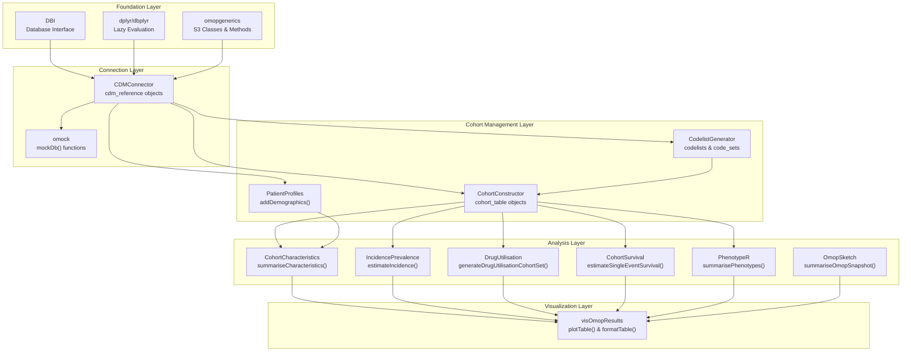
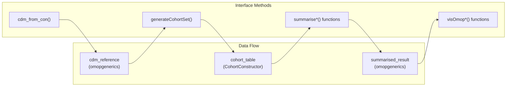
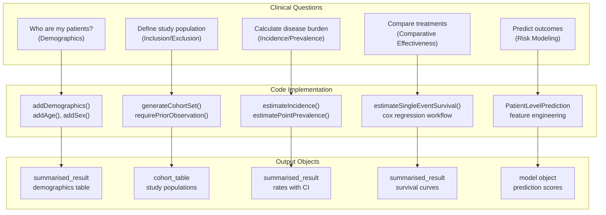
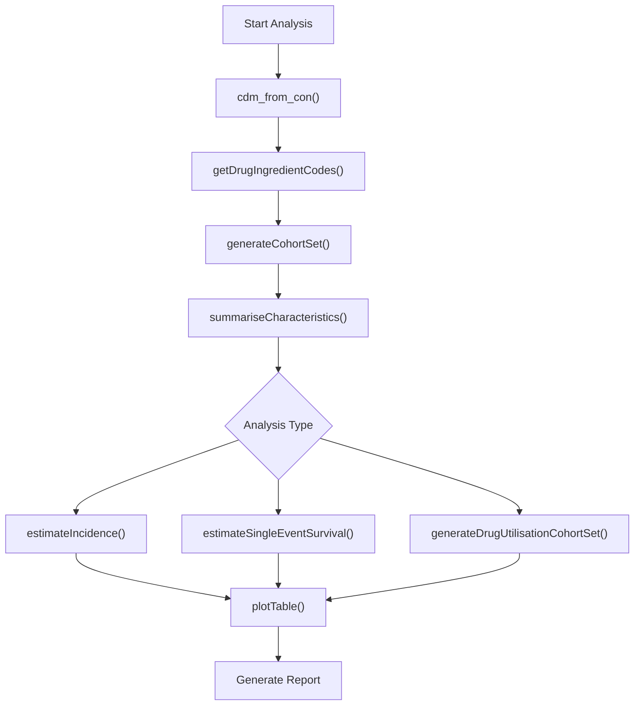

# Page: R Package Reference

# R Package Reference

Relevant source files

The following files were used as context for generating this wiki page:

- [docs/data_analysis/index.md](docs/data_analysis/index.md)
- [docs/data_analysis/package_reference/IncidencePrevalence.md](docs/data_analysis/package_reference/IncidencePrevalence.md)
- [docs/data_analysis/package_reference/index.md](docs/data_analysis/package_reference/index.md)

This comprehensive reference documents all R packages in the OMOP analytics ecosystem, providing a structured guide to the code entities, classes, and functions that form the foundation of observational health data research. This page serves as the technical specification for the package architecture and dependencies.

For step-by-step implementation guidance, see [Environment Setup and Getting Started](#3.1). For conceptual understanding of study methodologies, see [Study Methodologies](#4).

## Package Ecosystem Architecture

The OMOP analytics framework follows a layered architecture where foundation packages provide core infrastructure, and specialized packages build upon them for domain-specific analyses. Each layer defines specific interfaces and contracts that enable interoperability.

### Dependency Architecture

*Sources: [docs/data_analysis/package_reference/index.md:38-66]()*

### Core Data Objects and Interfaces

*Sources: [docs/data_analysis/index.md:36-44](), [docs/data_analysis/package_reference/index.md:38-66]()*

## Package Categories by Functional Role

### Foundation Layer Packages

Core infrastructure packages that establish database connections and provide common interfaces.

| Package | Primary Classes/Objects | Key Functions |
|---------|------------------------|---------------|
| **`omopgenerics`** | `cdm_reference`, `summarised_result` | `newCdmReference()`, `emptySummarisedResult()` |
| **`CDMConnector`** | `cdm_reference` | `cdm_from_con()`, `cdm_disconnect()` |
| **`omock`** | Mock `cdm_reference` | `mockDb()`, `mockPerson()` |

*Sources: [docs/data_analysis/index.md:40-43]()*

### Cohort Management Packages

Packages for defining, constructing, and characterizing patient populations.

| Package | Primary Objects | Core Functions |
|---------|----------------|----------------|
| **`CodelistGenerator`** | `codelists`, `code_sets` | `getDrugIngredientCodes()`, `getATCCodes()` |
| **`CohortConstructor`** | `cohort_table` | `generateCohortSet()`, `requirePriorObservation()` |
| **`PatientProfiles`** | Enhanced `cohort_table` | `addDemographics()`, `addTableIntersect()` |

*Sources: [docs/data_analysis/index.md:49-53]()*

### Specialized Analysis Packages

Domain-specific packages for epidemiological and clinical analyses.

| Package | Analysis Type | Primary Functions |
|---------|--------------|------------------|
| **`CohortCharacteristics`** | Baseline characterization | `summariseCharacteristics()`, `summariseLargeScaleCharacteristics()` |
| **`IncidencePrevalence`** | Population epidemiology | `estimateIncidence()`, `estimatePointPrevalence()` |
| **`DrugUtilisation`** | Medication patterns | `generateDrugUtilisationCohortSet()`, `summariseDrugRestart()` |
| **`CohortSurvival`** | Time-to-event analysis | `estimateSingleEventSurvival()`, `estimateCompetingRiskSurvival()` |
| **`PhenotypeR`** | Phenotype validation | `summarisePhenotypes()`, `summarisePhenotypeCodeUse()` |
| **`OmopSketch`** | Database profiling | `summariseOmopSnapshot()`, `summariseObservationPeriod()` |

*Sources: [docs/data_analysis/index.md:58-67](), [docs/data_analysis/package_reference/IncidencePrevalence.md:137-145]()*

### Visualization and Results Packages

Packages for standardized output generation and visualization.

| Package | Output Type | Key Functions |
|---------|------------|---------------|
| **`visOmopResults`** | Tables and plots | `plotTable()`, `formatTable()`, `plotCharacteristics()` |

*Sources: [docs/data_analysis/index.md:80-82]()*

## Analysis Workflow Mapping

### Clinical Question to Code Entity Mapping

*Sources: [docs/data_analysis/package_reference/index.md:70-196]()*

### Standard Analysis Workflow

*Sources: [docs/data_analysis/package_reference/IncidencePrevalence.md:90-105]()*

## Detailed Package References

For comprehensive documentation of specific packages and their functions:

- **Core Infrastructure**: See [Core Infrastructure Packages](#3.3.1) for `CDMConnector`, `omopgenerics`, `omock`, and `OmopSketch`
- **Cohort Management**: See [Cohort Management Packages](#3.3.2) for `CohortConstructor`, `CohortCharacteristics`, and `PatientProfiles`  
- **Specialized Analysis**: See [Specialized Analysis Packages](#3.3.3) for `IncidencePrevalence`, `DrugUtilisation`, `CohortSurvival`, `CodelistGenerator`, and `PhenotypeR`
- **Visualization**: See [Visualization and Results](#3.3.4) for `visOmopResults`

*Sources: [docs/data_analysis/index.md:1-86](), [docs/data_analysis/package_reference/index.md:1-196]()*