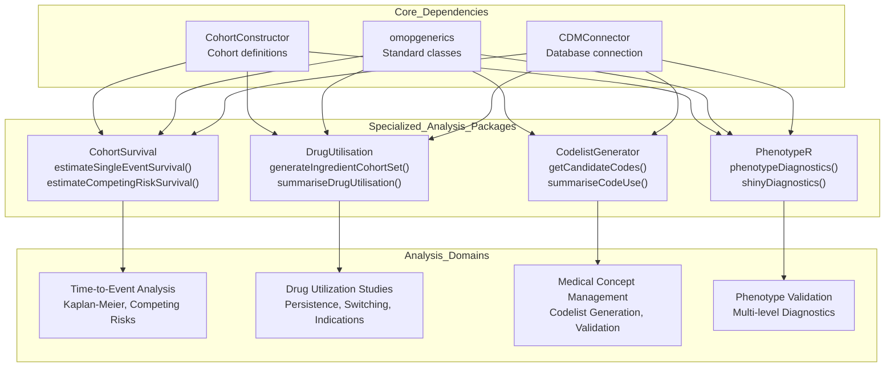
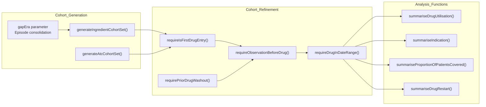
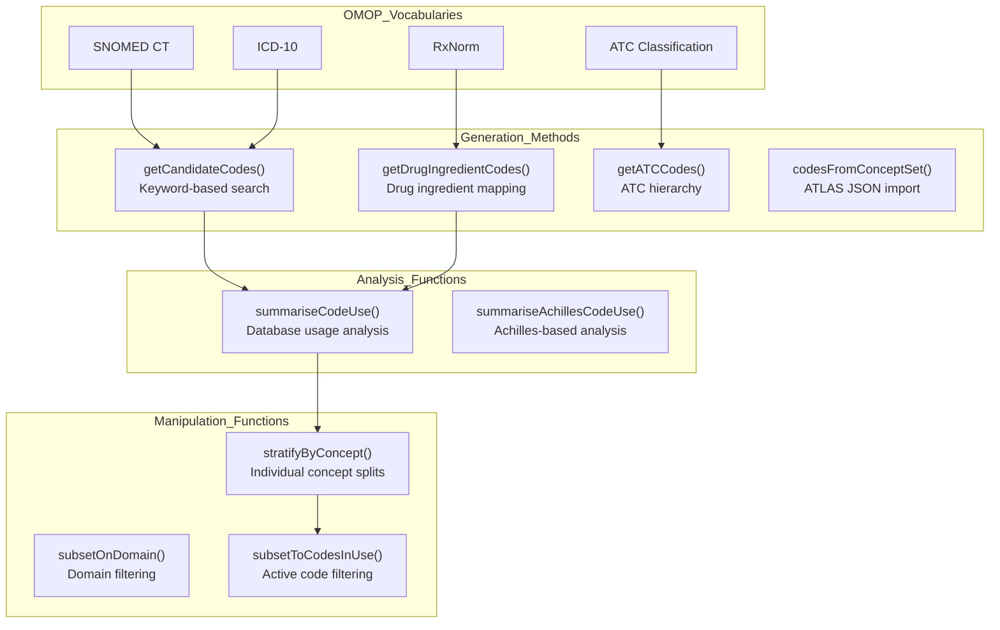
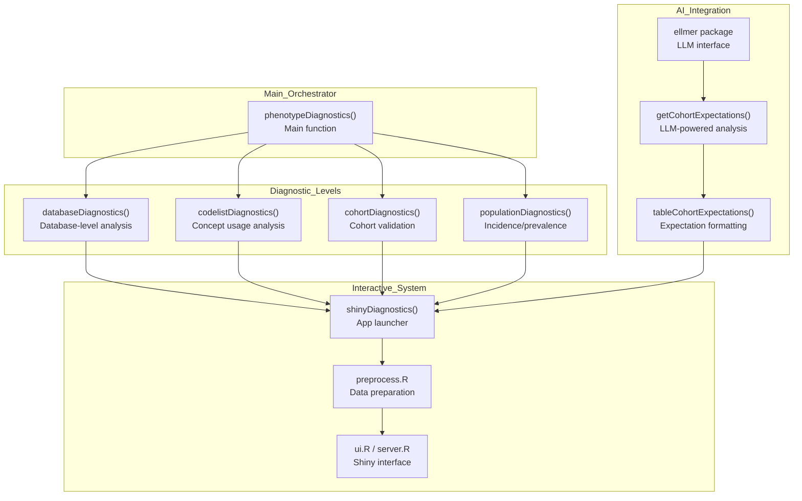

# Page: Specialized Analysis Packages

# Specialized Analysis Packages

<details>
<summary>Relevant source files</summary>

The following files were used as context for generating this wiki page:

- [docs/data_analysis/package_reference/codelistgenerator.md](docs/data_analysis/package_reference/codelistgenerator.md)
- [docs/data_analysis/package_reference/cohortsurvival.md](docs/data_analysis/package_reference/cohortsurvival.md)
- [docs/data_analysis/package_reference/drugutilisation.md](docs/data_analysis/package_reference/drugutilisation.md)
- [docs/data_analysis/package_reference/phenotyper.md](docs/data_analysis/package_reference/phenotyper.md)

</details>


This document covers the specialized analysis packages in the OMOP analytics ecosystem that provide domain-specific analytical capabilities for observational health research. These packages build upon the core infrastructure ([3.3.1](#3.3.1)) and cohort management ([3.3.2](#3.3.2)) layers to deliver standardized implementations of specific study methodologies.

The packages covered include time-to-event analysis, drug utilization studies, medical concept codelist generation, and phenotype validation. For visualization and reporting of analysis results, see [3.3.4](#3.3.4).

## Package Architecture and Dependencies

The specialized analysis packages form a cohesive ecosystem with distinct analytical domains, each implementing standardized OHDSI methodologies while maintaining interoperability through shared data structures.

### Analysis Package Ecosystem



Sources: [docs/data_analysis/package_reference/cohortsurvival.md:1-210](), [docs/data_analysis/package_reference/drugutilisation.md:1-209](), [docs/data_analysis/package_reference/codelistgenerator.md:1-242](), [docs/data_analysis/package_reference/phenotyper.md:1-157]()

### Function-Level Integration Patterns

```mermaid
graph LR
    subgraph "CodelistGenerator_Functions"
        getCandidateCodes["getCandidateCodes()"]
        getDrugIngredientCodes["getDrugIngredientCodes()"]
        summariseCodeUse["summariseCodeUse()"]
    end

    subgraph "DrugUtilisation_Functions"
        generateIngredientCohortSet["generateIngredientCohortSet()"]
        requireIsFirstDrugEntry["requireIsFirstDrugEntry()"]
        summariseDrugUtilisation["summariseDrugUtilisation()"]
    end

    subgraph "CohortSurvival_Functions"
        estimateSingleEventSurvival["estimateSingleEventSurvival()"]
        estimateCompetingRiskSurvival["estimateCompetingRiskSurvival()"]
        addCohortSurvival["addCohortSurvival()"]
    end

    subgraph "PhenotypeR_Functions"
        phenotypeDiagnostics["phenotypeDiagnostics()"]
        codelistDiagnostics["codelistDiagnostics()"]
        shinyDiagnostics["shinyDiagnostics()"]
    end

    getCandidateCodes --> generateIngredientCohortSet
    getDrugIngredientCodes --> generateIngredientCohortSet
    summariseCodeUse --> codelistDiagnostics
    
    generateIngredientCohortSet --> estimateSingleEventSurvival
    summariseDrugUtilisation --> phenotypeDiagnostics
    
    addCohortSurvival -.-> "External_Modeling"["survival::coxph()"]
```

Sources: [docs/data_analysis/package_reference/codelistgenerator.md:119-132](), [docs/data_analysis/package_reference/drugutilisation.md:196-209](), [docs/data_analysis/package_reference/cohortsurvival.md:189-209](), [docs/data_analysis/package_reference/phenotyper.md:124-153]()

## CohortSurvival Package

The `CohortSurvival` package provides standardized time-to-event analysis capabilities using Kaplan-Meier and Aalen-Johansen methodologies. It implements the OHDSI equivalent of traditional survival analysis tools like SAS `PROC LIFETEST`.

### Core Analytical Methods

| Function | Method | Use Case |
|----------|--------|----------|
| `estimateSingleEventSurvival()` | Kaplan-Meier | Single primary outcome (e.g., all-cause mortality) |
| `estimateCompetingRiskSurvival()` | Aalen-Johansen | Multiple competing outcomes (e.g., disease-specific vs. other death) |
| `addCohortSurvival()` | Data preparation | Export for Cox regression modeling |

### Key Parameters and Concepts

The package uses a three-step analytical workflow built around the `gapEra` concept for defining continuous treatment episodes. The `mockMGUS2cdm()` function provides demonstration data based on the monoclonal gammopathy dataset.

**Stratification Support**: Both primary functions support stratification through the `strata` parameter, enabling subgroup analysis by demographics or clinical characteristics.

**Visualization Functions**: `plotSurvival()` and `tableSurvival()` provide standardized output compatible with the `visOmopResults` framework.

Sources: [docs/data_analysis/package_reference/cohortsurvival.md:8-23](), [docs/data_analysis/package_reference/cohortsurvival.md:44-59](), [docs/data_analysis/package_reference/cohortsurvival.md:189-209]()

## DrugUtilisation Package

The `DrugUtilisation` package implements standardized drug utilization study methodologies with a sequential workflow for cohort generation, refinement, and analysis.

### Sequential Workflow Architecture



### Critical Design Parameters

**gapEra Parameter**: Controls consolidation of drug exposure records into continuous treatment episodes. Values typically range from 0 (no gap allowed) to 30+ days based on clinical context.

**Refinement Order**: The sequence of refinement functions is methodologically significant:
1. Washout/first use identification
2. Prior observation requirements  
3. Date range restrictions

Sources: [docs/data_analysis/package_reference/drugutilisation.md:25-49](), [docs/data_analysis/package_reference/drugutilisation.md:51-93](), [docs/data_analysis/package_reference/drugutilisation.md:196-209]()

## CodelistGenerator Package

The `CodelistGenerator` package provides systematic approaches to medical concept identification and validation within OMOP vocabularies, supporting both automated generation and manual curation workflows.

### Generation and Analysis Functions



### Key Integration Patterns

The package integrates with external concept set definitions through `codesFromConceptSet()` for ATLAS JSON imports and provides validation through database usage analysis via `summariseCodeUse()` and `summariseAchillesCodeUse()`.

**Vocabulary Integration**: Native support for OMOP standard vocabularies including SNOMED CT, ICD-10, ATC, and RxNorm through vocabulary-specific functions.

Sources: [docs/data_analysis/package_reference/codelistgenerator.md:58-115](), [docs/data_analysis/package_reference/codelistgenerator.md:119-132](), [docs/data_analysis/package_reference/codelistgenerator.md:192-242]()

## PhenotypeR Package

The `PhenotypeR` package provides comprehensive phenotype validation through multi-level diagnostic analysis, combining traditional database profiling with AI-powered expectation generation.

### Multi-Level Diagnostic Architecture



### Core Diagnostic Functions

The package implements a hierarchical diagnostic approach through its main orchestrator function `phenotypeDiagnostics()`, which coordinates four diagnostic levels and integrates with AI-powered expectation generation via the `ellmer` package interface.

**Sampling Strategies**: Functions support configurable sampling through `cohortSample`, `matchedSample`, and `populationSample` parameters for scalable analysis of large datasets.

**Interactive Output**: The `shinyDiagnostics()` function generates web-based diagnostic reports with integrated expectation comparison and interactive visualization.

Sources: [docs/data_analysis/package_reference/phenotyper.md:58-121](), [docs/data_analysis/package_reference/phenotyper.md:124-153]()

## Integration with Analysis Workflow

These specialized packages integrate into the broader OMOP analytics workflow by consuming standardized cohort definitions and producing `summarised_result` objects compatible with the `visOmopResults` visualization framework.

### Common Integration Patterns

**Cohort Dependencies**: All packages expect cohort tables generated via `CohortConstructor` and connected through `CDMConnector`.

**Result Standardization**: Output follows the `omopgenerics` `summarised_result` standard for downstream compatibility.

**Mock Data Support**: Each package provides mock data functions (`mockMGUS2cdm()`, `mockDrugUtilisation()`, `mockVocabRef()`, `mockPhenotypeR()`) for development and testing.

Sources: [docs/data_analysis/package_reference/cohortsurvival.md:77-83](), [docs/data_analysis/package_reference/drugutilisation.md:108-117](), [docs/data_analysis/package_reference/codelistgenerator.md:36-54](), [docs/data_analysis/package_reference/phenotyper.md:35-56]()