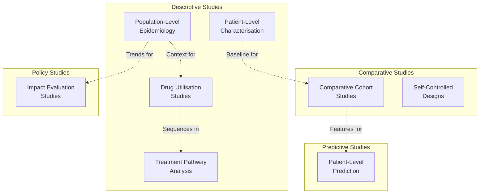
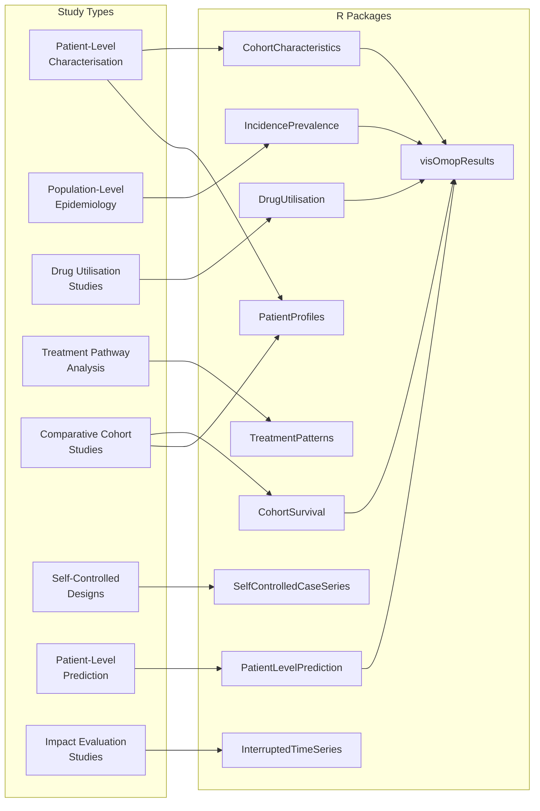
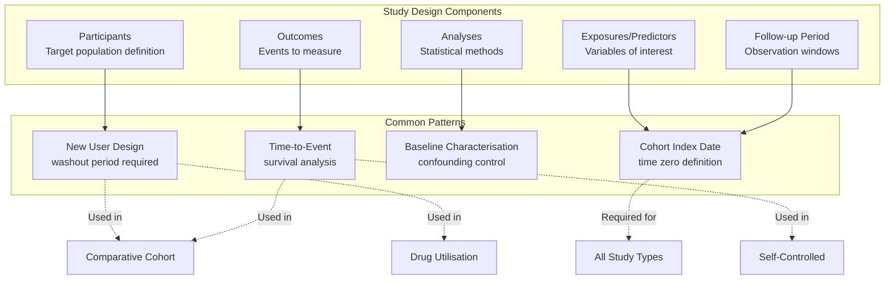
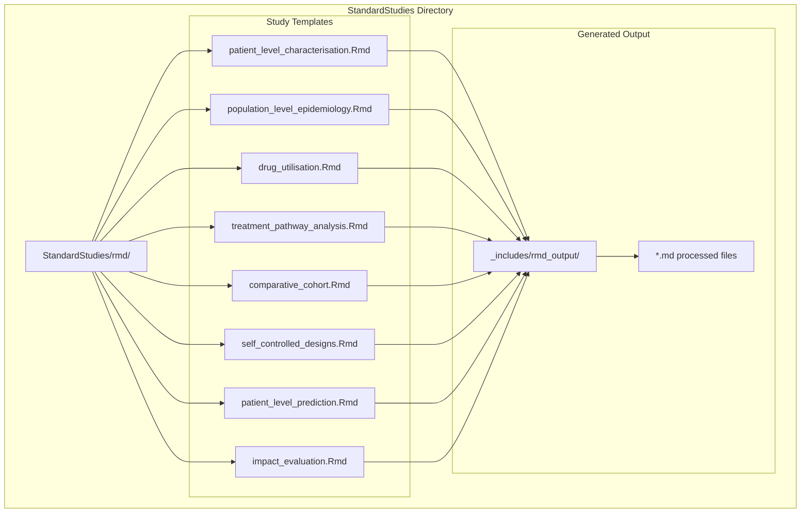

# Page: Standard Study Types

# Standard Study Types

Relevant source files

The following files were used as context for generating this wiki page:

- [docs/data_analysis/standard_studies/comparative_cohort.md](docs/data_analysis/standard_studies/comparative_cohort.md)
- [docs/data_analysis/standard_studies/drug_utilisation.md](docs/data_analysis/standard_studies/drug_utilisation.md)
- [docs/data_analysis/standard_studies/impact_evaluation.md](docs/data_analysis/standard_studies/impact_evaluation.md)
- [docs/data_analysis/standard_studies/patient_level_prediction.md](docs/data_analysis/standard_studies/patient_level_prediction.md)
- [docs/data_analysis/standard_studies/population_level_epidemiology.md](docs/data_analysis/standard_studies/population_level_epidemiology.md)
- [docs/data_analysis/standard_studies/self_controlled_designs.md](docs/data_analysis/standard_studies/self_controlled_designs.md)
- [docs/data_analysis/standard_studies/treatment_pathway_analysis.md](docs/data_analysis/standard_studies/treatment_pathway_analysis.md)

This document provides a comprehensive catalog of the eight standardized study methodologies supported by the OMOP Analytics Framework. Each study type represents a distinct analytical approach designed to answer specific research questions using observational health data. For detailed implementation guides and code examples, see [Study Templates and Examples](#4.2). For specific methodology deep-dives, see [Patient-Level Characterisation](#4.3) and [Population-Level Epidemiology](#4.4).

## Study Type Taxonomy

The eight standard study types can be classified into four primary analytical categories based on their methodological approach and research objectives:

Sources: [docs/data_analysis/standard_studies/population_level_epidemiology.md:1-52](), [docs/data_analysis/standard_studies/self_controlled_designs.md:1-52](), [docs/data_analysis/standard_studies/patient_level_prediction.md:1-67](), [docs/data_analysis/standard_studies/treatment_pathway_analysis.md:1-67](), [docs/data_analysis/standard_studies/drug_utilisation.md:1-67](), [docs/data_analysis/standard_studies/impact_evaluation.md:1-65](), [docs/data_analysis/standard_studies/comparative_cohort.md:1-67]()

## Complete Study Type Catalog

| Study Type | Primary Question | Design | Key Outputs | Typical Use Cases |
|------------|------------------|--------|-------------|-------------------|
| **Patient-Level Characterisation** | What are the baseline characteristics of this population? | Descriptive cross-sectional | Table 1 demographics, comorbidities | Study population description, feasibility assessment |
| **Population-Level Epidemiology** | How common is this condition in the population? | Population cohort | Incidence rates, prevalence proportions | Disease burden assessment, public health surveillance |
| **Drug Utilisation Studies** | How are medications used in real-world practice? | Descriptive cohort | Usage patterns, persistence, adherence | Real-world prescribing patterns, market research |
| **Treatment Pathway Analysis** | What is the typical sequence of treatments? | Sequential events mapping | Sankey diagrams, transition probabilities | Care pathway optimization, guideline adherence |
| **Comparative Cohort Studies** | Is Treatment A safer/more effective than B? | Comparative cohort with propensity matching | Hazard ratios, risk differences | Comparative effectiveness, safety surveillance |
| **Self-Controlled Designs** | Does exposure increase acute risk within individuals? | Case series with exposure windows | Incidence rate ratios | Vaccine safety, acute drug reactions |
| **Patient-Level Prediction** | Who is at highest risk for this outcome? | Machine learning prognostic model | Risk scores, AUC, calibration plots | Clinical decision support, risk stratification |
| **Impact Evaluation Studies** | Did this policy/intervention change population outcomes? | Quasi-experimental time series | Trend changes, effect sizes | Policy evaluation, regulatory impact assessment |

Sources: [docs/data_analysis/standard_studies/population_level_epidemiology.md:10-18](), [docs/data_analysis/standard_studies/self_controlled_designs.md:10-16](), [docs/data_analysis/standard_studies/patient_level_prediction.md:10-16](), [docs/data_analysis/standard_studies/treatment_pathway_analysis.md:10-22](), [docs/data_analysis/standard_studies/drug_utilisation.md:10-22](), [docs/data_analysis/standard_studies/impact_evaluation.md:10-18](), [docs/data_analysis/standard_studies/comparative_cohort.md:10-17]()

## R Package Implementation Mapping

Each study type is implemented using specific R packages from the OMOP analytics ecosystem:

Sources: [docs/data_analysis/standard_studies/population_level_epidemiology.md:51](), [docs/data_analysis/standard_studies/drug_utilisation.md:64-66](), [docs/data_analysis/standard_studies/comparative_cohort.md:64-66](), [docs/data_analysis/standard_studies/patient_level_prediction.md:54-62]()

## Study Design Components

Each study type follows a standardized structure with five core components:

### Methodological Framework

Sources: [docs/data_analysis/standard_studies/comparative_cohort.md:29-31](), [docs/data_analysis/standard_studies/drug_utilisation.md:30-34](), [docs/data_analysis/standard_studies/self_controlled_designs.md:36-42]()

## Study Selection Decision Framework

The choice of study type depends on the research question structure and available data:

| Research Question Pattern | Recommended Study Type | Key Considerations |
|---------------------------|------------------------|-------------------|
| "What are the characteristics of patients with...?" | Patient-Level Characterisation | Descriptive only, no comparisons |
| "How common is condition X?" | Population-Level Epidemiology | Requires whole population denominator |
| "How do patients use drug Y?" | Drug Utilisation Studies | Focus on medication patterns |
| "What treatments follow drug Z?" | Treatment Pathway Analysis | Sequential event analysis |
| "Is drug A safer than drug B?" | Comparative Cohort Studies | Requires active comparator |
| "Does vaccine C cause event D?" | Self-Controlled Designs | Acute events, individual as own control |
| "Who will develop outcome E?" | Patient-Level Prediction | Requires machine learning infrastructure |
| "Did policy F change outcomes?" | Impact Evaluation Studies | Requires pre/post intervention periods |

### Template File Structure

Study implementations are organized in the codebase as R Markdown templates:

Sources: [docs/data_analysis/standard_studies/population_level_epidemiology.md:51]()