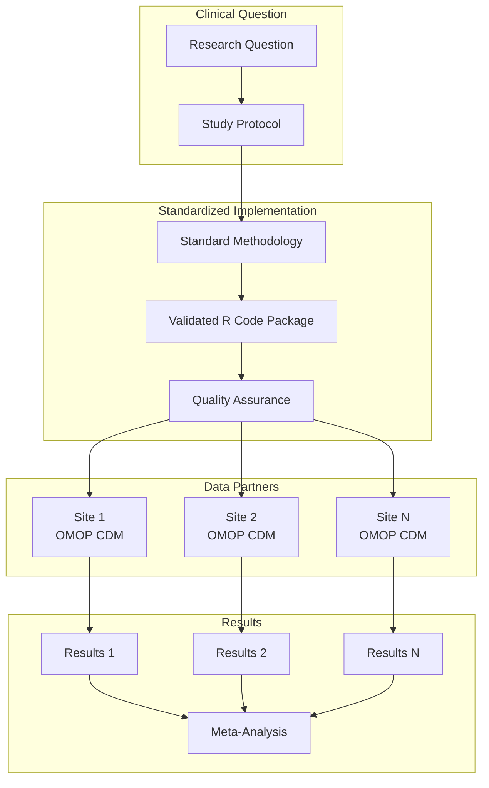
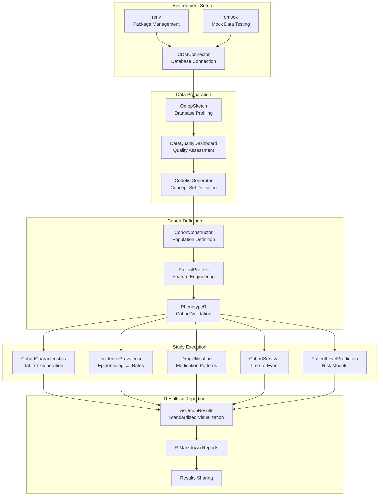
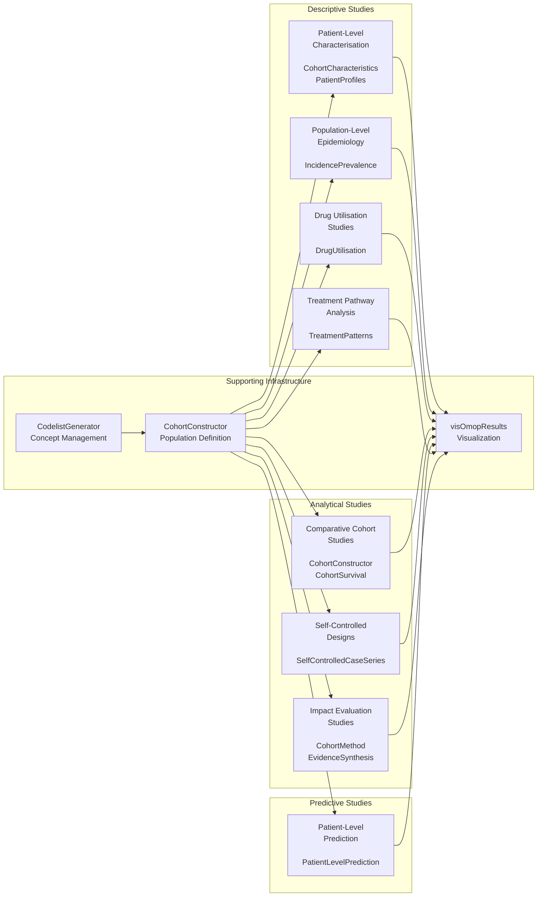
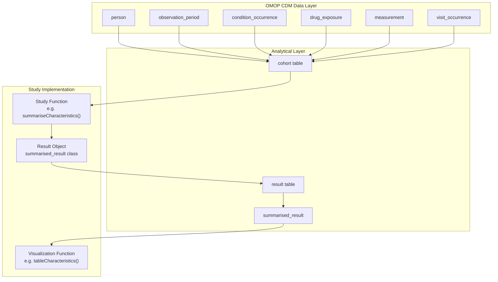

# Page: Study Methodologies

# Study Methodologies

Relevant source files

The following files were used as context for generating this wiki page:

- [docs/data_analysis/standard_studies/index.md](docs/data_analysis/standard_studies/index.md)
- [personas/david.md](personas/david.md)
- [personas/martina.md](personas/martina.md)
- [personas/montse.md](personas/montse.md)
- [personas/patrick.md](personas/patrick.md)

This document provides an overview of standardized study methodologies for observational health data research using the OMOP CDM. It covers the conceptual framework, workflow patterns, and methodological approaches that underpin all analytical studies in this ecosystem. For detailed implementation guides of specific study types, see [Standard Study Types](#4.1). For executable code examples and templates, see [Study Templates and Examples](#4.2).

## Standardized Analytics Framework

The OMOP analytics ecosystem employs a standardized analytics approach based on the DARWIN EU® methodology. This framework emphasizes sending validated analytical code packages rather than study protocols, ensuring that differences in results reflect data characteristics rather than implementation variations.

The standardized approach provides several key benefits:
- **Reproducibility**: Identical analytical code across all data partners
- **Transparency**: Open-source, peer-reviewed methodologies  
- **Speed**: Rapid deployment without site-specific implementation
- **Quality**: Validated statistical methods and data quality checks

Sources: [docs/data_analysis/standard_studies/index.md:9-25]()

## Study Methodology Workflow

All observational studies in the OMOP ecosystem follow a standardized analytical workflow that progresses through distinct phases, each supported by specific R packages and methodological frameworks.

Sources: [docs/data_analysis/standard_studies/index.md:35-51]()

## Study Type Taxonomy

The framework encompasses eight standardized study types, each addressing specific research questions and employing distinct methodological approaches. Each study type is supported by specialized R packages within the OHDSI ecosystem.

| Study Type | Primary Packages | Clinical Questions |
|------------|------------------|-------------------|
| **Population-Level Epidemiology** | `IncidencePrevalence` | Disease frequency, trends over time |
| **Patient-Level Characterisation** | `CohortCharacteristics`, `PatientProfiles` | Baseline demographics, comorbidities |
| **Drug Utilisation Studies** | `DrugUtilisation` | Medication usage patterns, indications |
| **Comparative Cohort Studies** | `CohortConstructor`, `CohortSurvival` | Treatment effectiveness, safety comparison |
| **Self-Controlled Designs** | `SelfControlledCaseSeries` | Acute event risk assessment |
| **Patient-Level Prediction** | `PatientLevelPrediction` | Individual risk stratification |
| **Treatment Pathway Analysis** | `TreatmentPatterns` | Patient journey mapping |
| **Impact Evaluation Studies** | `CohortMethod`, `EvidenceSynthesis` | Policy/intervention impact assessment |

Sources: [docs/data_analysis/standard_studies/index.md:41-51]()

## Methodological Considerations

### Cohort Definition Strategy

All study types begin with precise cohort definition using `CohortConstructor`. The package provides a systematic approach to population identification:

- **Index Event**: The qualifying event that marks cohort entry
- **Inclusion Criteria**: Additional requirements for cohort membership  
- **Exclusion Criteria**: Conditions that disqualify individuals
- **Washout Periods**: Time windows to ensure new user status
- **Observation Requirements**: Minimum follow-up time specifications

### Temporal Framework

Studies employ standardized temporal concepts to ensure consistent time-based analyses:

- **Index Date**: The reference date for each individual in the cohort
- **Baseline Period**: Pre-index period for covariate assessment
- **Follow-up Period**: Post-index period for outcome assessment
- **Washout Period**: Gap period to identify treatment-naive individuals
- **Grace Period**: Allowable gaps in continuous exposure

### Statistical Methodology

The framework emphasizes robust statistical practices:

- **Multiple Testing Correction**: Appropriate adjustment for multiple comparisons
- **Confounding Control**: Systematic identification and adjustment for confounders
- **Sensitivity Analyses**: Testing robustness of findings under different assumptions
- **Missing Data Handling**: Explicit strategies for incomplete data
- **Effect Size Interpretation**: Clinical significance alongside statistical significance

## Integration with OMOP Analytics Framework  

Study methodologies are tightly integrated with the broader OMOP analytics ecosystem, leveraging standardized data structures and analytical patterns consistent across all implementations.

The standardized result format (`summarised_result`) ensures that all study types produce consistent output structures that can be processed by `visOmopResults` for visualization and reporting.

Sources: [docs/data_analysis/standard_studies/index.md:18-32]()