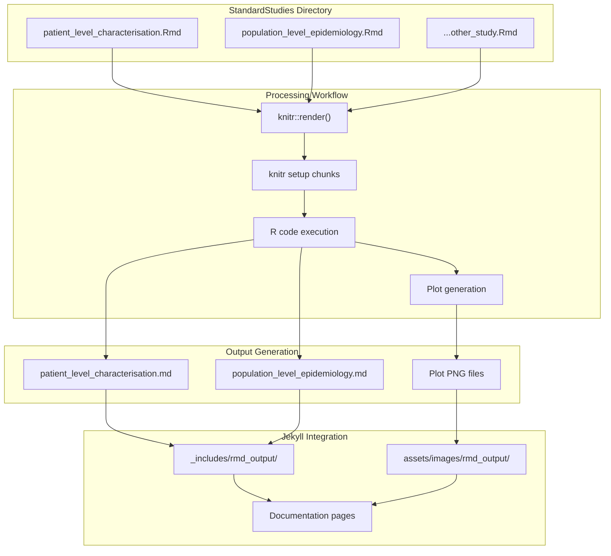
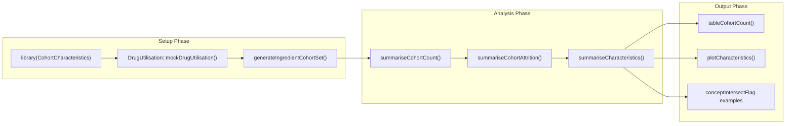
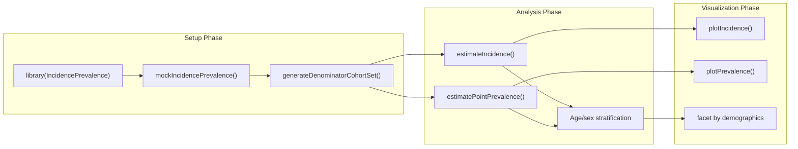
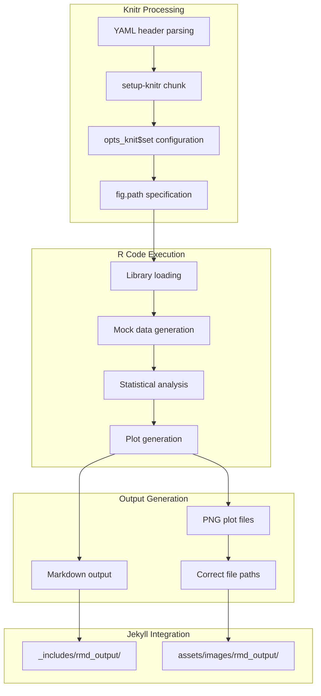

# Page: Study Templates and Examples

# Study Templates and Examples

Relevant source files

The following files were used as context for generating this wiki page:

- [StandardStudies/rmd/patient_level_characterisation.Rmd](StandardStudies/rmd/patient_level_characterisation.Rmd)
- [StandardStudies/rmd/population_level_epidemiology.Rmd](StandardStudies/rmd/population_level_epidemiology.Rmd)
- [_includes/rmd_output/patient_level_characterisation.md](_includes/rmd_output/patient_level_characterisation.md)
- [_includes/rmd_output/population_level_epidemiology.md](_includes/rmd_output/population_level_epidemiology.md)
- [assets/images/rmd_output/estimate_incidence-1.png](assets/images/rmd_output/estimate_incidence-1.png)
- [assets/images/rmd_output/estimate_prevalence-1.png](assets/images/rmd_output/estimate_prevalence-1.png)
- [assets/images/rmd_output/plot-age-distribution-1.png](assets/images/rmd_output/plot-age-distribution-1.png)

This section provides executable R Markdown templates that demonstrate each standard study type with working code examples. These templates serve as starting points for implementing observational health data studies using the OMOP CDM and associated R packages.

For information about the theoretical study methodologies, see [Standard Study Types](#4.1). For detailed implementation guides for specific study types, see [Patient-Level Characterisation](#4.3) and [Population-Level Epidemiology](#4.4).

## Overview

The study templates are fully executable R Markdown documents located in `StandardStudies/rmd/` that demonstrate real-world implementations of each standard study type. Each template includes:

- Complete working code using mock OMOP CDM data for reproducibility
- Step-by-step workflows following OHDSI best practices  
- Integrated visualizations using `visOmopResults`
- Detailed explanations of key analytical decisions
- Examples of stratification and grouping strategies

## Template Architecture

The template system integrates with the documentation build process through a specialized knit configuration that automatically processes R Markdown files and embeds their output in the Jekyll documentation site.

Sources: [StandardStudies/rmd/patient_level_characterisation.Rmd:1-11](), [_includes/rmd_output/patient_level_characterisation.md:1-201]()

## Template Configuration System

Each template uses a specialized YAML header that configures automatic processing and output placement:

| Configuration Element | Purpose | Implementation |
|----------------------|---------|----------------|
| `knit` function | Custom knit behavior | Renders to `github_document` format |
| `output_file` path | Target location | `_includes/rmd_output/{filename}.md` |
| `encoding` parameter | Character encoding | Ensures proper text handling |
| `html_preview` setting | Output format | Disabled for Jekyll compatibility |

The knit function automatically determines output paths using [StandardStudies/rmd/patient_level_characterisation.Rmd:8-9]() to place processed markdown in the Jekyll includes directory.

Sources: [StandardStudies/rmd/patient_level_characterisation.Rmd:1-11](), [StandardStudies/rmd/population_level_epidemiology.Rmd:1-13]()

## Available Study Templates

### Patient-Level Characterisation Template

**File:** `StandardStudies/rmd/patient_level_characterisation.Rmd`
**Primary Package:** `CohortCharacteristics`
**Output:** Baseline characteristics tables ("Table 1") and demographic plots

This template demonstrates the core workflow for generating baseline patient characteristics using the `CohortCharacteristics` package:

**Key Features:**
- Uses `DrugUtilisation::mockDrugUtilisation()` for reproducible mock data
- Demonstrates cohort construction with `generateIngredientCohortSet()` 
- Shows attrition reporting with `summariseCohortAttrition()`
- Includes advanced features like `conceptIntersectFlag` for comorbidity assessment
- Produces both tabular and visual outputs using `visOmopResults`

**Template Structure:**
- **Step 1:** Library loading and knitr configuration [StandardStudies/rmd/patient_level_characterisation.Rmd:32-46]()
- **Step 2:** Mock CDM and cohort generation [StandardStudies/rmd/patient_level_characterisation.Rmd:52-64]()
- **Step 3:** Cohort counting and attrition analysis [StandardStudies/rmd/patient_level_characterisation.Rmd:70-82]()
- **Step 4:** Baseline characteristics generation [StandardStudies/rmd/patient_level_characterisation.Rmd:88-102]()
- **Step 5:** Advanced stratification examples [StandardStudies/rmd/patient_level_characterisation.Rmd:108-127]()

Sources: [StandardStudies/rmd/patient_level_characterisation.Rmd:1-128](), [_includes/rmd_output/patient_level_characterisation.md:1-201]()

### Population-Level Epidemiology Template

**File:** `StandardStudies/rmd/population_level_epidemiology.Rmd`
**Primary Package:** `IncidencePrevalence`  
**Output:** Incidence and prevalence rate calculations with time-series plots

This template demonstrates population-level epidemiological analysis using the `IncidencePrevalence` package:

**Key Features:**
- Uses `mockIncidencePrevalence()` for standardized epidemiological mock data
- Demonstrates denominator population definition with age and sex stratification
- Shows both incidence (`estimateIncidence()`) and prevalence (`estimatePointPrevalence()`) calculations
- Includes temporal stratification by quarters
- Implements washout periods and repeated event handling

**Template Structure:**
- **Step 1:** Library loading and mock database creation [StandardStudies/rmd/population_level_epidemiology.Rmd:75-85]()
- **Step 2:** Denominator cohort definition with stratification [StandardStudies/rmd/population_level_epidemiology.Rmd:91-103]()
- **Step 3.1:** Incidence rate estimation [StandardStudies/rmd/population_level_epidemiology.Rmd:115-127]()
- **Step 3.2:** Prevalence rate estimation [StandardStudies/rmd/population_level_epidemiology.Rmd:133-143]()

Sources: [StandardStudies/rmd/population_level_epidemiology.Rmd:1-143](), [_includes/rmd_output/population_level_epidemiology.md:1-201]()

## Template Execution Workflow

Templates follow a standardized execution pattern that integrates code execution with documentation generation:

**Key Configuration Elements:**
- `knitr::opts_knit$set(upload.fun)` modifies image paths for Jekyll [StandardStudies/rmd/patient_level_characterisation.Rmd:35]()
- `knitr::opts_chunk$set(fig.path)` directs plots to assets directory [StandardStudies/rmd/patient_level_characterisation.Rmd:37]()
- Custom knit function ensures proper markdown placement [StandardStudies/rmd/patient_level_characterisation.Rmd:3-10]()

Sources: [StandardStudies/rmd/patient_level_characterisation.Rmd:32-38](), [StandardStudies/rmd/population_level_epidemiology.Rmd:65-71]()

## Common Template Patterns

### Mock Data Strategy

All templates use package-specific mock data functions to ensure reproducibility:

| Template Type | Mock Data Function | Purpose |
|--------------|-------------------|---------|
| Patient-Level Characterisation | `DrugUtilisation::mockDrugUtilisation()` | Creates OMOP CDM with drug exposure data |
| Population-Level Epidemiology | `mockIncidencePrevalence()` | Generates epidemiological study data |

### Analysis Workflow Pattern

Templates consistently follow the **summarise → table/plot** pattern common across OHDSI packages:

1. **Summarise:** Generate analytical results using package-specific functions
2. **Table:** Create formatted tables using `visOmopResults` table functions  
3. **Plot:** Generate visualizations using `visOmopResults` plot functions

### Output Integration

Templates generate two types of output that integrate with the documentation system:
- **Markdown content:** Processed text and code blocks placed in `_includes/rmd_output/`
- **Plot images:** PNG files placed in `assets/images/rmd_output/` with Jekyll-compatible paths

Sources: [StandardStudies/rmd/patient_level_characterisation.Rmd:50-64](), [StandardStudies/rmd/population_level_epidemiology.Rmd:82-85](), [_includes/rmd_output/patient_level_characterisation.md:44-66]()