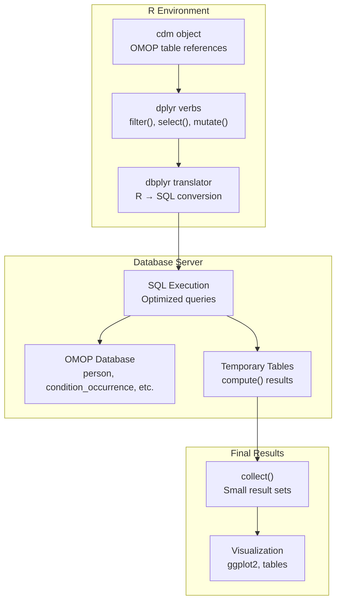
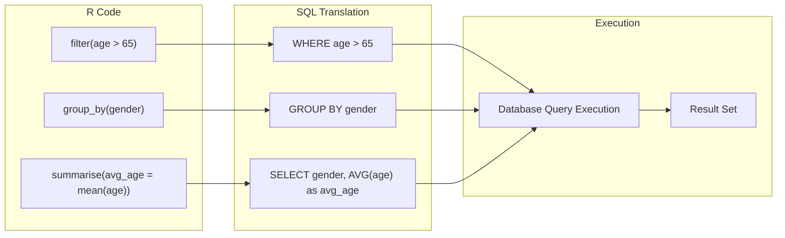
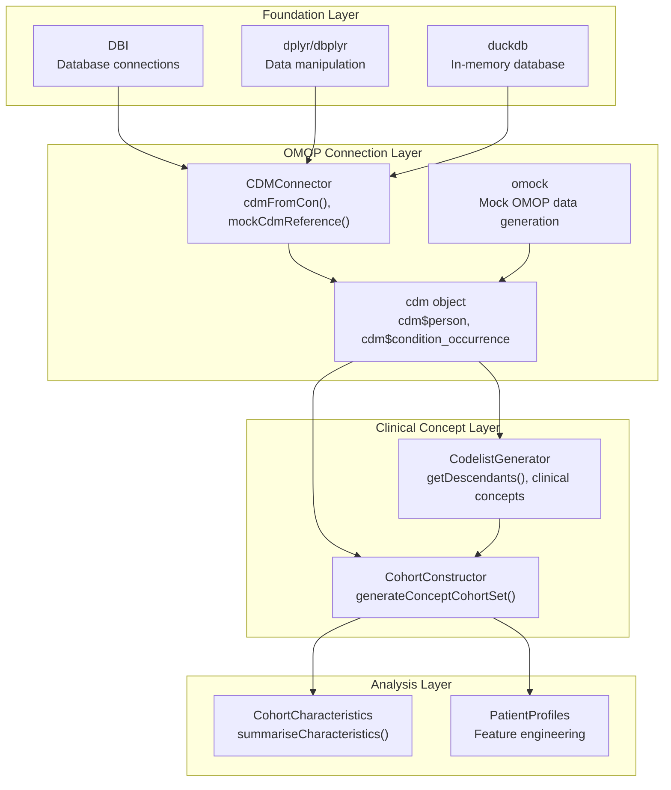
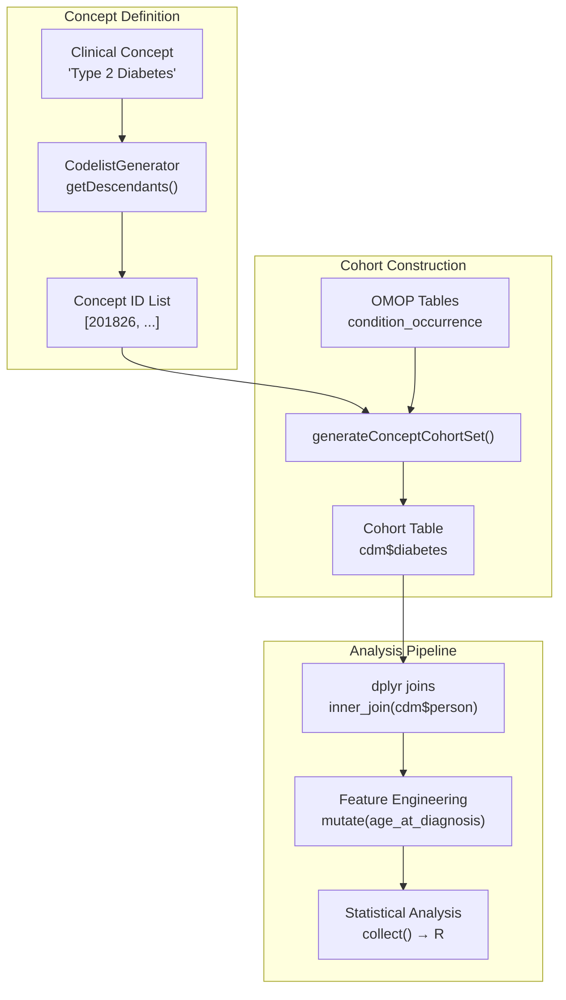

# Page: Tidyverse Programming with OMOP

# Tidyverse Programming with OMOP

<details>
<summary>Relevant source files</summary>

The following files were used as context for generating this wiki page:

- [StandardStudies/rmd/tidy_r_programming_with_omop.Rmd](StandardStudies/rmd/tidy_r_programming_with_omop.Rmd)
- [_includes/rmd_output/tidy_r_programming_with_omop.md](_includes/rmd_output/tidy_r_programming_with_omop.md)
- [docs/data_analysis/tidy_r_programming_with_omop.md](docs/data_analysis/tidy_r_programming_with_omop.md)

</details>


This document provides a comprehensive guide to using dplyr, dbplyr, and tidyverse principles for efficient OMOP CDM data analysis. It covers the foundational database manipulation concepts and demonstrates how OMOP-specific R packages extend these principles for observational health research.

For information about setting up the R environment and installing packages, see [Environment Setup and Getting Started](#3.1). For detailed reference documentation of specific packages, see [R Package Reference](#3.3).

## Tidyverse Database Programming Paradigm

The tidyverse approach to OMOP CDM analysis follows a "lazy evaluation" pattern where operations are translated to SQL and executed on the database server, minimizing data transfer and maximizing performance.

### Core Workflow Architecture



Sources: [_includes/rmd_output/tidy_r_programming_with_omop.md:140-220]()

## Core dplyr Verbs for Database Operations

The tidyverse provides a consistent grammar for data manipulation that translates seamlessly to SQL operations on OMOP databases.

### Essential Database Verbs

| Purpose | Functions | Database Translation |
|---------|-----------|---------------------|
| **Row Selection** | `filter()`, `distinct()` | `WHERE`, `DISTINCT` clauses |
| **Row Ordering** | `arrange()` | `ORDER BY` clause |
| **Column Operations** | `mutate()`, `select()`, `rename()` | `SELECT`, computed columns |
| **Grouping** | `group_by()`, `ungroup()` | `GROUP BY` clause |
| **Aggregation** | `summarise()`, `count()` | `COUNT()`, `AVG()`, `SUM()` functions |
| **Table Joins** | `inner_join()`, `left_join()` | `INNER JOIN`, `LEFT JOIN` |

### Database Query Translation Flow



Sources: [_includes/rmd_output/tidy_r_programming_with_omop.md:1137-1154](), [StandardStudies/rmd/tidy_r_programming_with_omop.Rmd:812-825]()

## OMOP CDM Integration Architecture

The OMOP ecosystem builds on tidyverse foundations with specialized packages that understand the OMOP Common Data Model structure.

### CDM Object and Package Dependencies



Sources: [_includes/rmd_output/tidy_r_programming_with_omop.md:1162-1192](), [StandardStudies/rmd/tidy_r_programming_with_omop.Rmd:831-848]()

## Key Programming Patterns

### collect() vs compute() Strategy

The distinction between `collect()` and `compute()` is fundamental to efficient OMOP analysis:

- **`collect()`**: Pulls data from database into R memory for small result sets, visualization, or final analysis
- **`compute()`**: Creates temporary tables in the database for multi-step analyses, keeping computations server-side

### Clinical Cohort Definition Workflow



Sources: [_includes/rmd_output/tidy_r_programming_with_omop.md:1213-1281](), [StandardStudies/rmd/tidy_r_programming_with_omop.Rmd:868-914]()

## Database Connection Patterns

### CDM Reference Creation

The `cdm` object serves as the central interface to OMOP databases:

```r
# Production database connection
cdm <- cdmFromCon(
  con = dbConnect(duckdb(), "path/to/omop.db"),
  cdmSchema = "main", 
  writeSchema = "main"
)

# Mock data for development/testing
cdm <- mockCdmReference()
```

Sources: [_includes/rmd_output/tidy_r_programming_with_omop.md:691-697](), [StandardStudies/rmd/tidy_r_programming_with_omop.Rmd:457-469]()

### Table Access and Manipulation

The `cdm` object provides direct access to OMOP tables as lazy tibbles:

- `cdm$person` - Patient demographics
- `cdm$condition_occurrence` - Diagnoses  
- `cdm$drug_exposure` - Medications
- `cdm$observation_period` - Observation windows

Sources: [_includes/rmd_output/tidy_r_programming_with_omop.md:710-740](), [StandardStudies/rmd/tidy_r_programming_with_omop.Rmd:485-491]()

## Analytical Pipeline Principles

### Modular Pipeline Design

Effective OMOP analyses follow these principles:

1. **Separation of Concerns**: Break complex queries into focused steps
2. **Reusability**: Create functions for common operations  
3. **Efficiency**: Minimize data movement between database and R
4. **Readability**: Use clear variable names and consistent patterns

### Example Pipeline Structure

```r
# Step 1: Filter and prepare base data
base_cohort <- cdm$condition_occurrence |>
  filter(!is.na(condition_start_date))

# Step 2: Apply business logic  
enriched_cohort <- base_cohort |>
  mutate(analysis_flag = case_when(...)) |>
  compute(name = "temp_cohort")

# Step 3: Join with demographics
final_dataset <- enriched_cohort |>
  inner_join(cdm$person, by = "person_id") |>
  collect()
```

Sources: [_includes/rmd_output/tidy_r_programming_with_omop.md:601-676](), [StandardStudies/rmd/tidy_r_programming_with_omop.Rmd:370-441]()

## Advanced OMOP Operations

### Cohort Generation and Validation

The `CohortConstructor` package automates complex cohort definitions:

```r
cdm <- generateConceptCohortSet(
  cdm = cdm,
  name = "diabetes", 
  conceptSet = list("type_2_diabetes" = diabetes_codes),
  end = "observation_period_end_date",
  limit = "first"
)
```

### Patient Characterization

Use `CohortCharacteristics` for standardized summaries:

```r
characteristics <- cdm$diabetes |>
  summariseCharacteristics(
    ageGroup = list(c(0, 17), c(18, 64), c(65, 999)),
    gender = TRUE,
    priorObservation = TRUE
  )
```

Sources: [_includes/rmd_output/tidy_r_programming_with_omop.md:984-1035](), [StandardStudies/rmd/tidy_r_programming_with_omop.Rmd:670-725]()

## Best Practices and Common Patterns

### Memory Management

- Use `compute()` for intermediate results in multi-step analyses
- Apply `collect()` only to final, aggregated results  
- Leverage database-side filtering before joins
- Test queries on small samples before full execution

### Error Handling and Validation

- Verify `cdm` object connection with `names(cdm)`
- Check table row counts with `count() |> collect()` 
- Use `glimpse()` to inspect table structures
- Validate cohort definitions with summary statistics

Sources: [_includes/rmd_output/tidy_r_programming_with_omop.md:742-780](), [StandardStudies/rmd/tidy_r_programming_with_omop.Rmd:494-502]()