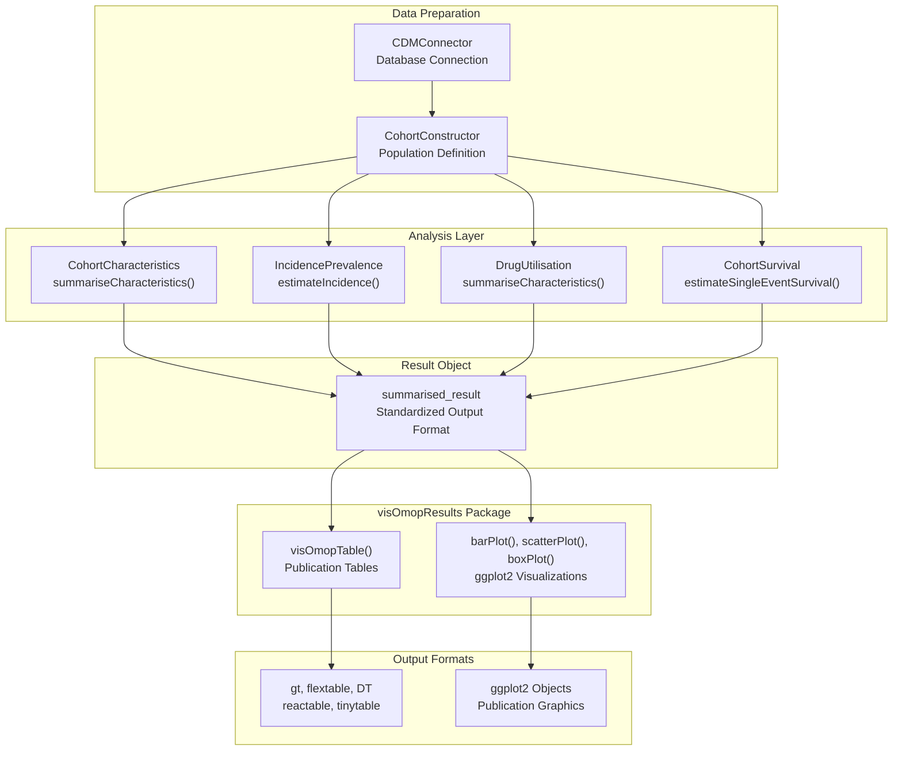
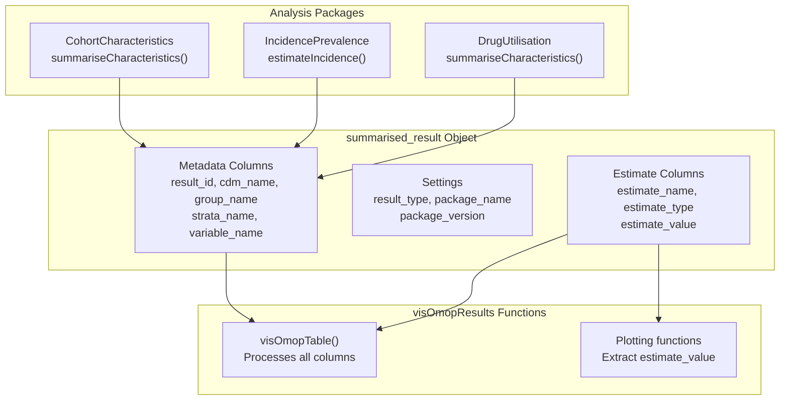
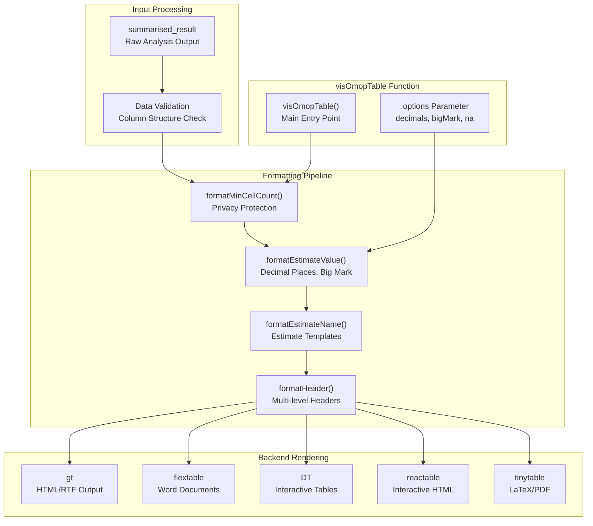
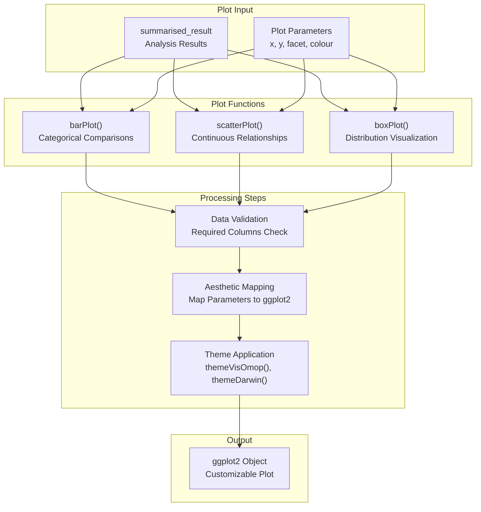
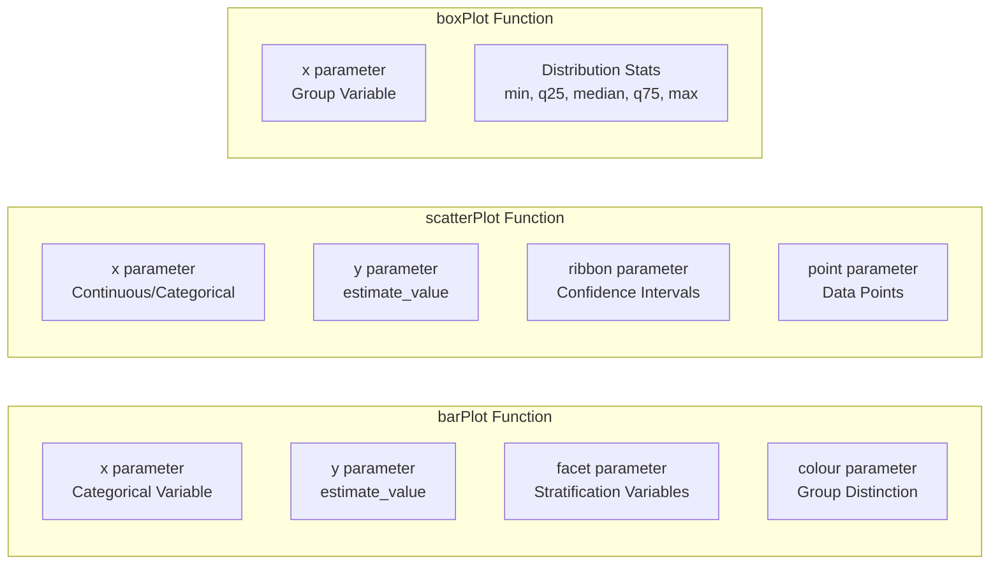
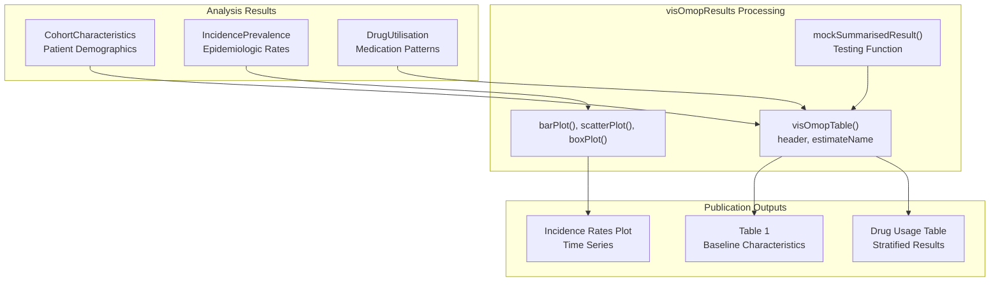
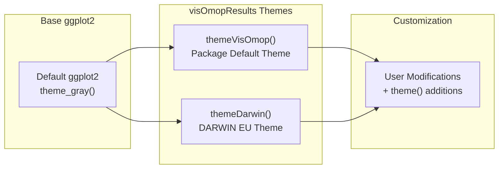

# Page: Visualization and Results

# Visualization and Results

Relevant source files

The following files were used as context for generating this wiki page:

- [docs/data_analysis/intro_to_observational_research.md](docs/data_analysis/intro_to_observational_research.md)
- [docs/data_analysis/package_reference/visomopresults.md](docs/data_analysis/package_reference/visomopresults.md)
- [docs/data_analysis/setup.md](docs/data_analysis/setup.md)

This document covers the `visOmopResults` package, which serves as the visualization and output formatting layer for OMOP CDM analytics. The package transforms analysis results from specialized OMOP packages into publication-ready tables and plots. For information about the underlying analysis packages that generate the data being visualized, see [Specialized Analysis Packages](#3.3.3). For details on setting up the R environment to use these visualization tools, see [Environment Setup and Getting Started](#3.1).

## Overview and Purpose

The `visOmopResults` package fills a critical role in the OMOP analytics ecosystem by providing standardized visualization and formatting capabilities. It serves as the final stage in the analysis pipeline, converting raw analysis outputs into presentation-ready materials for research publications, reports, and regulatory submissions.

### Integration with OMOP Workflow

Sources: [docs/data_analysis/package_reference/visomopresults.md:1-171](), [docs/data_analysis/setup.md:109-116]()

## Core Data Format: summarised_result Objects

The `visOmopResults` package operates exclusively on `summarised_result` objects, which provide a standardized format for analysis results across the OMOP ecosystem. These objects contain structured metadata and estimates that enable consistent visualization regardless of the originating analysis package.

### summarised_result Structure

Sources: [docs/data_analysis/package_reference/visomopresults.md:67-68](), [docs/data_analysis/package_reference/visomopresults.md:12-18]()

## Table Generation System

The table generation system in `visOmopResults` processes data through a sequential formatting pipeline, allowing detailed customization before rendering to various backend formats.

### Table Pipeline Architecture

Sources: [docs/data_analysis/package_reference/visomopresults.md:72-80](), [docs/data_analysis/package_reference/visomopresults.md:96-111]()

### Table Function Reference

| Function | Purpose | Key Parameters |
|----------|---------|----------------|
| `visOmopTable()` | Main table creation function | `header`, `estimateName`, `type`, `.options` |
| `visTable()` | Generic table function for data frames | `columns`, `type`, `style` |
| `formatEstimateValue()` | Format numeric estimates | `decimals`, `bigMark`, `keepTrailingZeros` |
| `formatEstimateName()` | Apply estimate templates | Template patterns like `"<count> (<percentage>%)"` |
| `formatHeader()` | Create multi-level headers | `header` column specifications |

Sources: [docs/data_analysis/package_reference/visomopresults.md:128-135]()

## Plot Generation System

The plotting system transforms `summarised_result` objects into `ggplot2` visualizations through data validation, aesthetic mapping, and theme application.

### Plot Generation Pipeline

Sources: [docs/data_analysis/package_reference/visomopresults.md:82-92](), [docs/data_analysis/package_reference/visomopresults.md:131-135]()

### Plot Function Specifications

Sources: [docs/data_analysis/package_reference/visomopresults.md:114-124](), [docs/data_analysis/package_reference/visomopresults.md:156-170]()

## Backend Integration and Output Formats

The `visOmopResults` package supports multiple output backends to accommodate different publication and reporting requirements.

### Backend Capabilities Matrix

| Backend | Interactive | Word Export | HTML Export | PDF Export | Use Case |
|---------|-------------|-------------|-------------|------------|----------|
| `gt` | No | Via RTF | Yes | Via HTML | High-quality static tables |
| `flextable` | No | Yes | Yes | Yes | Word document integration |
| `DT` | Yes | No | Yes | No | Interactive web applications |
| `reactable` | Yes | No | Yes | No | Modern interactive tables |
| `tinytable` | No | No | Yes | Yes | LaTeX/academic papers |

Sources: [docs/data_analysis/package_reference/visomopresults.md:14-16]()

### Integration with Analysis Workflow

Sources: [docs/data_analysis/package_reference/visomopresults.md:34-63](), [docs/data_analysis/intro_to_observational_research.md:252-287]()

## Advanced Configuration and Customization

The package provides extensive customization options through the `.options` parameter system and theme functions.

### Estimate Name Templates

The `estimateName` parameter uses template syntax to format complex estimates:

| Template Pattern | Output Example | Use Case |
|------------------|----------------|----------|
| `"<count> (<percentage>%)"` | `"150 (25.3%)"` | Categorical summaries |
| `"<mean> (<sd>)"` | `"45.2 (12.8)"` | Continuous variables |
| `"<median> [<q25>; <q75>]"` | `"42.0 [35.0; 55.0]"` | Non-parametric summaries |
| `"<count>"` | `"150"` | Simple counts |

Sources: [docs/data_analysis/package_reference/visomopresults.md:44-50](), [docs/data_analysis/package_reference/visomopresults.md:100-111]()

### Theme System Architecture

Sources: [docs/data_analysis/package_reference/visomopresults.md:134-136](), [docs/data_analysis/package_reference/visomopresults.md:18-20]()