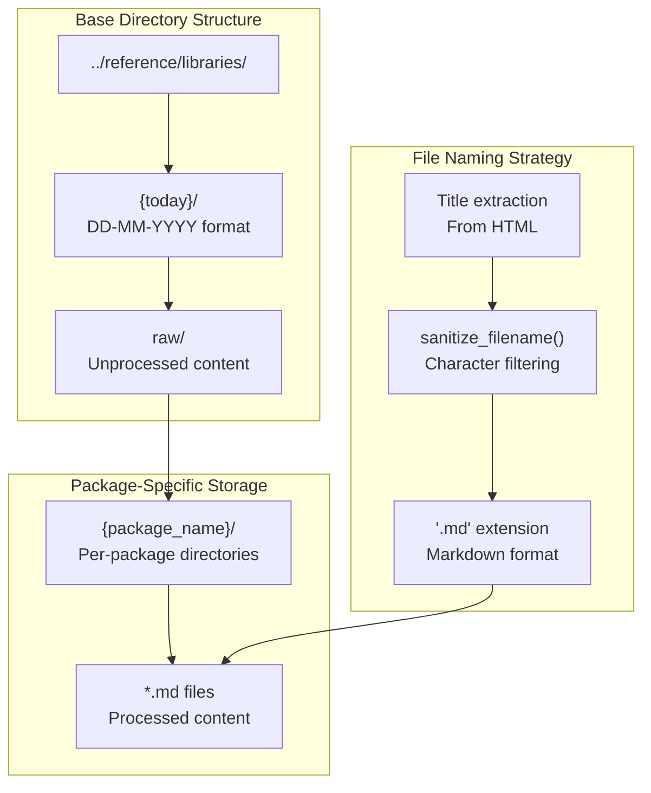

# Page: "` markers |

The system uses the MCP (Model Context Protocol) to communicate with the Deepwiki service, calling the `read_wiki_contents` tool with repository names as arguments.

Sources: [utils/scrape_deepwiki.py:25-54](), [utils/scrape_deepwiki.py:56-89]()

## Data Flow and Storage Architecture

The system implements a date-versioned storage structure that maintains historical snapshots of scraped content while supporting parallel processing workflows.

### Storage Hierarchy



Sources: [utils/scrape_all.sh:23-24](), [utils/scrape_deepwiki.py:63-64](), [utils/scrape_and_md.py:10-15]()

### Content Processing Functions

Both scraping modules implement identical filename sanitization to ensure consistent file naming across different content sources:

```python
# Common sanitization pattern used in both modules
def sanitize_filename(title):
    sanitized = re.sub(r'[^\w\s-]', '', title)
    sanitized = re.sub(r'[-\s]+', '_', sanitized)
    return sanitized.strip('_')
```

This function removes special characters, replaces spaces and hyphens with underscores, and ensures clean filesystem-compatible filenames.

Sources: [utils/scrape_and_md.py:10-15](), [utils/scrape_deepwiki.py:18-23]()

## Configuration Management

The system uses a CSV-based configuration approach for managing the list of R packages and their corresponding documentation sources.

### Package Registry Structure

The `libraries.csv` file defines the complete set of packages to be scraped:

| Column | Purpose | Example |
|--------|---------|---------|
| `repo` | GitHub repository identifier | `darwin-eu/CohortSurvival` |
| `url` | Documentation website URL | `https://darwin-eu-dev.github.io/CohortSurvival/` |
| `name` | Package identifier for storage | `CohortSurvival` |

The configuration covers both DARWIN-EU and OHDSI ecosystem packages, ensuring comprehensive coverage of the OMOP analytics framework.

Sources: [utils/libraries.csv:1-15]()

### Processing Integration

The orchestration script processes this configuration through shell array manipulation:

```bash
# Configuration loading pattern
libraries=()
while IFS=',' read -r repo url name; do
    repo=$(echo "$repo" | xargs)  # Whitespace trimming
    url=$(echo "$url" | xargs)
    name=$(echo "$name" | xargs)
    libraries+=("$repo|$url|$name")  # Pipe-delimited storage
done < <(tail -n +2 libraries.csv)  # Skip header row
```

This approach enables parallel processing while maintaining structured access to package metadata throughout the scraping workflow.

Sources: [utils/scrape_all.sh:8-16]()